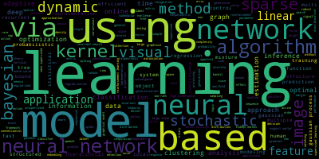
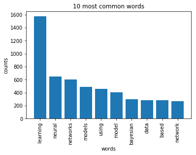

## 1. Loading the NIPS papers

</p>
<p>First, we will explore the CSV file to determine what type of data we can use for the analysis and how it is structured. A research paper typically consists of a title, an abstract and the main text. Other data such as figures and tables were not extracted from the PDF files. Each paper discusses a novel technique or improvement. In this analysis, we will focus on analyzing these papers with natural language processing methods.</p>


```python
# Importing modules
import pandas as pd

# Read datasets/papers.csv into papers
papers = pd.read_csv("datasets/papers.csv")

# Print out the first rows of papers
print(papers.head())
```

         id  year                                              title event_type  \
    0     1  1987  Self-Organization of Associative Database and ...        NaN   
    1    10  1987  A Mean Field Theory of Layer IV of Visual Cort...        NaN   
    2   100  1988  Storing Covariance by the Associative Long-Ter...        NaN   
    3  1000  1994  Bayesian Query Construction for Neural Network...        NaN   
    4  1001  1994  Neural Network Ensembles, Cross Validation, an...        NaN   
    
                                                pdf_name          abstract  \
    0  1-self-organization-of-associative-database-an...  Abstract Missing   
    1  10-a-mean-field-theory-of-layer-iv-of-visual-c...  Abstract Missing   
    2  100-storing-covariance-by-the-associative-long...  Abstract Missing   
    3  1000-bayesian-query-construction-for-neural-ne...  Abstract Missing   
    4  1001-neural-network-ensembles-cross-validation...  Abstract Missing   
    
                                              paper_text  
    0  767\n\nSELF-ORGANIZATION OF ASSOCIATIVE DATABA...  
    1  683\n\nA MEAN FIELD THEORY OF LAYER IV OF VISU...  
    2  394\n\nSTORING COVARIANCE BY THE ASSOCIATIVE\n...  
    3  Bayesian Query Construction for Neural\nNetwor...  
    4  Neural Network Ensembles, Cross\nValidation, a...  


```python
%%nose

import pandas as pd

def test_papers_exists():
    assert "papers" in globals(), \
        "The variable papers should be defined."
        
def test_papers_correctly_loaded():
    correct_papers = pd.read_csv("datasets/papers.csv")
    assert correct_papers.equals(papers), "The variable papers should contain the data in papers.csv"
```


    2/2 tests passed


## 2. Preparing the data for analysis
<p>For the analysis of the papers, we are only interested in the text data associated with the paper as well as the year the paper was published in.</p>
<p>We will analyze this text data using natural language processing.  Since the file contains some metadata such as id's and filenames, it is necessary to remove all the columns that do not contain useful text information.</p>


```python
# Remove the columns
df=pd.DataFrame(papers)
df.drop(['id','event_type','pdf_name'], axis=1, inplace=True)

# Print out the first rows of papers
print(df.head())
```

       year                                              title          abstract  \
    0  1987  Self-Organization of Associative Database and ...  Abstract Missing   
    1  1987  A Mean Field Theory of Layer IV of Visual Cort...  Abstract Missing   
    2  1988  Storing Covariance by the Associative Long-Ter...  Abstract Missing   
    3  1994  Bayesian Query Construction for Neural Network...  Abstract Missing   
    4  1994  Neural Network Ensembles, Cross Validation, an...  Abstract Missing   
    
                                              paper_text  
    0  767\n\nSELF-ORGANIZATION OF ASSOCIATIVE DATABA...  
    1  683\n\nA MEAN FIELD THEORY OF LAYER IV OF VISU...  
    2  394\n\nSTORING COVARIANCE BY THE ASSOCIATIVE\n...  
    3  Bayesian Query Construction for Neural\nNetwor...  
    4  Neural Network Ensembles, Cross\nValidation, a...  


## 3. Plotting how machine learning has evolved over time
<p>In order to understand how the machine learning field has recently exploded in popularity, we will begin by visualizing the number of publications per year. </p>
<p>By looking at the number of published papers per year,  we can understand the extent of the machine learning 'revolution'! Typically, this significant increase in popularity is attributed to the large amounts of compute power, data and improvements in algorithms.</p>


```python
# Group the papers by year
groups = df.groupby('year')

# Determine the size of each group
counts = groups.size()

# Visualise the counts as a bar plot
import matplotlib.pyplot
%matplotlib inline
counts.plot(kind='bar')
```


  


```python
%%nose

# one or more tests of the students code. 
# The @solution should pass the tests.
# The purpose of the tests is to try to catch common errors and to 
# give the student a hint on how to resolve these errors.

def test_vars_exists():
    assert "groups" in globals(), \
        "The variable groups should be defined."
    assert "counts" in globals(), \
        "The variable counts should be defined."
        
def test_vars_columns():
    correct_groups = papers.groupby('year')
    correct_counts = correct_groups.size()
    assert correct_counts.equals(counts), "The variable counts is not correctly defined."
```


    2/2 tests passed


## 4. Preprocessing the text data
<p>Let's now analyze the titles of the different papers to identify machine learning trends. First, we will perform some simple preprocessing on the titles in order to make them more amenable for analysis. We will use a regular expression to remove any punctuation in the title. Then we will perform lowercasing. We'll then print the titles of the first rows before and after applying the modification.</p>


```python
# Load the regular expression library
import re

# Print the titles of the first rows 
print(papers['title'].head())

# Remove punctuation
papers['title_processed'] = papers['title'].map(lambda title: re.sub('[,\.!?]', '', title))

# Convert the titles to lowercase
papers['title_processed'] = papers['title_processed'].map(lambda title: title.lower())

# Print the processed titles of the first rows 
print(papers['title_processed'].head())
```

    0    Self-Organization of Associative Database and ...
    1    A Mean Field Theory of Layer IV of Visual Cort...
    2    Storing Covariance by the Associative Long-Ter...
    3    Bayesian Query Construction for Neural Network...
    4    Neural Network Ensembles, Cross Validation, an...
    Name: title, dtype: object
    0    self-organization of associative database and ...
    1    a mean field theory of layer iv of visual cort...
    2    storing covariance by the associative long-ter...
    3    bayesian query construction for neural network...
    4    neural network ensembles cross validation and ...
    Name: title_processed, dtype: object


```python
%%nose

# one or more tests of the students code. 
# The @solution should pass the tests.
# The purpose of the tests is to try to catch common errors and to 
# give the student a hint on how to resolve these errors.

def test_processed_title_column():
    tmp = papers['title'].map(lambda x: re.sub('[,\.!?]', '', x))
    # Convert the titles to lowercase
    tmp = tmp.map(lambda x: x.lower())
    tmp.name = 'title_processed'
    assert tmp.equals(papers['title_processed']), "The column of processed titles is not correctly defined."
```


    1/1 tests passed


## 5.  A word cloud to visualize the preprocessed text data
<p>In order to verify whether the preprocessing happened correctly, we can make a word cloud of the titles of the research papers. This will give us a visual representation of the most common words. Visualisation is key to understanding whether we are still on the right track! In addition, it allows us to verify whether we need additional preprocessing before further analyzing the text data.</p>
<p>Python has a massive number of open libraries! Instead of trying to develop a method to create word clouds ourselves, we'll use Andreas Mueller's <a href="http://amueller.github.io/word_cloud/">wordcloud library</a>.</p>


```python
# Import the wordcloud library
import wordcloud

# Join the different processed titles together.
s=''
long_string = s.join(papers['title_processed'])
print(long_string)
# Create a WordCloud object
wordcloud = wordcloud.WordCloud()

# Generate a word cloud
wordcloud.generate(long_string)

# Visualize the word cloud
wordcloud.to_image()
```

    self-organization of associative database and its applicationsa mean field theory of layer iv of visual cortex and its application to artificial neural networksstoring covariance by the associative long-term potentiation and depression of synaptic strengths in the hippocampusbayesian query construction for neural network modelsneural network ensembles cross validation and active learningusing a neural net to instantiate a deformable modelplasticity-mediated competitive learningiceg morphology classification using an analogue vlsi neural networkreal-time control of a tokamak plasma using neural networkspulsestream synapses with non-volatile analogue amorphous-silicon memorieslearning to play the game of chessmultidimensional scaling and data clusteringan experimental comparison of recurrent neural networkstraining multilayer perceptrons with the extended kalman algorithminterference in learning internal models of inverse dynamics in humansactive learning with statistical modelsa rapid graph-based method for arbitrary transformation-invariant pattern classificationocular dominance and patterned lateral connections in a self-organizing model of the primary visual cortexassociative decorrelation dynamics: a theory of self-organization and optimization in feedback networksa connectionist technique for accelerated textual input: letting a network do the typingconnectionist speaker normalization with generalized resource allocating networksa critical comparison of models for orientation and ocular dominance columns in the striate cortexgeneralization in reinforcement learning: safely approximating the value functiona mixture model system for medical and machine diagnosisan application of the principle of maximum information preservation to linear systemsa computational model of prefrontal cortex functionthe gamma mlp for speech phoneme recognitiona multiscale attentional framework for relaxation neural networkscorrelated neuronal response: time scales and mechanismsonset-based sound segmentationa model of transparent motion and non-transparent motion aftereffectsa model of auditory streamingremap: recursive estimation and maximization of a posteriori probabilities - application to transition-based connectionist speech recognitionexponentially many local minima for single neuronsa practical monte carlo implementation of bayesian learningan adaptive network that learns sequences of transitionsneuron-mos temporal winner search hardware for fully-parallel data processingdynamics of attention as near saddle-node bifurcation behaviorvlsi model of primate visual smooth pursuitgradient and hamiltonian dynamics applied to learning in neural networksis learning the n-th thing any easier than learning the firsta dynamical model of context dependencies for the vestibulo-ocular refleximproved gaussian mixture density estimates using bayesian penalty terms and network averagingquadratic-type lyapunov functions for competitive neural networks with different time-scalesstable linear approximations to dynamic programming for stochastic control problems with local transitionscontext-dependent classes in a hybrid recurrent network-hmm speech recognition systemdigital realisation of self-organising mapsempirical entropy manipulation for real-world problemsthe geometry of eye rotations and listing's lawreinforcement learning by probability matchingneural control for nonlinear dynamic systemslearning with ensembles: how overfitting can be usefulseemore: a view-based approach to 3-d object recognition using multiple visual cuesanalog vlsi processor implementing the continuous wavelet transformselective attention for handwritten digit recognitiongaussian processes for regressionmodern analytic techniques to solve the dynamics of recurrent neural networksbackpropagation and its application to handwritten signature verificationfamily discoveryneural networks with quadratic vc dimensionlearning the structure of similarityreorganisation of somatosensory cortex after tactile trainingimplementation issues in the fourier transform algorithmadaptive retina with center-surround receptive fieldforward-backward retraining of recurrent neural networkswhen is an integrate-and-fire neuron like a poisson neuronfrom isolation to cooperation: an alternative view of a system of expertsboosting decision treesconstraints on adaptive networks for modeling human generalizationstatistical theory of overtraining - is cross-validation asymptotically effectivestable dynamic parameter adaptionuniversal approximation and learning of trajectories using oscillatorslearning fine motion by markov mixtures of expertsestimating the bayes risk from sample dataa unified learning scheme: bayesian-kullback ying-yang machineon neural networks with minimal weightsspert-ii: a vector microprocessor system and its application to large problems in backpropagation traininga neural network model of 3-d lightness perceptionhow perception guides production in birdsong learningneural network recognizer for hand-written zip code digitsa bound on the error of cross validation using the approximation and estimation rates with consequences for the training-test splita model of spatial representations in parietal cortex explains hemineglectdynamics of on-line gradient descent learning for multilayer neural networksimproving elevator performance using reinforcement learningvisual gesture-based robot guidance with a modular neural systemimproving committee diagnosis with resampling techniqueslearning sparse perceptronsa neural network autoassociator for induction motor failure predictionmodeling interactions of the rat's place and head direction systemsactive gesture recognition using learned visual attentionneural networks for model matching and perceptual organizationsymplectic nonlinear component analysisusing the future to "sort out" the present: rankprop and multitask learning for medical risk evaluationprediction of beta sheets in proteinsunsupervised pixel-predictionhigh-speed airborne particle monitoring using artificial neural networkshigh-performance job-shop scheduling with a time-delay td() networkexamples of learning curves from a modified vc-formalismusing feedforward neural networks to monitor alertness from changes in eeg correlation and coherencesoftassign versus softmax: benchmarks in combinatorial optimizationbeating a defender in robotic soccer: memory-based learning of a continuous functionapplications of error back-propagation to phonetic classificationabsence of cycles in symmetric neural networksindependent component analysis of electroencephalographic dataclustering data through an analogy to the potts modelplasticity of center-surround opponent receptive fields in real and artificial neural systems of visionworst-case loss bounds for single neuronspredictive q-routing: a memory-based reinforcement learning approach to adaptive traffic controlusing unlabeled data for supervised learningdiscovering structure in continuous variables using bayesian networksadaptive mixture of probabilistic transducersmicroelectronic implementations of connectionist neural networksadaptive neural networks using mos charge storagetempering backpropagation networks: not all weights are created equalfinite state automata that recurrent cascade-correlation cannot representhierarchical recurrent neural networks for long-term dependenciesoptimizing cortical mappingskodak lmagelink ocr alphanumeric handprint modulecholinergic suppression of transmission may allow combined associative memory function and self-organization in the neocortexhandwritten word recognition using contextual hybrid radial basis function network/hidden markov modelshuman reading and the curse of dimensionalitysample complexity for learning recurrent perceptron mappingsgeneralization in reinforcement learning: successful examples using sparse coarse codingdynamics of analog neural networks with time delayfast learning by bounding likelihoods in sigmoid type belief networkslearning model biasgeneralized learning vector quantizationstock selection via nonlinear multi-factor modelsa new learning algorithm for blind signal separationclassifying facial actionparallel optimization of motion controllers via policy iterationa framework for non-rigid matching and correspondencea smoothing regularizer for recurrent neural networkscricket wind detectionoptimization principles for the neural codeoptimal asset allocation using adaptive dynamic programmingrecursive estimation of dynamic modular rbf networkssilicon models for auditory scene analysismemory-based stochastic optimizationparallel analog vlsi architectures for computation of heading direction and time-to-contactrecurrent neural networks for missing or asynchronous dataa realizable learning task which exhibits overfittingmodeling saccadic targeting in visual searchsimulation of a thalamocortical circuit for computing directional heading in the ratuse of multi-layered networks for coding speech with phonetic featuressome results on convergent unlearning algorithmdiscriminant adaptive nearest neighbor classification and regressionem optimization of latent-variable density modelsstable fitted reinforcement learningcompetence acquisition in an autonomous mobile robot using hardware neural techniquesinformation through a spiking neuronthe capacity of a bumpa dynamical systems approach for a learnable autonomous robotrapid quality estimation of neural network input representationsimplications of recursive distributed representationsactive learning in multilayer perceptronsinvestment learning with hierarchical psomsexplorations with the dynamic wave modelimproving policies without measuring meritsfactorial hidden markov modelsa predictive switching model of cerebellar movement controlthe role of activity in synaptic competition at the neuromuscular junctiongeometry of early stopping in linear networksstrong unimodality and exact learning of constant depth -perceptron networkslaterally interconnected self-organizing maps in hand-written digit recognitionheterogeneous neural networks for adaptive behavior in dynamic environmentsprimitive manipulation learning with connectionismlearning long-term dependencies is not as difficult with narx networksextracting tree-structured representations of trained networksdoes the wake-sleep algorithm produce good density estimatorscontrol of selective visual attention: modeling the "where" pathwayexploiting tractable substructures in intractable networksadaptive back-propagation in on-line learning of multilayer networkstemporal coding in the sub-millisecond range: model of barn owl auditory pathwayon the computational power of noisy spiking neuronsa novel channel selection system in cochlear implants using artificial neural networkconvergence and pattern-stabilization in the boltzmann machineharmony networks do not workan information-theoretic learning algorithm for neural network classificationexperiments with neural networks for real time implementation of controlgeneralisation of a class of continuous neural networkslearning to predict visibility and invisibility from occlusion eventsconstructive algorithms for hierarchical mixtures of expertsmodel matching and sfmd computationbayesian methods for mixtures of expertshuman face detection in visual scenestemporal difference learning in continuous time and spacea neural network classifier for the i100 ocr chipusing pairs of data-points to define splits for decision treesstochastic hillclimbing as a baseline method for evaluating genetic algorithmsimproved silicon cochlea using compatible lateral bipolar transistorspruning with generalization based weight saliencies: obd obsgenerating accurate and diverse members of a neural-network ensemblestatistical mechanics of the mixture of expertsmicroscopic equations in rough energy landscape for neural networksan architectural mechanism for direction-tuned cortical simple cells: the role of mutual inhibitionmaximum likelihood blind source separation: a context-sensitive generalization of icalearning by choice of internal representationsrepresenting face images for emotion classificationearly brain damagebalancing between bagging and bumpingadaptive on-line learning in changing environmentsradial basis function networks and complexity regularization in function learninglearning decision theoretic utilities through reinforcement learningtext-based information retrieval using exponentiated gradient descentsupport vector method for function approximation regression estimation and signal processingspatiotemporal coupling and scaling of natural images and human visual sensitivitiessecond-order learning algorithm with squared penalty termskeletonization: a technique for trimming the fat from a network via relevance assessmentsource separation and density estimation by faithful equivariant somregression with input-dependent noise: a bayesian treatmentbangs clicks snaps thuds and whacks: an architecture for acoustic transient processinga new approach to hybrid hmm/ann speech recognition using mutual information neural networksan apobayesian relative of winnowhebb learning of features based on their information contentcompetition among networks improves committee performancecomputing with infinite networksarc-lh: a new adaptive resampling algorithm for improving ann classifiersneural network models of chemotaxis in the nematode caenorhabditis elegansusing neural networks to improve cochlear implant speech perceptiona model of neural oscillator for a unified submodulevisual cortex circuitry and orientation tuningcombining neural network regression estimates with regularized linear weightsdual kalman filtering methods for nonlinear prediction smoothing and estimationtime series prediction using mixtures of expertsfor valid generalization the size of the weights is more important than the size of the networkan adaptive wta using floating gate technologya micropower analog vlsi hmm state decoder for wordspottinggtm: a principled alternative to the self-organizing mapa mixture of experts classifier with learning based on both labelled and unlabelled datacomplex-cell responses derived from center-surround inputs: the surprising power of intradendritic computationlearning the solution to the aperture problem for pattern motion with a hebb ruleself-organizing and adaptive algorithms for generalized eigen-decompositionlearning bayesian belief networks with neural network estimatorsselective integration: a model for disparity estimationon the effect of analog noise in discrete-time analog computationsa convergence proof for the softassign quadratic assignment algorithmlstm can solve hard long time lag problemsreinforcement learning for dynamic channel allocation in cellular telephone systemsclustering sequences with hidden markov modelson a modification to the mean field em algorithm in factorial learningmlp can provably generalize much better than vc-bounds indicategemini: gradient estimation through matrix inversion after noise injectionthe generalisation cost of ramnetsmulti-task learning for stock selectionextraction of temporal features in the electrosensory system of weakly electric fishlearning appearance based models: mixtures of second moment expertslearning from demonstrationdynamics of trainingviewpoint invariant face recognition using independent component analysis and attractor networksusing curvature information for fast stochastic searchefficient nonlinear control with actor-tutor architecturemultidimensional triangulation and interpolation for reinforcement learninglinear learning: landscapes and algorithmslocal bandit approximation for optimal learning problemspromoting poor features to supervisors: some inputs work better as outputsgaussian processes for bayesian classification via hybrid monte carlofast network pruning and feature extraction by using the unit-obs algorithma constructive learning algorithm for discriminant tangent modelsblind separation of delayed and convolved sourcesneural models for part-whole hierarchiessupport vector regression machinesmultilayer neural networks: one or two hidden layersmodels of ocular dominance column formation: analytical and computational resultspredicting lifetimes in dynamically allocated memoryordered classes and incomplete examples in classificationunsupervised learning by convex and conic codinglearning with noise and regularizers in multilayer neural networksa neural model of visual contour integrationsequential tracking in pricing financial options using model based and neural network approachesgenetic algorithms and explicit search statisticsneural learning in structured parameter spaces - natural riemannian gradientan analog implementation of the constant average statistics constraint for sensor calibrationtraining a 3-node neural network is np-completeeffective training of a neural network character classifier for word recognitionmulti-effect decompositions for financial data modelinga comparison between neural networks and other statistical techniques for modeling the relationship between tobacco and alcohol and cancerimproving the accuracy and speed of support vector machinesthe effect of correlated input data on the dynamics of learninga model of recurrent interactions in primary visual cortexthe learning dynamcis of a universal approximatorremoving noise in on-line search using adaptive batch sizesa constructive rbf network for writer adaptationare hopfield networks faster than conventional computerscomputer modeling of associative learningclustering via concave minimizationcontinuous sigmoidal belief networks trained using slice samplingtemporal low-order statistics of natural soundstraining algorithms for hidden markov models using entropy based distance functionshidden markov decision treesa silicon model of amplitude modulation detection in the auditory brainstemlearning temporally persistent hierarchical representationsadaptive access control applied to ethernet dataa mean field algorithm for bayes learning in large feed-forward neural networksanalysis of temporal-diffference learning with function approximationoptimization by mean field annealingmonotonicity hintsonline learning from finite training sets: an analytical case studybayesian model comparison by monte carlo chainingmulti-grid methods for reinforcement learning in controlled diffusion processeslearning exact patterns of quasi-synchronization among spiking neurons from data on multi-unit recordingsrepresentation and induction of finite state machines using time-delay neural networksneural network modeling of speech and music signalsa hierarchical model of visual rivalryreinforcement learning for mixed open-loop and closed-loop controladaptively growing hierarchical mixtures of expertselectronic receptors for tactile/haptic sensingensemble methods for phoneme classificationdynamically adaptable cmos winner-take-all neural networkunification of information maximization and minimizationa variational principle for model-based morphinganalytical mean squared error curves in temporal difference learningspectroscopic detection of cervical pre-cancer through radial basis function networksanalog vlsi circuits for attention-based visual trackingvlsi implementation of cortical visual motion detection using an analog neural computerminimizing statistical bias with queriesthe condensation algorithm - conditional density propagation and applications to visual trackingscaling and generalization in neural networks: a case studyseparating style and contentcontour organisation with the em algorithmwhy did td-gammon workbayesian unsupervised learning of higher order structuredynamic features for visual speechreading: a systematic comparisonlimitations of self-organizing maps for vector quantization and multidimensional scaling3d object recognition: a model of view-tuned neuronsapproximate solutions to optimal stopping problems488 solutions to the xor problemthe neurothermostat: predictive optimal control of residential heating systemstemporal patterns of activity in neural networksstatistical prediction with kanerva's sparse distributed memoryreconstructing stimulus velocity from neuronal responses in area mton-line policy improvement using monte-carlo searchsize of multilayer networks for exact learning: analytic approachspatial decorrelation in orientation tuned cortical cellsrapid visual processing using spike asynchronypractical confidence and prediction intervalsnoisy spiking neurons with temporal coding have more computational power than sigmoidal neuronssoftening discrete relaxationinterpreting images by propagating bayesian beliefsmodeling small oscillating biological networks in analog vlsisalient contour extraction by temporal binding in a cortically-based networkconsistent classification firm and softstatistically efficient estimations using cortical lateral connectionsinterpolating earth-science data using rbf networks and mixtures of expertssmoothing regularizers for projective basis function networksone-unit learning rules for independent component analysisrecursive algorithms for approximating probabilities in graphical modelsexploiting model uncertainty estimates for safe dynamic control learningtriangulation by continuous embeddingcholinergic modulation preserves spike timing under physiologically realistic fluctuating inputtheory of self-organization of cortical mapsan orientation selective neural network for pattern identification in particle detectorsedges are the 'independent components' of natural scenesa spike based learning neuron in analog vlsineuroscale: novel topographic feature extraction using rbf networksprobabilistic interpretation of population codescombinations of weak classifiersestimating equivalent kernels for neural networks: a data perturbation approachcompositionality mdl priors and object recognitionmimic: finding optima by estimating probability densitiesartex: a self-organizing architecture for classifying image regionsa back-propagation algorithm with optimal use of hidden unitsorientation contrast sensitivity from long-range interactions in visual cortexrecovering perspective pose with a dual step em algorithmmapping a manifold of perceptual observationsthe efficiency and the robustness of natural gradient descent learning rulefeatures as sufficient statisticstraining methods for adaptive boosting of neural networksminimax and hamiltonian dynamics of excitatory-inhibitory networksanalog vlsi model of intersegmental coordination with nearest-neighbor couplingdynamic stochastic synapses as computational unitsmodeling acoustic correlations by factor analysisefficient parallel learning algorithms for neural networksgeneralization in decision trees and dnf: does size matternonlinear markov networks for continuous variablesmultiplicative updating rule for blind separation derived from the method of scoringextended ica removes artifacts from electroencephalographic recordingsanalytical study of the interplay between architecture and predictabilitymulti-modular associative memorya framework for multiple-instance learningincorporating test inputs into learninga solution for missing data in recurrent neural networks with an application to blood glucose predictionlearning to schedule straight-line codea connectionist expert system that actually worksanalysis of drifting dynamics with neural network hidden markov models2d observers for human 3d object recognitiona simple and fast neural network approach to stereovisionstacked density estimationphase transitions and the perceptual organization of video sequencesa neural network model of naive preference and filial imprinting in the domestic chickon parallel versus serial processing: a computational study of visual searchthe canonical distortion measure in feature space and 1-nn classificationmonotonic networksdata-dependent structural risk minimization for perceptron decision treesautomatic local annealingsilicon retina with adaptive filtering propertiesrecurrent neural networks can learn to implement symbol-sensitive countingmulti-time models for temporally abstract planningactive data clusteringan analog vlsi neural network for phase-based machine visiontoward a single-cell account for binocular disparity tuning: an energy model may be hiding in your dendritesblind separation of radio signals in fading channelsan analog vlsi model of the fly elementary motion detectorcomputing with action potentialslearning continuous attractors in recurrent networksan electronic photoreceptor sensitive to small changes in intensitymelonet i: neural nets for inventing baroque-style chorale variationsdetection of first and second order motionfrom regularization operators to support vector kernelsglobally optimal on-line learning rulesjust one view: invariances in inferotemporal cell tuningclassification by pairwise couplingagnostic classification of markovian sequencesbidirectional retrieval from associative memoryusing expectation to guide processing: a study of three real-world applicationsshared context probabilistic transducersmodeling the olfactory bulb - coupled nonlinear oscillatorsestimating dependency structure as a hidden variablehippocampal model of rat spatial abilities using temporal difference learningreinforcement learning for call admission control and routing in integrated service networksthe asymptotic convergence-rate of q-learningreinforcement learning with hierarchies of machinesthe observer-observation dilemma in neuro-forecastingautomated aircraft recovery via reinforcement learning: initial experimentslocal dimensionality reductionon efficient heuristic ranking of hypothesesserial order in reading aloud: connectionist models and neighborhood structurean optimality principle for unsupervised learningon-line learning from finite training sets in nonlinear networkseffects of spike timing underlying binocular integration and rivalry in a neural model of early visual cortexapproximating posterior distributions in belief networks using mixturescomparison of human and machine word recognitioncombining classifiers using correspondence analysisa 1 000-neuron system with one million 7-bit physical interconnectionsmultiple threshold neural logicfunction approximation with the sweeping hinge algorithmem algorithms for pca and spcatask and spatial frequency effects on face specializationencoding geometric invariances in higher-order neural networksassociative learning via inhibitory searchsynchronized auditory and cognitive 40 hz attentional streams and the impact of rhythmic expectation on auditory scene analysiscoding of naturalistic stimuli by auditory midbrain neuronsthe rectified gaussian distributionmodeling complex cells in an awake macaque during natural image viewingreinforcement learning for continuous stochastic control problemshybrid nn/hmm-based speech recognition with a discriminant neural feature extractionbayesian robustification for audio visual fusionuse of a multi-layer perceptron to predict malignancy in ovarian tumorsnew approximations of differential entropy for independent component analysis and projection pursuitgeneralized prioritized sweepingspeech production using a neural network with a cooperative learning mechanisma mathematical model of axon guidance by diffusible factorsinstabilities in eye movement control: a model of periodic alternating nystagmusboltzmann machine learning using mean field theory and linear response correctionselecting weighting factors in logarithmic opinion poolsvisual navigation in a robot using zig-zag behaviora hippocampal model of recognition memorycorrelates of attention in a model of dynamic visual recognitions-map: a network with a simple self-organization algorithm for generative topographic mappingsan incremental nearest neighbor algorithm with queriescompetitive on-line linear regressionconnectionist learning of expert preferences by comparison traininghow to dynamically merge markov decision processesbayesian model of surface perceptionan application of reversible-jump mcmc to multivariate spherical gaussian mixturesgradients for retinotectal mappinglearning nonlinear overcomplete representations for efficient codingexperiences with bayesian learning in a real world applicationrcc cannot compute certain fsa even with arbitrary transfer functionsenhancing q-learning for optimal asset allocationmodelling seasonality and trends in daily rainfall datatemporal representations in a connectionist speech systemperturbative m-sequences for auditory systems identificationlearning to order thingsthe storage capacity of a fully-connected committee machinea generic approach for identification of event related brain potentials via a competitive neural network structurehybrid reinforcement learning and its application to biped robot controlincorporating contextual information in white blood cell identificationensemble and modular approaches for face detection: a comparisonwavelet models for video time-serieslearning path distributions using nonequilibrium diffusion networksneural basis of object-centered representationsa passive shared element analog electrical cochleatwo approaches to optimal annealingon the infeasibility of training neural networks with small squared errorsusing helmholtz machines to analyze multi-channel neuronal recordingsan annealed self-organizing map for source channel codingregression with input-dependent noise: a gaussian process treatmentstructure driven image database retrievalfactorizing multivariate function classesan improved policy iteration algorithm for partially observable mdpsadaptation in speech motor controla bifurcation theory approach to the programming of periodic attractors in network models of olfactory cortexa non-parametric multi-scale statistical model for natural imagesradial basis functions: a bayesian treatmentasymptotic theory for regularization: one-dimensional linear casegraph matching with hierarchical discrete relaxationa general purpose image processing chip: orientation detectionon the separation of signals from neighboring cells in tetrode recordingsprior knowledge in support vector kernelsreceptive field formation in natural scene environments: comparison of single cell learning rulesintrusion detection with neural networksperformance of synthetic neural network classification of noisy radar signalsself-similarity properties of natural imagesrefractoriness and neural precisioncharacterizing neurons in the primary auditory cortex of the awake primate using reverse correlationstatistical models of conditioningregularisation in sequential learning algorithmsadaptive choice of grid and time in reinforcement learningindependent component analysis for identification of artifacts in magnetoencephalographic recordingsa revolution: belief propagation in graphs with cycleslearning human-like knowledge by singular value decomposition: a progress reporta superadditive-impairment theory of optic aphasiaa network for image segmentation using colorbach in a box - real-time harmonya model of early visual processinghierarchical non-linear factor analysis and topographic mapslinear concepts and hidden variables: an empirical studymultiresolution tangent distance for affine-invariant classificationstructural risk minimization for nonparametric time series predictionnonparametric model-based reinforcement learningsynaptic transmission: an information-theoretic perspectiverelative loss bounds for multidimensional regression problemsunsupervised on-line learning of decision trees for hierarchical data analysisadaptive neural net preprocessing for signal detection in non-gaussian noiseensemble learning for multi-layer networksthe error coding and substitution pactsa principle for unsupervised hierarchical decomposition of visual scenesthe bias-variance tradeoff and the randomized gacvgraph matching for shape retrievaldynamically adapting kernels in support vector machinesevidence for a forward dynamics model in human adaptive motor controla reinforcement learning algorithm in partially observable environments using short-term memorya model for associative multiplicationa neuromorphic monaural sound localizerself organizing neural networks for the identification problemvery fast em-based mixture model clustering using multiresolution kd-treeskernel pca and de-noising in feature spacesviewing classifier systems as model free learning in pomdpsmulti-electrode spike sorting by clustering transfer functionswhere does the population vector of motor cortical cells point during reaching movementsa high performance k-nn classifier using a binary correlation matrix memorycoordinate transformation learning of hand position feedback controller by using change of position error normfinite-dimensional approximation of gaussian processesmaking templates rotationally invariant an application to rotated digit recognitionvlsi implementation of motion centroid localization for autonomous navigationcorrelational strength and computational algebra of synaptic connections between neuronsan information theoretic approach to rule-based connectionist expert systemsoutcomes of the equivalence of adaptive ridge with least absolute shrinkagelearning curves for gaussian processesadding constrained discontinuities to gaussian process models of wind fieldslearning from dyadic dataexample-based image synthesis of articulated figurescall-based fraud detection in mobile communication networks using a hierarchical regime-switching modelapplications of multi-resolution neural networks to mammographylazy learning meets the recursive least squares algorithmmarkov processes on curves for automatic speech recognitionexperimental results on learning stochastic memoryless policies for partially observable markov decision processeswinner-take-all networks of o(n) complexitythe effect of correlations on the fisher information of population codeslearning multi-class dynamicsreplicator equations maximal cliques and graph isomorphismconvergence rates of algorithms for visual search: detecting visual contourscoding time-varying signals using sparse shift-invariant representationsalmost linear vc dimension bounds for piecewise polynomial networksprobabilistic image sensor fusionon the optimality of incremental neural network algorithmscontrast adaptation in simple cells by changing the transmitter release probabilitycontrolling the complexity of hmm systems by regularizationsimulation and measurement of the electric fields generated by weakly electric fishexploiting generative models in discriminative classifierssmem algorithm for mixture modelsan entropic estimator for structure discoveryoptimizing classifers for imbalanced training setsbatch and on-line parameter estimation of gaussian mixtures based on the joint entropyrecurrent cortical amplification produces complex cell responsesfacial memory is kernel density estimation (almost)orientation scale and discontinuity as emergent properties of illusory contour shapestationarity and stability of autoregressive neural network processesrange image restoration using mean field annealinga precise characterization of the class of languages recognized by neural nets under gaussian and other common noise distributionsfinite-sample convergence rates for q-learning and indirect algorithmsmean field methods for classification with gaussian processesmodeling surround suppression in v1 neurons with a statistically derived normalization modelanalog vlsi cellular implementation of the boundary contour systemdts: dynamic treesdivisive normalization line attractor networks and ideal observersmaximum conditional likelihood via bound maximization and the cem algorithmrobot docking using mixtures of gaussiansfisher scoring and a mixture of modes approach for approximate inference and learning in nonlinear state space modelswhat size net gives valid generalizationgeneral-purpose localization of textured image regionsactive noise canceling using analog neuro-chip with on-chip learning capabilitybayesian modeling of human concept learninglearning mixture hierarchiesexploratory data analysis using radial basis function latent variable modelsindependent component analysis of intracellular calcium spike datavertex identification in high energy physics experimentsattentional modulation of human pattern discrimination psychophysics reproduced by a quantitative modelfamiliarity discrimination of radar pulsesbayesian pcaan analog self-organizing neural network chiprobust efficient globally-optimized reinforcement learning with the parti-game algorithmreinforcement learning for tradingvisualizing group structuredirect optimization of margins improves generalization in combined classifiersneuronal regulation implements efficient synaptic pruningcomputation of smooth optical flow in a feedback connected analog networkdistributional population codes and multiple motion modelsscheduling straight-line code using reinforcement learning and rolloutsa micropower cmos adaptive amplitude and shift invariant vector quantisercomputational differences between asymmetrical and symmetrical networkscomparing biases for minimal network construction with back-propagationgraphical models for recognizing human interactionsprobabilistic visualisation of high-dimensional binary datafast neural network emulation of dynamical systems for computer animationshrinking the tube: a new support vector regression algorithminference in multilayer networks via large deviation boundsbarycentric interpolators for continuous space and time reinforcement learningprobabilistic modeling for face orientation discrimination: learning from labeled and unlabeled datablind separation of filtered sources using state-space approachdiscontinuous recall transitions induced by competition between short- and long-range interactions in recurrent networkson the k-winners-take-all networkthe belief in tapclassification on pairwise proximity datainformation maximization in single neuronslearning instance-independent value functions to enhance local searchanalyzing and visualizing single-trial event-related potentialssemiparametric support vector and linear programming machinesgradient descent for general reinforcement learningusing analytic qp and sparseness to speed training of support vector machinesdynamics of supervised learning with restricted training setsdiscovering hidden features with gaussian processes regressionneural networks that learn to discriminate similar kanji characterslearning a continuous hidden variable model for binary dataclassification in non-metric spacessemi-supervised support vector machinesrisk sensitive reinforcement learninglearning lie groups for invariant visual perceptionmultiple paired forward-inverse models for human motor learning and controllearning macro-actions in reinforcement learningphase diagram and storage capacity of sequence-storing neural networksapproximate learning of dynamic modelsperceiving without learning: from spirals to inside/outside relationsperformance of a stochastic learning microchipbayesian modeling of facial similarityusing collective intelligence to route internet trafficunsupervised classification with non-gaussian mixture models using icaa randomized algorithm for pairwise clusteringlearning nonlinear dynamical systems using an em algorithmlearning to find pictures of peoplerestructuring sparse high dimensional data for effective retrievalglobal optimisation of neural network models via sequential samplingoptimizing admission control while ensuring quality of service in multimedia networks via reinforcement learningnetwork generality training required and precision requiredanalyzing the energy landscapes of distributed winner-take-all networksnon-linear pi control inspired by biological control systemsthe role of lateral cortical competition in ocular dominance developmentboxlets: a fast convolution algorithm for signal processing and neural networksthe effect of eligibility traces on finding optimal memoryless policies in partially observable markov decision processesa theory of mean field approximationtight bounds for the vc-dimension of piecewise polynomial networkson-line learning with restricted training sets: exact solution as benchmark for general theoriesimproved switching among temporally abstract actionsexploring unknown environments with real-time search or reinforcement learningsupport vector machines applied to face recognitionneural approach for tv image compression using a hopfield type networklinear hinge loss and average marginsynergy and redundancy among brain cells of behaving monkeyssparse code shrinkage: denoising by nonlinear maximum likelihood estimationan integrated vision sensor for the computation of optical flow singular pointsreinforcement learning based on on-line em algorithmregularizing adaboostefficient bayesian parameter estimation in large discrete domainstractable variational structures for approximating graphical modelsa v1 model of pop out and asymmetty in visual searchsource separation as a by-product of regularizationmapping classifier systems into neural networkstemporally asymmetric hebbian learning spike liming and neural response variabilityoptimizing correlation algorithms for hardware-based transient classificationgeneral bounds on bayes errors for regression with gaussian processesbasis selection for wavelet regressionneural networks for density estimationunsupervised and supervised clustering: the mutual information between parameters and observationsa phase space approach to minimax entropy learning and the minutemax approximationsa polygonal line algorithm for constructing principal curvesutilizing lime: asynchronous bindinglearning to estimate scenes from imageslinks between markov models and multilayer perceptronsmechanisms of generalization in perceptual learninglearning a hierarchical belief network of independent factor analyzersconvergence of the wake-sleep algorithmsignal detection in noisy weakly-active dendritesmaximum-likelihood continuity mapping (malcom): an alternative to hmmsspike-based compared to rate-based hebbian learningneural computation with winner-take-all as the only nonlinear operationbayesian modelling of fmri lime seriesan oculo-motor system with multi-chip neuromorphic analog vlsi controlalgorithms for independent components analysis and higher order statisticsdynamic non-local role bindings and inferencing in a localist network for natural language understandingapproximate inference a lgorithms for two-layer bayesian networkscorrectness of belief propagation in gaussian graphical models of arbitrary topologyrobust learning of chaotic attractorsgaussian fields for approximate inference in layered sigmoid belief networksgeneralized model selection for unsupervised learning in high dimensionson input selection with reversible jump markov chain monte carlo samplingmemory capacity of linear vs nonlinear models of dendritic integrationan information-theoretic framework for understanding saccadic eye movementsonline independent component analysis with local learning rate adaptationlocal probability propagation for factor analysisa massively parallel self-tuning context-free parsera mcmc approach to hierarchical mixture modellingagglomerative information bottlenecksupport vector method for multivariate density estimationsemiparametric approach to multichannel blind deconvolution of nonminimum phase systemslearning the similarity of documents: an information-geometric approach to document retrieval and categorizationsearch for information bearing components in speechresonance in a stochastic neuron model with delayed interactioninformation capacity and robustness of stochastic neuron modelsspike-based learning rules and stabilization of persistent neural activityboosting with multi-way branching in decision treesa programmable analog neural computer and simulatorreconstruction of sequential data with probabilistic models and continuity constraintsinference for the generalization errorapplication of blind separation of sources to optical recording of brain activitymodel selection for support vector machinesapproximate planning in large pomdps via reusable trajectoriesan environment model for nonstationary reinforcement learningrules and similarity in concept learningreinforcement learning using approximate belief stateslearning sparse codes with a mixture-of-gaussians prioran oscillatory correlation frame work for computational auditory scene analysisneural architectureemergence of topography and complex cell properties from natural images using extensions of icatraining data selection for optimal generalization in trigonometric polynomial networksvariational inference for bayesian mixtures of factor analysersmixture density estimationmodel selection in clustering by uniform convergence boundsimage recognition in context: application to microscopic urinalysisrecurrent cortical competition: strengthen or weakenthe entropy regularization information criterioninformation factorization in connectionist models of perceptionmodeling high-dimensional discrete data with multi-layer neural networksneural control of sensory acquisition: the vestibulo-ocular reflexbroadband direction-of-arrival estimation based on second order statisticsdual estimation and the unscented transformationindependent factor analysis with temporally structured sourcesrecognizing evoked potentials in a virtual environmentbayesian network induction via local neighborhoodsaudio vision: using audio-visual synchrony to locate soundsa geometric interpretation of v-svm classifiersgraded grammaticality in prediction fractal machinessome theoretical results concerning the convergence of compositions of regularized linear functionsan analog vlsi chip for thin-plate surface interpolationbifurcation analysis of a silicon neurongreedy importance samplinglower bounds on the complexity of approximating continuous functions by sigmoidal neural networksdynamics of supervised learning with restricted training sets and noisy teachersefficient approaches to gaussian process classificationa generative model for attractor dynamicsrobust recognition of noisy and superimposed patterns via selective attentionstatistical dynamics of batch learningbayesian reconstruction of 3d human motion from single-camera videotransductive inference for estimating values of functionslearning a color algorithm from examplessong learning in birdsregular and irregular gallager-zype error-correcting codesdifferentiating functions of the jacobian with respect to the weightsdistributed synchrony of spiking neurons in a hebbian cell assemblyconstructing heterogeneous committees using input feature grouping: application to economic forecastinga recurrent model of the interaction between prefrontal and inferotemporal cortex in delay tasksfrom coexpression to coregulation: an approach to inferring transcriptional regulation among gene classes from large-scale expression dataan meg study of response latency and variability in the human visual system during a visual-motor integration taskthe parallel problems server: an interactive tool for large scale machine learningbayesian averaging is well-temperatedneuronal maps for sensory-motor control in the barn owllearning to parse imagesprobabilistic methods for support vector machinesbayesian transductionpolicy gradient methods for reinforcement learning with function approximationunmixing hyperspectral datainvariant feature extraction and classification in kernel spacesbayesian map learning in dynamic environmentsan improved decomposition algorithm for regression support vector machinesa multi-class linear learning algorithm related to winnowthe relevance vector machinea low-power cmos circuit which emulates temporal electrical properties of neuronsa neuromorphic vlsi system for modeling the neural control of axial locomotionv-arc: ensemble learning in the presence of outliersbayesian model selection for support vector machines gaussian processes and other kernel classifierssupport vector method for novelty detectionspiking boltzmann machinesa winner-take-all circuit with controllable soft max propertya variational baysian framework for graphical modelsthe relaxed online maximum margin algorithmwiring optimization in the braintopographic transformation as a discrete latent variableusing backpropagation with temporal windows to learn the dynamics of the cmu direct-drive arm iiperceptual organization based on temporal dynamicsspectral cues in human sound localizationoptimal sizes of dendritic and axonal arborsmaximum entropy discriminationneural system model of human sound localizationuniqueness of the svm solutionnonlinear discriminant analysis using kernel functionspotential boostersconstrained hidden markov modelsalgebraic analysis for non-regular learning machinesspeech recognition: statistical and neural information processing approacheslow power wireless communication via reinforcement learningrobust full bayesian methods for neural networksmanaging uncertainty in cue combinationthe nonnegative boltzmann machinekirchoff law markov fields for analog circuit designthe infinite gaussian mixture modelcan vi mechanisms account for figure-ground and medial axis effectsa snow-based face detectorpolicy search via density estimationchurn reduction in the wireless industryfast learning in multi-resolution hierarchiesscale mixtures of gaussians and the statistics of natural imagesa neurodynamical approach to visual attentionpopulation decoding based on an unfaithful modelan analysis of turbo decoding with gaussian densitieslearning factored representations for partially observable markov decision processesoptimal kernel shapes for local linear regressionmanifold stochastic dynamics for bayesian learningchannel noise in excitable neural membraneseffects of spatial and temporal contiguity on the acquisition of spatial informationneural representation of multi-dimensional stimulilearning from user feedback in image retrieval systemsbuilding predictive models from fractal representations of symbolic sequencescoastal navigation with mobile robotsnoisy neural networks and generalizationslearning informative statistics: a nonparametnic approachboosting algorithms as gradient descentpredictive app roaches for choosing hyperparameters in gaussian processesrobust neural network regression for offline and online learningunderstanding stepwise generalization of support vector machines: a toy modelneural network star pattern recognition for spacecraft attitude determination and controlstate abstraction in maxq hierarchical reinforcement learningleveraged vector machinesmonte carlo pomdpslarge margin dags for multiclass classificationeffective learning requires neuronal remodeling of hebbian synapsesreinforcement learning for spoken dialogue systemsltd facilitates learning in a noisy environmentacquisition in autoshapingbetter generative models for sequential data problems: bidirectional recurrent mixture density networksdata visualization and feature selection: new algorithms for nongaussian dataa model for resolution enhancement (hyperacuity) in sensory representationlearning statistically neutral tasks without expert guidancean analog vlsi model of periodicity extractionevolving learnable languagespredictive sequence learning in recurrent neocortical circuitshierarchical image probability (h1p) modelsimage representations for facial expression codingactor-critic algorithmsspeech modelling using subspace and em techniquesneural network based model predictive controlimproved output coding for classification using continuous relaxationtraining a limited-interconnect synthetic neural icregularization with dot-product kernelssparse kernel principal component analysisredundancy and dimensionality reduction in sparse-distributed representations of natural objects in terms of their local featurespermitted and forbidden sets in symmetric threshold-linear networksminimum bayes error feature selection for continuous speech recognitionactive learning for parameter estimation in bayesian networksthe early word catches the weightsa gradient-based boosting algorithm for regression problemsbayes networks on ice: robotic search for antarctic meteoriteswho does what a novel algorithm to determine function localizationprogrammable synaptic chip for electronic neural networksthe boltzmann perceptron network: a multi-layered feed-forward network equivalent to the boltzmann machinelearning continuous distributions: simulations with field theoretic priorsplace cells and spatial navigation based on 2d visual feature extraction path integration and reinforcement learningthe kernel gibbs samplererror-correcting codes on a bethe-like latticethe manhattan world assumption: regularities in scene statistics which enable bayesian inferenceon iterative krylov-dogleg trust-region steps for solving neural networks nonlinear least squares problemsensemble learning and linear response theory for icarecognizing hand-written digits using hierarchical products of expertsefficient learning of linear perceptronsmultiple timescales of adaptation in a neural codefixed point analysis for recurrent networksbeyond maximum likelihood and density estimation: a sample-based criterion for unsupervised learning of complex modelsexact solutions to time-dependent mdpsbayesian video shot segmentationfinding the key to a synapseincremental and decremental support vector machine learningsequentially fitting ``inclusive'' trees for inference in noisy-or networksdivisive and subtractive mask effects: linking psychophysics and biophysicsthe use of classifiers in sequential inferencethe unscented particle filterthe interplay of symbolic and subsymbolic processes in anagram problem solvinggenesis: a system for simulating neural networkscombining ica and top-down attention for robust speech recognitionautomated state abstraction for options using the u-tree algorithma linear programming approach to novelty detectiona support vector method for clusteringfour-legged walking gait control using a neuromorphic chip interfaced to a support vector learning algorithmlearning curves for gaussian processes regression: a framework for good approximationsalgebraic information geometry for learning machines with singularitiesa productive systematic framework for the representation of visual structurespike-timing-dependent learning for oscillatory networkslearning winner-take-all competition between groups of neurons in lateral inhibitory networksfurther explorations in visually-guided reaching: making murphy smarterlearning segmentation by random walksbalancing multiple sources of reward in reinforcement learninggeneralized belief propagationregularized winnow methodsa new model of spatial representation in multimodal brain areaskeeping flexible active contours on track using metropolis updatespartially observable sde models for image sequence recognition taskshierarchical memory-based reinforcement learningfeature correspondence: a markov chain monte carlo approacha neural probabilistic language modeldoes the neuron "learn" like the synapseapricodd: approximate policy construction using decision diagramsrobust reinforcement learninghippocampally-dependent consolidation in a hierarchical model of neocortexfrom mixtures of mixtures to adaptive transform codinga pac-bayesian margin bound for linear classifiers: why svms workstructure learning in human causal inductionthe missing link - a probabilistic model of document content and hypertext connectivitystability and noise in biochemical switches`n-body' problems in statistical learningkernel-based reinforcement learning in average-cost problems: an application to optimal portfolio choiceconsonant recognition by modular construction of large phonemic time-delay neural networksfeature selection for svmsdendritic compartmentalization could underlie competition and attentional biasing of simultaneous visual stimuliexplaining away in weight spaceautomatic choice of dimensionality for pcaalgorithmic stability and generalization performancefast training of support vector classifiersgaussianizationtree-based modeling and estimation of gaussian processes on graphs with cyclesstagewise processing in error-correcting codes and image restorationaccumulator networks: suitors of local probability propagationneural net receivers in multiple access-communicationsnatural sound statistics and divisive normalization in the auditory systemalgorithms for non-negative matrix factorizationthe kernel trick for distancesan information maximization approach to overcomplete and recurrent representationsa new approximate maximal margin classification algorithmmodel complexity goodness of fit and diminishing returnsusing the nystrm method to speed up kernel machineswhat can a single neuron computesparsity of data representation of optimal kernel machine and leave-one-out estimatortext classification using string kernelsprogrammable analog pulse-firing neural networksfrom margin to sparsityfactored semi-tied covariance matricesdopamine bonuseson a connection between kernel pca and metric multidimensional scalingmachine learning for video-based renderingan adaptive metric machine for pattern classificationvicinal risk minimizationa comparison of image processing techniques for visual speech recognition applicationslearning sparse image codes using a wavelet pyramid architectureon reversing jensen's inequalitylearning sequential structure in simple recurrent networkssparse greedy gaussian process regressiongeneralizable singular value decomposition for ill-posed datasetstemporally dependent plasticity: an information theoretic accountposition variance recurrence and perceptual learningwhence sparsenessone microphone source separationrate-coded restricted boltzmann machines for face recognitionsupport vector novelty detection applied to jet engine vibration spectrausing free energies to represent q-values in a multiagent reinforcement learning taskadaptive object representation with hierarchically-distributed memory sitesa self-learning neural networksecond order approximations for probability modelsconvergence of large margin separable linear classificationlearning switching linear models of human motionsparse representation for gaussian process modelsuniversality and individuality in a neural codeoverfitting in neural nets: backpropagation conjugate gradient and early stoppingdata clustering by markovian relaxation and the information bottleneck methodthe use of mdl to select among computational models of cognitionlearning joint statistical models for audio-visual fusion and segregationsome new bounds on the generalization error of combined classifiersoptimization with artificial neural network systems: a mapping principle and a comparison to gradient based methodscontour-map encoding of shape for early visionmixtures of gaussian processesinteractive parts model: an application to recognition of on-line cursive scriptnoise suppression based on neurophysiologically-motivated snr estimation for robust speech recognitionprocessing of time series by neural circuits with biologically realistic synaptic dynamicscompetition and arbors in ocular dominancea silicon primitive for competitive learningweak learners and improved rates of convergence in boostingpropagation algorithms for variational bayesian learningspeech denoising and dereverberation using probabilistic modelscolor opponency constitutes a sparse representation for the chromatic structure of natural scenesneural network weight matrix synthesis using optimal control techniquesfoundations for a circuit complexity theory of sensory processingreinforcement learning with function approximation converges to a regionsmart vision chip fabricated using three dimensional integration technologyshape context: a new descriptor for shape matching and object recognitiona tighter bound for graphical modelsdecomposition of reinforcement learning for admission control of self-similar call arrival processesmodelling spatial recall mental imagery and neglectnew approaches towards robust and adaptive speech recognitiona variational mean-field theory for sigmoidal belief networksdirect classification with indirect datahmm speech recognition with neural net discriminationincorporating second-order functional knowledge for better option pricingfacesync: a linear operator for measuring synchronization of video facial images and audio trackslarge scale bayes point machineshomeostasis in a silicon integrate and fire neuronactive support vector machine classificationoccam's razorhigher-order statistical properties arising from the non-stationarity of natural signalsanalysis of bit error probability of direct-sequence cdma multiuser demodulatorskernel expansions with unlabeled exampleshigh-temperature expansions for learning models of nonnegative dataanalysis of linsker's simulations of hebbian rulesa mathematical programming approach to the kernel fisher algorithmactive inference in concept learningprobabilistic semantic video indexingsex with support vector machinescomputing with finite and infinite networksconstrained independent component analysisprogrammable reinforcement learning agentsemergence of movement sensitive neurons' properties by learning a sparse code for natural moving imageslearning and tracking cyclic human motionperiodic component analysis: an eigenvalue method for representing periodic structure in speechsequential decision problems and neural networksdiscovering hidden variables: a structure-based approachmultiagent planning with factored mdpsgeneralizable relational binding from coarse-coded distributed representationsa quantitative model of counterfactual reasoningconvergence of optimistic and incremental q-learningnatural language grammar induction using a constituent-context modelon kernel-target alignmentan efficient clustering algorithm using stochastic association model and its implementation using nanostructuresrisk sensitive particle filtersa parallel mixture of svms for very large scale problemstraining stochastic model recognition algorithms as networks can lead to maximum mutual information estimation of parametersa hierarchical model of complex cells in visual cortex for the binocular perception of motion-in-deptha sequence kernel and its application to speaker recognitionagglomerative multivariate information bottleneckreinforcement learning with long short-term memoryactive information retrievalswitch packet arbitration via queue-learningthe infinite hidden markov modelwhy neuronal dynamics should control synaptic learning ruleskernel machines and boolean functionsem-dd: an improved multiple-instance learning techniquea computer modeling approach to understanding the inferior olive and its relationships to the cerebellar cortex in ratsspeech recognition with missing data using recurrent neural netslaplacian eigenmaps and spectral techniques for embedding and clusteringfast large-scale transformation-invariant clusteringon the convergence of leveraginga kernel method for multi-labelled classificationentropy and inference revisitedlinking motor learning to function approximation: learning in an unlearnable force fieldpartially labeled classification with markov random walks(not) bounding the true erroractive portfolio-management based on error correction neural networksdynamic behavior of constained back-propagation networksmeans correlations and boundsgrammar transfer in a second order recurrent neural networkself-regulation mechanism of temporally asymmetric hebbian plasticityproduct analysis: learning to model observations as products of hidden variablesmodularity in the motor system: decomposition of muscle patterns as combinations of time-varying synergiescharacterizing neural gain control using spike-triggered covarianceadaptive sparseness using jeffreys priorlearning spike-based correlations and conditional probabilities in siliconincremental learning and selective sampling via parametric optimization framework for svmiterative double clustering for unsupervised and semi-supervised learningneural networks: the early daysblind source separation via multinode sparse representationdirect value-approximation for factored mdpsa maximum-likelihood approach to modeling multisensory enhancementpredictive representations of stateplaying is believing: the role of beliefs in multi-agent learningdiscriminative direction for kernel classifiersthe steering approach for multi-criteria reinforcement learninggaussian process regression with mismatched modelsneural implementation of bayesian inference in population codesa rational analysis of cognitive control in a speeded discrimination tasklearning to control an unstable system with forward modelinginformation-geometrical significance of sparsity in gallager codesa rotation and translation invariant discrete saliency networkspectral relaxation for k-means clusteringcausal categorization with bayes netseye movements and the maturation of cortical orientation selectivitygenerating velocity tuning by asymmetric recurrent connectionslearning a gaussian process prior for automatically generating music playlistsprobabilistic inference of hand motion from neural activity in motor cortexkld-sampling: adaptive particle filterstempo tracking and rhythm quantization by sequential monte carlothe capacity of the kanerva associative memory is exponentialan artificial neural network for spatio-temporal bipolar patterns: application to phoneme classificationassociative memory in a simple model of oscillating cortexreinforcement learning and time perception -- a model of animal experimentsthe unified propagation and scaling algorithmspectral kernel methods for clusteringincremental a*scaling laws and local minima in hebbian icaaudio-visual sound separation via hidden markov modelsinformation-geometric decomposition in spike analysisquantizing density estimatorsmodel based population tracking and automatic detection of distribution changesmime: mutual information minimization and entropy maximization for bayesian belief propagationincremental parsing by modular recurrent connectionist networksinformation geometrical framework for analyzing belief propagation decoderorientational and geometric determinants of place and head-directionoptimising synchronisation times for mobile devicesgrouping with biasa new discriminative kernel from probabilistic modelsgeometrical singularities in the neuromanifold of multilayer perceptronsalgonquin - learning dynamic noise models from noisy speech for robust speech recognitionstabilizing value function approximation with the bfbp algorithmthe fidelity of local ordinal encodinglearning body pose via specialized mapslearning in higher-order "artificial dendritic treeson discriminative vs generative classifiers: a comparison of logistic regression and naive bayesgroup redundancy measures reveal redundancy reduction in the auditory pathwaylearning lateral interactions for feature binding and sensory segmentationpranking with rankingincorporating invariances in non-linear support vector machinesa model of the phonological loop: generalization and bindingmodeling temporal structure in classical conditioningtap gibbs free energy belief propagation and sparsitylearning discriminative feature transforms to low dimensions in low dimentionshyperbolic self-organizing maps for semantic navigationperformance comparisons between backpropagation networks and classification trees on three real-world applicationsclassifying single trial eeg: towards brain computer interfacingcorrelation codes in neuronal populationsstochastic mixed-signal vlsi architecture for high-dimensional kernel machinesgrouping and dimensionality reduction by locally linear embeddingreceptive field structure of flow detectors for heading perceptiona bayesian network for real-time musical accompanimentminimax probability machineescaping the convex hull with extrapolated vector machinesspike timing and the coding of naturalistic sounds in a central auditory area of songbirdsa dynamic hmm for on-line segmentation of sequential dataneuronal group selection theory: a grounding in roboticspac generalization bounds for co-traininggrammatical bigramsboosting and maximum likelihood for exponential modelsefficient resources allocation for markov decision processesspeech recognition using svmsorientation-selective avlsi spiking neuronsmulti dimensional ica to separate correlated sourcesthe intelligent surfer: probabilistic combination of link and content information in pagerankmotivated reinforcement learningthe noisy euclidean traveling salesman problem and learningthe chir algorithm for feed forward networks with binary weightslinear-time inference in hierarchical hmmsa general greedy approximation algorithm with applicationsvariance reduction techniques for gradient estimates in reinforcement learningrates of convergence of performance gradient estimates using function approximation and bias in reinforcement learningadaptive nearest neighbor classification using support vector machinesinfinite mixtures of gaussian process expertsassociative memory in realistic neuronal networksmatching free trees with replicator equationsk-local hyperplane and convex distance nearest neighbor algorithmskernel logistic regression and the import vector machinea method for the associative storage of analog vectorsthe g factor: relating distributions on features to distributions on imagessmall-world phenomena and the dynamics of informationestimating car insurance premia: a case study in high-dimensional data inferenceusing vocabulary knowledge in bayesian multinomial estimationlearning from infinite data in finite timeprobabilistic abstraction hierarchiesrao-blackwellised particle filtering via data augmentationperceptual metamers in stereoscopic visionlearning hierarchical structures with linear relational embeddingthin junction treesthe cascade-correlation learning architecturelatent dirichlet allocationdistribution of mutual informationsampling techniques for kernel methodsa natural policy gradientcontextual modulation of target saliencymodeling the modulatory effect of attention on human spatial visionexact differential equation population dynamics for integrate-and-fire neuronsconstructing distributed representations using additive clusteringa generalization of principal components analysis to the exponential familyimprovisation and learninggeneralization and scaling in reinforcement learningthe emergence of multiple movement units in the presence of noise and feedback delayfragment completion in humans and machinesglobal coordination of local linear modelsthe method of quantum clusteringintransitive likelihood-ratio classifiersmultiplicative updates for classification by mixture modelsestimating the reliability of ica projectionsface recognition using kernel methodsbayesian morphometry of hippocampal cells suggests same-cell somatodendritic repulsionconvolution kernels for natural languageunsupervised learning in neurodynamics using the phase velocity field approacha variational approach to learning curvesfast and robust classification using asymmetric adaboost and a detector cascadeon spectral clustering: analysis and an algorithmsequential noise compensation by sequential monte carlo methodkernel feature spaces and nonlinear blind souce separationprodding the roc curve: constrained optimization of classifier performancebayesian time series classificationactive learning in the drug discovery processtransform-invariant image decomposition with similarity templatesa theory of neural integration in the head-direction systempattern class degeneracy in an unrestricted storage density memorythe effect of catecholamines on performance: from unit to system behaviorefficiency versus convergence of boolean kernels for on-line learning algorithmsan efficient exact algorithm for solving tree-structured graphical gamesproducts of gaussiansach uncertainty and cortical inferencefast parameter estimation using green's functionsalgorithmic luckinessunsupervised learning of human motion modelstree-based reparameterization for approximate inference on loopy graphssemi-supervised marginboostcategorization by learning and combining object partsa large-scale neural network which recognizes handwritten kanji charactersa neural oscillator model of auditory selective attentioncomputing time lower bounds for recurrent sigmoidal neural networksactivity driven adaptive stochastic resonanceon the generalization ability of on-line learning algorithmsanalog soft-pattern-matching classifier using floating-gate mos technology3 state neurons for contextual processingbatch value function approximation via support vectorseffective size of receptive fields of inferior temporal visual cortex neurons in natural scenescobot: a social reinforcement learning agentprobabilistic principles in unsupervised learning of visual structure: human data and a modeltime dependent adaptive neural networksbayesian predictive profiles with applications to retail transaction dataanalysis of sparse bayesian learningreducing multiclass to binary by coupling probability estimatesasymptotic universality for learning curves of support vector machinescitcuits for vlsi implementation of temporally asymmetric hebbian learningthe concave-convex procedure (cccp)very loopy belief propagation for unwrapping phase imageson the concentration of spectral propertiesonline learning with kernelsapproximate dynamic programming via linear programmingconnectionist architectures for multi-speaker phoneme recognitiona bayesian model predicts human parse preference and reading times in sentence processingdynamic time-alignment kernel in support vector machineduality geometry and support vector regressioncovariance kernels from bayesian generative modelsmodel-free least-squares policy iterationnovel iteration schemes for the cluster variation methodgeneralization performance of some learning problems in hilbert functional spacesrelative density nets: a new way to combine backpropagation with hmm'sscaling of probability-based optimization algorithmsstability-based model selectiona neural network to detect homologies in proteinslearning attractor landscapes for learning motor primitivesglobal versus local methods in nonlinear dimensionality reductiondopamine induced bistability enhances signal processing in spiny neuronsa convergent form of approximate policy iterationgeneralized linear modelslearning sparse multiscale image representationsconditional models on the ranking posetefficient learning equilibriumcoulomb classifiers: generalizing support vector machines via an analogy to electrostatic systemsidentity uncertainty and citation matchingpulse-firing neural chips for hundreds of neuronsbayesian monte carlodiscriminative binaural sound localizationinterpreting neural response variability as monte carlo sampling of the posteriorprediction and semantic associationmargin-based algorithms for information filteringindependent components analysis through product density estimationadaptive scaling for feature selection in svmslearning to perceive transparency from the statistics of natural scenesdynamical causal learningrational kernelsrule representations in a connectionist chunkeron the dirichlet prior and bayesian regularizationanalysis of information in speech based on manovareal-time monitoring of complex industrial processes with particle filtersone-class lp classifiers for dissimilarity representationsdistance metric learning with application to clustering with side-informationcharting a manifoldadapting codes and embeddings for polychotomiesa model for learning variance components of natural imagesrate distortion function in the spin glass state: a toy modelfeature selection by maximum marginal diversityvlsi implementation of a high-capacity neural network associative memoryretinal processing emulation in a programmable 2-layer analog array processor cmos chipreinforcement learning to play an optimal nash equilibrium in team markov gamesvibes: a variational inference engine for bayesian networksincremental gaussian processesapplication of variational bayesian approach to speech recognitionthe ra scanner: prediction of rheumatoid joint inflammation based on laser imagingautomatic derivation of statistical algorithms: the em family and beyondlearning sparse topographic representations with products of student-t distributionsneural decoding of cursor motion using a kalman filtermismatch string kernels for svm protein classificationreal-time computer vision and robotics using analog vlsi circuitsautomatic alignment of local representationsapproximate inference and protein-foldingrecovering articulated model topology from observed rigid motionhalf-lives of eigenflows for spectral clusteringtemporal coherence natural image sequences and the visual cortexa statistical mechanics approach to approximate analytical bootstrap averagesbayesian estimation of time-frequency coefficients for audio signal enhancementrobust novelty detection with single-class mpmselectivity and metaplasticity in a unified calcium-dependent modeloptoelectronic implementation of a fitzhugh-nagumo neural modela systematic study of the input/output properties of a 2 compartment model neuron with active membranesspike timing-dependent plasticity in the address domainregularized greedy importance samplingvalue-directed compression of pomdpshyperkernelsinformed projectionsa minimal intervention principle for coordinated movementeffective dimension and generalization of kernel learninglearning to classify galaxy shapes using the em algorithmdyadic classification trees via structural risk minimizationinformation regularization with partially labeled datanew hardware for massive neural networksmechanisms for neuromodulation of biological neural networksa bilinear model for sparse codingbinary tuning is optimal for neural rate coding with high temporal resolutionkernel design using boostingmanifold parzen windowslearning to take concurrent actionsspikernels: embedding spiking neurons in inner-product spacesexact map estimates by (hyper)tree agreementconvergence properties of some spike-triggered analysis techniquesconvergent combinations of reinforcement learning with linear function approximationkernel-based extraction of slow features: complex cells learn disparity and translation invariance from natural imagesdevelopment and regeneration of eye-brain maps: a computational modelmultiple cause vector quantizationtopographic map formation by silicon growth conesfast transformation-invariant factor analysisnonparametric representation of policies and value functions: a trajectory-based approachmaximum likelihood and the information bottleneckgoing metric: denoising pairwise datainformation diffusion kernelslearning to detect natural image boundaries using brightness and texturehow to combine color and shape information for 3d object recognition: kernels do the tricktiming and partial observability in the dopamine systema continuous speech recognition system embedding mlp into hmmstable fixed points of loopy belief propagation are local minima of the bethe free energyboosted dyadic kernel discriminantsknowledge-based support vector machine classifiersextracting relevant structures with side informationa probabilistic approach to single channel blind signal separationvisual development aids the acquisition of motion velocity sensitivitiesa differential semantics for jointree algorithmsadaptive classification by variational kalman filteringlearning in zero-sum team markov games using factored value functionsmorton-style factorial coding of color in primary visual cortexeffects of firing synchrony on signal propagation in layered networkstransductive and inductive methods for approximate gaussian process regressionan information theoretic approach to the functional classification of neuronssupport vector machines for multiple-instance learningcircuit model of short-term synaptic dynamicslearning with multiple labelsthe decision list machinefield-programmable learning arraysreconstructing stimulus-driven neural networks from spike timessource separation with a sensor array using graphical models and subband filteringartefactual structure from least-squares multidimensional scalingacoustic-imaging computations by echolocating bats: unification of diversely-represented stimulus features into whole imagesfast sparse gaussian process methods: the informative vector machineapproximate linear programming for average-cost dynamic programmingforward-decoding kernel-based phone recognitiona digital antennal lobe for pattern equalization: analysis and designparametric mixture models for multi-labeled textlearning a forward model of a reflexexpected and unexpected uncertainty: ach and ne in the neocortexlinear combinations of optic flow vectors for estimating self-motion - a real-world test of a neural modelconcentration inequalities for the missing mass and for histogram rule errorcombining dimensions and features in similarity-based representationsmaximum likelihood competitive learningmean field approach to a probabilistic model in information retrievalreplay repair and consolidationcategorization under complexity: a unified mdl account of human learning of regular and irregular categoriesautomatic acquisition and efficient representation of syntactic structureshidden markov model of cortical synaptic plasticity: derivation of the learning rulethe effect of singularities in a learning machine when the true parameters do not lie on such singularitiesimproving transfer rates in brain computer interfacing: a case studycluster kernels for semi-supervised learningcritical lines in symmetry of mixture models and its application to component splittinghow the poverty of the stimulus solves the poverty of the stimulusthe perceptron algorithm is fast for non-malicious distributionshandling missing data with variational bayesian learning of icamargin analysis of the lvq algorithm"name that song" a probabilistic approach to querying on music and textnash propagation for loopy graphical gamesannealing and the rate distortion problembranching law for axonsfloatboost learning for classificationdata-dependent bounds for bayesian mixture methodsshape recipes: scene representations that refer to the imageranking with large margin principle: two approachesmeiosis networksan estimation-theoretic framework for the presentation of multiple stimulidynamic structure super-resolutionfast kernels for string and tree matchinggraph-driven feature extraction from microarray data using diffusion kernels and kernel ccaa formulation for minimax probability machine regressionself supervised boostingstochastic neighbor embeddinga prototype for automatic recognition of spontaneous facial actionsa maximum entropy approach to collaborative filtering in dynamic sparse high-dimensional domainsmulticlass learning by probabilistic embeddingssynergy of clustering multiple back propagation networksmultiplicative updates for nonnegative quadratic programming in support vector machinesusing tarjan's red rule for fast dependency tree constructiona hierarchical bayesian markovian model for motifs in biopolymer sequencesmodeling midazolam's effect on the hippocampus and recognition memorybayesian models of inductive generalizationa probabilistic model for learning concatenative morphologyrecovering intrinsic images from a single imagederivative observations in gaussian process models of dynamic systemslearning about multiple objects in images: factorial learning without factorial searchreal time voice processing with audiovisual feedback: toward autonomous agents with perfect pitcha cost function for internal representationsintrinsic dimension estimation using packing numbersimproving a page classifier with anchor extraction and link analysisclustering with the fisher scorelearning graphical models with mercer kernelsevidence optimization techniques for estimating stimulus-response functionsconstraint classification for multiclass classification and rankingadaptive caching by refetchingkernel dependency estimationboosting density estimationbias-optimal incremental problem solvinga computer simulation of cerebral neocortex: computational capabilities of nonlinear neural networkslearning aspect graph representations from view sequenceson the complexity of learning the kernel matrixan asynchronous hidden markov model for audio-visual speech recognitionprediction of protein topologies using generalized iohmms and rnnsspeeding up the parti-game algorithmminimax differential dynamic programming: an application to robust biped walkingreal-time particle filtersusing manifold stucture for partially labeled classificationa model for real-time computation in generic neural microcircuitsfeature selection in mixture-based clusteringthe stability of kernel principal components analysis and its relation to the process eigenspectrumbayesian inference of regular grammar and markov source modelsadaptation and unsupervised learningclassifying patterns of visual motion - a neuromorphic approachmaximally informative dimensions: analyzing neural responses to natural signalsgaussian process priors with uncertain inputs application to multiple-step ahead time series forecastingmonaural speech separationbayesian image super-resolutionlearning semantic similaritypac-bayes & marginsadaptive nonlinear system identification with echo state networksexponential family pca for belief compression in pomdpsanalog neural networks of limited precision i: computing with multilinear threshold functionscombining features for bcifeature selection and classification on matrix data: from large margins to small covering numbersoptimality of reinforcement learning algorithms with linear function approximationunsupervised color constancyinferring a semantic representation of text via cross-language correlation analysisfast exact inference with a factored model for natural language parsingdeveloping topography and ocular dominance using two avlsi vision sensors and a neurotrophic model of plasticitystring kernels fisher kernels and finite state automataa note on the representational incompatibility of function approximation and factored dynamicsa neural edge-detection model for enhanced auditory sensitivity in modulated noisethe "moving targets" training algorithmlearning in spiking neural assembliesneuromorphic bisable vlsi synapses with spike-timing-dependent plasticitytheory-based causal inferencediscriminative learning for label sequences via boostingspectro-temporal receptive fields of subthreshold responses in auditory cortexhow linear are auditory cortical responsesdiscriminative densities from maximum contrast estimationdynamical constraints on computing with spike timing in the cortexconcurrent object recognition and segmentation by graph partitioningfractional belief propagationdimensionality reduction and prior knowledge in e-set recognitionan impossibility theorem for clusteringlocation estimation with a differential update networkbinary coding in auditory cortexdynamic bayesian networks with deterministic latent tablesadaptive quantization and density estimation in siliconerror bounds for transductive learning via compression and clusteringpredicting speech intelligibility from a population of neuronsmarkov models for automated ecg interval analysisperception of the structure of the physical world using unknown multimodal sensors and effectorsfinding the m most probable configurations using loopy belief propagationcomputational efficiency: a common organizing principle for parallel computer maps and brain mapsnonstationary covariance functions for gaussian process regressiona kullback-leibler divergence based kernel for svm classification in multimedia applicationsdiscriminative fields for modeling spatial dependencies in natural imageslearning a rare event detection cascade by direct feature selectiondenoising and untangling graphs using degree priorsdiscriminating deformable shape classesdopamine modulation in a basal ganglio-cortical network of working memoryprediction on spike data using kernel algorithmsprobabilistic inference of speech signals from phaseless spectrogramslocality preserving projectionscomparing the performance of connectionist and statistical classifiers on an image segmentation problemonline passive-aggressive algorithmsgeometric clustering using the information bottleneck methodsequential bayesian kernel regressiontraining a quantum neural networknear-minimax optimal classification with dyadic classification treeslarge scale online learninglearning a distance metric from relative comparisonsrobustness in markov decision problems with uncertain transition matricesan improved scheme for detection and labelling in johansson displayscircuit optimization predicts dynamic networks for chemosensory orientation in nematode c elegansa reconfigurable analog vlsi neural network chipautomatic annotation of everyday movementsstatistical debugging of sampled programsbounded finite state controllersminimax embeddingsan mcmc-based method of comparing connectionist models in cognitive sciencesynchrony detection by analogue vlsi neurons with bimodal stdp synapsesiterative scaled trust-region learning in krylov subspaces via pearlmutter's implicit sparse hessianmodeling user rating profiles for collaborative filteringpolicy search by dynamic programmingsparse representation and its applications in blind source separationasymptotic convergence of backpropagation: numerical experimentseye movements for reward maximizationa sampled texture prior for image super-resolutionara*: anytime a* with provable bounds on sub-optimalitya holistic approach to compositional semantics: a connectionist model and robot experimentsincrease information transfer rates in bci by csp extension to multi-classonline classification on a budgetusing the forest to see the trees: a graphical model relating features objects and scenespac-bayesian generic chaininglearning spectral clusteringinformation dynamics and emergent computation in recurrent circuits of spiking neuronsdigital-analog hybrid synapse chips for electronic neural networkslearning near-pareto-optimal conventions in polynomial timeinferring state sequences for non-linear systems with embedded hidden markov modelsplasticity kernels and temporal statisticsperspectives on sparse bayesian learningmaximum likelihood estimation of a stochastic integrate-and-fire neural modelmechanism of neural interference by transcranial magnetic stimulation: network or single neuronica-based clustering of genes from microarray expression datamax-margin markov networkslocal phase coherence and the perception of bluroptimal manifold representation of data: an information theoretic approachoptimal neural spike classificationa self-organizing multiple-view representation of 3d objectswormholes improve contrastive divergencea probabilistic model of auditory space representation in the barn owltowards social robots: automatic evaluation of human-robot interaction by facial expression classificationinvariant pattern recognition by semi-definite programming machinesapproximate expectation maximizationclassification with hybrid generative/discriminative modelsidentifying structure across pre-partitioned datatree-structured approximations by expectation propagationanalytical solution of spike-timing dependent plasticity based on synaptic biophysicsa mixed-signal vlsi for real-time generation of edge-based image vectorstraffic: recognizing objects using hierarchical reference frame transformationsinformation maximization in noisy channels : a variational approachon the concentration of expectation and approximate inference in layered networksa biologically plausible algorithm for reinforcement-shaped representational learninga nonlinear predictive state representationa classification-based cocktail-party processora summating exponentially-decaying cmos synapse for spiking neural systemslarge margin classifiers: convex loss low noise and convergence rateslearning to find pre-imagesestimating internal variables and paramters of a learning agent by a particle filterlinear response for approximate inferencealgorithms for better representation and faster learning in radial basis function networksgaussian processes in reinforcement learningeigenvoice speaker adaptation via composite kernel principal component analysisimpact of an energy normalization transform on the performance of the lf-asd brain computer interfaceprobabilistic inference in human sensorimotor processingenvelope-based planning in relational mdpsbounded invariance and the formation of place fieldsbayesian color constancy with non-gaussian modelsbias-corrected bootstrap and model uncertaintyclustering with the connectivity kernelvariational linear responsehigher order recurrent networks and grammatical inferencelinear program approximations for factored continuous-state markov decision processeslinear dependent dimensionality reductionan mdp-based approach to online mechanism designmargin maximizing loss functionssemi-definite programming by perceptron learningefficient multiscale sampling from products of gaussian mixturesone microphone blind dereverberation based on quasi-periodicity of speech signalsapplying metric-trees to belief-point pomdpssemidefinite relaxations for approximate inference on graphs with cycleslearning bounds for a generalized family of bayesian posterior distributionsa neural network for feature extractiononline learning of non-stationary sequencesthe doubly balanced network of spiking neurons: a memory model with high capacityefficient and robust feature extraction by maximum margin criterionnon-linear cca and pca by alignment of local modelslaplace propagationgene expression clustering with functional mixture modelsa neuromorphic multi-chip model of a disparity selective complex cellranking on data manifoldsdistributed optimization in adaptive networkstraining fmri classifiers to detect cognitive states across multiple human subjectsanalog circuits for constrained optimization1-norm support vector machinesan infinity-sample theory for multi-category large margin classificationlearning a world model and planning with a self-organizing dynamic neural systemcan we learn to beat the best stockprobability estimates for multi-class classification by pairwise couplingautonomous helicopter flight via reinforcement learningapproximate policy iteration with a policy language biasinformation bottleneck for gaussian variablesan autonomous robotic system for mapping abandoned minesambiguous model learning made unambiguous with 1/f priorscomputer simulation of oscillatory behavior in cerebral cortical networksreconstructing meg sources with unknown correlationsout-of-sample extensions for lle isomap mds eigenmaps and spectral clusteringself-calibrating probability forecastingwhen does non-negative matrix factorization give a correct decomposition into partssemi-supervised learning with treeslink prediction in relational datahierarchical topic models and the nested chinese restaurant processunsupervised context sensitive language acquisition from a large corpusno unbiased estimator of the variance of k-fold cross-validationnew algorithms for efficient high dimensional non-parametric classificationsparse greedy minimax probability machine classificationminimising contrastive divergence in noisy mixed-mode vlsi neuronsa recurrent model of orientation maps with simple and complex cellsdesign of experiments via information theorya model for learning the semantics of picturesa functional architecture for motion pattern processing in mstdall learning is local: multi-agent learning in global reward gamessparseness of support vector machines---some asymptotically sharp boundsmultiple instance learning via disjunctive programming boostinghuman and ideal observers for detecting image curvesthe effects of circuit integration on a feature map vector quantizerfrom algorithmic to subjective randomnesswarped gaussian processessalient boundary detection using ratio contourapproximate analytical bootstrap averages for support vector classifiersinsights from machine learning applied to human visual classificationapproximate planning in pomdps with macro-actionsfeature selection in clustering problemsapplication of svms for colour classification and collision detection with aibo robotssample propagationhow to combine expert (and novice) advice when actions impact the environmentneural network analysis of distributed representations of dynamical sensory-motor transformations in the leechreasoning about time and knowledge in neural symbolic learning systemsdecoding v1 neuronal activity using particle filtering with volterra kernelsa low-power analog vlsi visual collision detectorfactorization with uncertainty and missing data: exploiting temporal coherencesubject-independent magnetoencephalographic source localization by a multilayer perceptronalgorithms for interdependent security gamessemi-supervised protein classification using cluster kernelsunsupervised color decomposition of histologically stained tissue samplesapproximability of probability distributionsattractive people: assembling loose-limbed models using non-parametric belief propagationcomputing motion using resistive networksoptimal brain damagean iterative improvement procedure for hierarchical clusteringlimiting form of the sample covariance eigenspectrum in pca and kernel pcanonlinear filtering of electron micrographs by means of support vector regressionextending q-learning to general adaptive multi-agent systemsmeasure based regularizationgeneralised propagation for fast fourier transforms with partial or missing datalearning with local and global consistencyconvex methods for transductionparameterized novelty detectors for environmental sensor monitoringlearning non-rigid 3d shape from 2d motiona self-organizing associative memory system for control applicationsfast embedding of sparse similarity graphslearning curves for stochastic gradient descent in linear feedforward networkscomputing gaussian mixture models with em using equivalence constraintskernel dimensionality reduction for supervised learningeye micro-movements improve stimulus detection beyond the nyquist limit in the peripheral retinageometric analysis of constrained curvesdynamical modeling with kernels for nonlinear time series predictionextreme components analysisauc optimization vs error rate minimizationsimplicial mixtures of markov chains: distributed modelling of dynamic user profilescan simple cells learn curves a hebbian model in a structured environmentmutual boosting for contextual inferencenecessary intransitive likelihood-ratio classifiersthe diffusion-limited biochemical signal-relay channelphonetic speaker recognition with support vector machinessensory modality segregationfast algorithms for large-state-space hmms with applications to web usage analysislearning the k in k-meansfast feature selection from microarray expression data via multiplicative large margin algorithmsonline learning via global feedback for phrase recognitiona fast multi-resolution method for detection of significant spatial disease clusterssubgrouping reduces complexity and speeds up learning in recurrent networksmodel uncertainty in classical conditioninglog-linear models for label rankingboosting versus coveringentrainment of silicon central pattern generators for legged locomotory controldifferent cortico-basal ganglia loops specialize in reward prediction at different time scaleson the dynamics of boostingkernels for structured natural language dataauction mechanism design for multi-robot coordinationpairwise clustering and graphical modelsnonlinear processing in lgn neuronsneural implementation of motivated behavior: feeding in an artificial insectgaussian process latent variable models for visualisation of high dimensional datagpps: a gaussian process positioning system for cellular networksimage reconstruction by linear programmingmachine learning applied to perception: decision images for gender classificationa large deviation bound for the area under the roc curvetemporal-difference networksmarkov networks for detecting overalpping elements in sequence datatwo-dimensional linear discriminant analysisinference attention and decision in a bayesian neural architecturethe power of selective memory: self-bounded learning of prediction suffix treesthe computation of sound source elevation in the barn owlefficient kernel machines using the improved fast gauss transforman auditory paradigm for brain-computer interfacesintrinsically motivated reinforcement learningsampling methods for unsupervised learningactive learning for anomaly and rare-category detectioninstance-based relevance feedback for image retrievalparametric embedding for class visualizationconditional models of identity uncertainty with application to noun coreferencepictorial structures for molecular modeling: interpreting density mapsspike sorting: bayesian clustering of non-stationary dataperformance of connectionist learning algorithms on 2-d simd processor arraysadaptive manifold learningdependent gaussian processesedge of chaos computation in mixed-mode vlsi - a hard liquidlinear multilayer independent component analysis for large natural scenesunsupervised variational bayesian learning of nonlinear modelsinstance-specific bayesian model averaging for classificationneighbourhood components analysisdiscriminant saliency for visual recognition from cluttered scenessolitaire: man versus machinelearning first-order markov models for controlusing a translation-invariant neural network to diagnose heart arrhythmiaconstraining a bayesian model of human visual speed perceptionusing machine learning to break visual human interaction proofs (hips)blind one-microphone speech separation: a spectral learning approachsub-microwatt analog vlsi support vector machine for pattern classification and sequence estimationthe rescorla-wagner algorithm and maximum likelihood estimation of causal parameterscomparing beliefs surveys and random walksobject classification from a single example utilizing class relevance metricsmaximum likelihood estimation of intrinsic dimensionco-training and expansion: towards bridging theory and practicelearning preferences for multiclass problemsan analog vlsi model of adaptation in the vestibulo-ocular reflexkernel projection machine: a new tool for pattern recognitionsparse coding of natural images using an overcomplete set of limited capacity unitschemosensory processing in a spiking model of the olfactory bulb: chemotopic convergence and center surround inhibitiona method for inferring label sampling mechanisms in semi-supervised learningworst-case analysis of selective sampling for linear-threshold algorithmshierarchical clustering of a mixture modelvariational minimax estimation of discrete distributions under kl lossintegrating topics and syntaxspike-timing dependent plasticity and mutual information maximization for a spiking neuron modelreducing spike train variability: a computational theory of spike-timing dependent plasticitypractical characteristics of neural network and conventional pattern classifiers on artificial and speech problemslog-concavity results on gaussian process methods for supervised and unsupervised learningdetecting significant multidimensional spatial clustersschema learning: experience-based construction of predictive action modelspac-bayes learning of conjunctions and classification of gene-expression datacomputing regularization paths for learning multiple kernelslearning gaussian process kernels via hierarchical bayesmatrix exponential gradient updates for on-line learning and bregman projectioncoarticulation in markov decision processestriangle fixing algorithms for the metric nearness problemeconomic properties of social networksneural net and traditional classifiersdiscovering high order features with mean field modulesfollowing curved regularized optimization solution pathsthe correlated correspondence algorithm for unsupervised registration of nonrigid surfacesmaximum margin clusteringco-validation: using model disagreement on unlabeled data to validate classification algorithmsassignment of multiplicative mixtures in natural imagessemi-supervised learning via gaussian processesgeneralization error and algorithmic convergence of median boostinglarge-scale prediction of disulphide bond connectivityparallel support vector machines: the cascade svmdensity level detection is classificationtraining connectionist networks with queries and selective samplingsemi-supervised learning with penalized probabilistic clusteringimplicit wiener series for higher-order image analysisdiscrete profile alignment via constrained information bottleneckboosting on manifolds: adaptive regularization of base classifiersmass meta-analysis in talairach spacekernels for multi--task learningthe variational ising classifier (vic) algorithm for coherently contaminated datathe convergence of contrastive divergencesseeing through waterself-tuning spectral clusteringadjoint operator algorithms for faster learning in dynamical neural networkslearning efficient auditory codes using spikes predicts cochlear filtersa cost-shaping lp for bellman error minimization with performance guaranteesthe power of feature clustering: an application to object detectionstable adaptive control with online learningmodeling conversational dynamics as a mixed-memory markov processon the adaptive properties of decision treesefficient out-of-sample extension of dominant-set clustersjoint probabilistic curve clustering and alignmenta direct formulation for sparse pca using semidefinite programminga feature selection algorithm based on the global minimization of a generalization error bounddesigning application-specific neural networks using the genetic algorithmfast rates to bayes for kernel machinesreal-time pitch determination of one or more voices by nonnegative matrix factorizationdistributed information regularization on graphsapproximately efficient online mechanism designnearly tight bounds for the continuum-armed bandit problemheuristics for ordering cue search in decision makinganalysis of a greedy active learning strategyonline bounds for bayesian algorithmssynergistic face detection and pose estimation with energy-based modelsa probabilistic model for online document clustering with application to novelty detectionmodel based image compression and adaptive data representation by interacting filter banksa three tiered approach for articulated object action modeling and recognitionincremental learning for visual trackingadaptive discriminative generative model and its applicationshierarchical bayesian inference in networks of spiking neuronsa temporal kernel-based model for tracking hand movements from neural activitiesconfidence intervals for the area under the roc curveface detection --- efficient and rank deficientnon-local manifold tangent learningsemi-markov conditional random fields for information extractionoptimal information decoding from neuronal populations with specific stimulus selectivitythe cocktail party problem: speech/data signal separation comparison between backpropagation and sonnnewscast emmultiple relational embeddingconditional random fields for object recognitiona topographic support vector machine: classification using local label configurationssurface reconstruction using learned shape modelsmaximum-margin matrix factorizationoutlier detection with one-class kernel fisher discriminantsclass-size independent generalization analsysis of some discriminative multi-category classificationgenerative affine localisation and trackinglearning syntactic patterns for automatic hypernym discoveryneurally inspired plasticity in oculomotor processesan information maximization model of eye movementsexpectation consistent free energies for approximate inferencemethods towards invasive human brain computer interfacescontextual models for object detection using boosted random fieldsdynamic bayesian networks for brain-computer interfaceshierarchical eigensolver for transition matrices in spectral methodsan investigation of practical approximate nearest neighbor algorithmsusing random forests in the structured language modela hidden markov model for de novo peptide sequencingmaximal margin labeling for multi-topic text categorizationrecognizing hand-printed letters and digitsa second order cone programming formulation for classifying missing dataat the edge of chaos: real-time computations and self-organized criticality in recurrent neural networksexponential family harmoniums with an application to information retrievalconvergence and no-regret in multiagent learningmaximising sensitivity in a spiking networkprobabilistic computation in spiking populationsusing the equivalent kernel to understand gaussian process regressionexponentiated gradient algorithms for large-margin structured classificationprobabilistic inference of alternative splicing events in microarray datamessage errors in belief propagationa computational basis for phonologynew criteria and a new algorithm for learning in multi-agent systemsproximity graphs for clustering and manifold learningoptimal sub-graphical modelsrate- and phase-coded autoassociative memoryjoint mri bias removal using entropy minimization across imagesthe laplacian pdf distance: a cost function for clustering in a kernel feature spaceefficient kernel discriminant analysis via qr decompositionmulti-agent cooperation in diverse population gamesmodelling uncertainty in the game of gomodeling nonlinear dependencies in natural images using mixture of laplacian distributionpredicting weather using a genetic memory: a combination of kanerva's sparse distributed memory with holland's genetic algorithmson-chip compensation of device-mismatch effects in analog vlsi neural networkshierarchical distributed representations for statistical language modelinglimits of spectral clusteringsemi-parametric exponential family pcasaliency-driven image acuity modulation on a reconfigurable array of spiking silicon neuronsbreaking svm complexity with cross-trainingidentifying protein-protein interaction sites on a genome-wide scaletheory of localized synfire chain: characteristic propagation speed of stable spike patternsharing clusters among related groups: hierarchical dirichlet processesoptimal aggregation of classifiers and boosting maps in functional magnetic resonance imagingbit-serial neural networkscoupled markov random fields and mean field theorygeneralization error bounds for collaborative prediction with low-rank matricesalgebraic set kernels with application to inference over local image representationsnonparametric transforms of graph kernels for semi-supervised learningthe cerebellum chip: an analog vlsi implementation of a cerebellar model of classical conditioningvdcbpi: an approximate scalable algorithm for large pomdpsa generalized bradley-terry model: from group competition to individual skillmaking latin manuscripts searchable using ghmm'sneural network computation by in vitro transcriptional circuitswho's in the picturesemigroup kernels on finite setsbayesian regularization and nonnegative deconvolution for time delay estimationsimilarity and discrimination in classical conditioning: a latent variable accounta harmonic excitation state-space approach to blind separation of speechthe entire regularization path for the support vector machineharmonising chorales by probabilistic inferencetheories of access consciousnessbayesian inference in spiking neuronsbinet-cauchy kernelssemi-supervised learning on directed graphson semi-supervised classificationreading a neural codetrait selection for assessing beef meat quality using non-linear svmmultiple alignment of continuous time serieslearning regularization and ill-posed inverse problemsresolving perceptual aliasing in the presence of noisy sensorskernel methods for implicit surface modelinga machine learning approach to conjoint analysis-norm minimization for basis selectionplanning for markov decision processes with sparse stochasticityresult analysis of the nips 2003 feature selection challengemistake bounds for maximum entropy discriminationspeaker independent speech recognition with neural networks and speech knowledgeexperts in a markov decision processsynergies between intrinsic and synaptic plasticity in individual model neuronsjoint tracking of pose expression and texture using conditionally gaussian filterseuclidean embedding of co-occurrence dataexploration-exploitation tradeoffs for experts algorithms in reactive environmentslearning hyper-features for visual identificationnonlinear blind source separation by integrating independent component analysis and slow feature analysismethods for estimating the computational power and generalization capability of neural microcircuitssupervised graph inferencean application of boosting to graph classificationon the distribution of the number of local minima of a random function on a graphsemi-supervised learning by entropy minimizationvalidity estimates for loopy belief propagation on binary real-world networksincremental algorithms for hierarchical classificationsupport vector classification with input data uncertaintysynchronization of neural networks by mutual learning and its application to cryptographybeat tracking the graphical model waycommon-frame model for object recognitionresponding to modalities with different latenciesdistributed occlusion reasoning for tracking with nonparametric belief propagationbrain inspired reinforcement learninggeneralization and parameter estimation in feedforward nets: some experimentsdynamical synapses give rise to a power-law distribution of neuronal avalancheslearning shared latent structure for image synthesis and robotic imitationnorepinephrine and neural interruptsnested sampling for potts modelsrecovery of jointly sparse signals from few random projectionsfrom batch to transductive online learningconsistency of one-class svm and related algorithmsgeneralized nonnegative matrix approximations with bregman divergencesa hierarchical compositional system for rapid object detectionanalysis of spectral kernel design based semi-supervised learningnon-boltzmann dynamics in networks of spiking neuronsq-clusteringa bayesian framework for tilt perception and confidenceon the convergence of eigenspaces in kernel principal component analysisa probabilistic interpretation of svms with an application to unbalanced classificationthe information-form data association filterrepresenting part-whole relationships in recurrent neural networksfixing two weaknesses of the spectral methodoff-policy learning with options and recognizersan alternative infinite mixture of gaussian process expertsfast biped walking with a reflexive controller and real-time policy searchingcomplexity of finite precision neural network classifieraffine structure from soundcomparing the effects of different weight distributions on finding sparse representationsdescribing visual scenes using transformed dirichlet processessilicon growth cones map silicon retinalearning multiple related tasks using latent independent component analysisdata-driven online to batch conversionsmodeling neural population spiking activity with gibbs distributionsstimulus evoked independent factor analysis of meg data with large background activityfrom weighted classification to policy searchgeneralization error bounds for aggregation by mirror descent with averagingspectral bounds for sparse pca: exact and greedy algorithmsanalyzing coupled brain sources: distinguishing true from spurious interactiontemporally changing synaptic plasticitygaussian process dynamical modelsfactorial switching kalman filters for condition monitoring in neonatal intensive carelearning to control an octopus arm with gaussian process temporal difference methodsoblivious equilibrium: a mean field approximation for large-scale dynamic gamessubsequence kernels for relation extractionhot coupling: a particle approach to inference and normalization on pairwise undirected graphslarge scale networks fingerprinting and visualization using the k-core decompositionnote on development of modularity in simple cortical modelsconvergence and consistency of regularized boosting algorithms with stationary b-mixing observationsgaussian processes for multiuser detection in cdma receiversrobust fisher discriminant analysisa bayes rule for density matricesstructured prediction via the extragradient methoddistance metric learning for large margin nearest neighbor classificationefficient unsupervised learning for localization and detection in object categoriesproducts of ``edge-pertsworst-case bounds for gaussian process modelsidentifying distributed object representations in human extrastriate visual cortexon tropistic processing and its applicationsgeneralized hopfield networks and nonlinear optimizationconvex neural networksrate distortion codes in sensor networks: a system-level analysisoptimal cue selection strategyan avlsi cricket ear modellearning rankings via convex hull separationthe role of top-down and bottom-up processes in guiding eye movements during visual searchthe forgetron: a kernel-based perceptron on a fixed budgetideal observers for detecting motion: correspondence noiserodeo: sparse nonparametric regression in high dimensionsaugmented rescorla-wagner and maximum likelihood estimationan efficient implementation of the back-propagation algorithm on the connection machine cm-2the curse of highly variable functions for local kernel machinesinference with minimal communication: a decision-theoretic variational approachgradient flow independent component analysis in micropower vlsion the accuracy of bounded rationality: how far from optimal is fast and frugalcue integration for figure/ground labelingbayesian models of human action understandingsequence and tree kernels with statistical feature miningbayesian setsa domain decomposition method for fast manifold learninga bayesian spatial scan statisticsigma-pi learning: on radial basis functions and cortical associative learninggroup and topic discovery from relations and their attributesgeneralization to unseen casesbayesian surprise attracts human attentionextracting dynamical structure embedded in neural activitya criterion for the convergence of learning with spike timing dependent plasticityfast online policy gradient learning with smd gain vector adaptationtemporal abstraction in temporal-difference networkslearning vehicular dynamics with application to modeling helicoptersasymptotics of gaussian regularized least squarestwo view learning: svm-2k theory and practiceoperational fault tolerance of cmac networkssaliency based on information maximizationfaster rates in regression via active learninglayered dynamic textureswalk-sum interpretation and analysis of gaussian belief propagationcyclic equilibria in markov gamesfast gaussian process regression using kd-treesoptimizing spatio-temporal filters for improving brain-computer interfacingan application of markov random fields to range sensingpattern recognition from one example by choppingimproved risk tail bounds for on-line algorithmsa neural network for real-time signal processingactive bidirectional coupling in a cochlear chippredicting emg data from m1 neurons with variational bayesian least squareshow fast to work: response vigor motivation and tonic dopaminetransfer learning for text classificationa pac-bayes approach to the set covering machineresponse analysis of neuronal population with synaptic depressionbenchmarking non-parametric statistical testsoff-road obstacle avoidance through end-to-end learningnearest neighbor based feature selection for regression and its application to neural activityphase synchrony rate for the recognition of motor imagery in brain-computer interfacecollective oscillations in the visual cortexmaximum margin semi-supervised learning for structured variableslearning minimum volume setsspiking inputs to a winner-take-all networkseparation of music signals by harmonic structure modelingnon-gaussian component analysis: a semi-parametric framework for linear dimension reductionmodeling neuronal interactivity using dynamic bayesian networkscomputing the solution path for the regularized support vector regressionsparse gaussian processes using pseudo-inputsintegrate-and-fire models with adaptation are good enoughlearning in silicon: timing is everythingneural network visualizationgeneralization error bounds for classifiers trained with interdependent datakernels for gene regulatory regionsa matching pursuit approach to sparse gaussian process regressionfrom lasso regression to feature vector machineprinciples of real-time computing with feedback applied to cortical microcircuit modelsfast krylov methods for n-body learningconditional visual tracking in kernel spacea theoretical analysis of robust coding over noisy overcomplete channelsbayesian model learning in human visual perceptionbeyond gaussian processes: on the distributions of infinite networksneural network simulation of somatosensory representational plasticitymixture modeling by affinity propagationvalue function approximation with diffusion wavelets and laplacian eigenfunctionsefficient estimation of oomsmodeling memory transfer and saving in cerebellar motor learningnoise and the two-thirds power lawtop-down control of visual attention: a rational accountmeasuring shared information and coordinated activity in neuronal networkstd(0) leads to better policies than approximate value iterationan approximate inference approach for the pca reconstruction errordynamic social network analysis using latent space modelsanalytic solutions to the formation of feature-analysing cells of a three-layer feedforward visual information processing neural netfusion of similarity data in clusteringlarge-scale multiclass transductioninfinite latent feature models and the indian buffet processonline discovery and learning of predictive state representationsselecting landmark points for sparse manifold learningneural mechanisms of contrast dependent receptive field size in v1efficient estimation of hidden state dynamics from spike trainscontext as filteringlarge-scale biophysical parameter estimation in single neurons via constrained linear regressionaer building blocks for multi-layer multi-chip neuromorphic vision systemsusing local models to control movementa general and efficient multiple kernel learning algorithmstatistical convergence of kernel ccalogic and mrf circuitry for labeling occluding and thinline visual contoursanalyzing auditory neurons by learning distance functionsvisual encoding with jittering eyesusing ``epitomes'' to model genetic diversity: rational design of hiv vaccine cocktailsgeneralization in clustering with unobserved featuresunbiased estimator of shape parameter for spiking irregularities under changing environmentsfast information value for graphical modelstensor subspace analysisbasins of attraction for electronic neural networkscombining visual and acoustic speech signals with a neural network improves intelligibilitynonparametric inference of prior probabilities from bayes-optimal behavioris early vision optimized for extracting higher-order dependenciessize regularized cut for data clusteringassessing approximations for gaussian process classificationhierarchical linear/constant time slam using particle filters for dense mapsdivergences surrogate loss functions and experimental designcorrelated topic modelsradial basis function network for multi-task learningnon-iterative estimation with perturbed gaussian markov processeslaplacian score for feature selectiondataflow architectures: flexible platforms for neural network simulationpolicy-gradient methods for planninglocation-based activity recognitionsensory adaptation within a bayesian framework for perceptionconsensus propagationnon-local manifold parzen windowsvariable kd-tree algorithms for spatial pattern search and discoveryquery by committee made realneuronal fiber delineation in area of edema from diffusion weighted mrilearning influence among interacting markov chainssearching for character modelsdiscovering the structure of a reactive environment by explorationlearning from data of variable qualitylearning depth from single monocular imageslearning topology with the generative gaussian graph and the em algorithmbeyond pair-based stdp: a phenomenological rule for spike triplet and frequency effectsrobust design of biological experimentsestimating the wrong markov random field: benefits in the computation-limited settingmultiple instance boosting for object detectionscaling laws in natural scenes and the inference of 3d shapedual-tree fast gauss transformscorrecting sample selection bias in maximum entropy density estimationhandwritten digit recognition with a back-propagation networkan analog visual pre-processing processor employing cyclic line access in only-nearest-neighbor-interconnects architecturea connectionist model for constructive modal reasoninghyperparameter and kernel learning for graph based semi-supervised classificationvariational em algorithms for non-gaussian latent variable modelskernelized infomax clusteringvariational bayesian stochastic complexity of mixture modelsa cortically-plausible inverse problem solving method applied to recognizing static and kinematic 3d objectsinferring motor programs from images of handwritten digitscombining graph laplacians for semi--supervised learninglearning cue-invariant visual responsesgeneralization properties of radial basis functionsactive learning for identifying function threshold boundariesinterpolating between types and tokens by estimating power-law generatorsdiffusion maps spectral clustering and eigenfunctions of fokker-planck operatorscoarse sample complexity bounds for active learningactive learning for misspecified modelsestimation of intrinsic dimensionality using high-rate vector quantizationprediction and change detectionmetric learning by collapsing classessoft clustering on graphsa computational model of eye movements during object class detectionspoken letter recognitionan exploration-exploitation model based on norepinepherine and dopamine activityon local rewards and scaling distributed reinforcement learninga probabilistic approach for optimizing spectral clusteringpreconditioner approximations for probabilistic graphical modelsmessage passing for task redistribution on sparse graphscmol crossnets: possible neuromorphic nanoelectronic circuitsgoal-based imitation as probabilistic inference over graphical modelslearning dense 3d correspondenceeffects of stress and genotype on meta-parameter dynamics in reinforcement learningpac-bayes bounds for the risk of the majority vote and the variance of the gibbs classifierhow receptive field parameters affect neural learningbalanced graph matchingactive learning for misspecified generalized linear modelsnon-rigid point set registration: coherent point driftadaboost is consistenta switched gaussian process for estimating disparity and segmentation in binocular stereohidden markov dirichlet process: modeling genetic recombination in open ancestral spacecomparative gene prediction using conditional random fieldslarge margin multi-channel analog-to-digital conversion with applications to neural prosthesisautomated hierarchy discovery for planning in partially observable environmentsrecursive attribute factoringspherical units as dynamic consequential regions: implications for attention competition and categorizationsparse kernel orthonormalized pls for feature extraction in large data setslearning to rank with nonsmooth cost functionslearning from multiple sourcesfast computation of graph kernelssingle channel speech separation using factorial dynamicshierarchical dirichlet processes with random effectslearning to parse images of articulated bodiesonline clustering of moving hyperplanesmutagenetic tree fisher kernel improves prediction of hiv drug resistance from viral genotypeefficient sparse coding algorithmslanguage induction by phase transition in dynamical recognizersconditional random sampling: a sketch-based sampling technique for sparse datachained boostingshifting one-inclusion mistake bounds and tight multiclass expected risk boundsanalysis of representations for domain adaptationonline classification for complex problems using simultaneous projectionsreducing calibration time for brain-computer interfaces: a clustering approachcontext dependent amplification of both rate and event-correlation in a vlsi network of spiking neuronsoptimal single-class classification strategieslarge scale hidden semi-markov svmsconvergence of laplacian eigenmapsdevelopment and spatial structure of cortical feature maps: a model studysample complexity of policy search with known dynamicsfast iterative kernel pcatraining conditional random fields for maximum labelwise accuracybayesian policy gradient algorithmsmodeling general and specific aspects of documents with a probabilistic topic modelan information theoretic framework for eukaryotic gradient sensingdistributed inference in dynamical systemsmanifold denoisingstochastic relational models for discriminative link predictioncomputation of similarity measures for sequential data using generalized suffix treessupervised learning of probability distributions by neural networksa 'neural' network that learns to play backgammonmulti-layer perceptrons with b-spline receptive field functionson the relation between low density separation spectral clustering and graph cutslearning to be bayesian without supervisionlinearly-solvable markov decision problemsefficient structure learning of markov networks using towards a general independent subspace analysislarge-scale sparsified manifold regularizationoptimal change-detection and spiking neuronsattribute-efficient learning of decision lists and linear threshold functions under unconcentrated distributionsclustering under prior knowledge with application to image segmentationemergence of conjunctive visual features by quadratic independent component analysisconstructing hidden units using examples and queriesrobotic grasping of novel objectsneurophysiological evidence of cooperative mechanisms for stereo computationhandling advertisements of unknown quality in search advertisingnear-uniform sampling of combinatorial spaces using xor constraintsgeneralized regularized least-squares learning with predefined features in a hilbert spacestratification learning: detecting mixed density and dimensionality in high dimensional point cloudsdynamic foreground/background extraction from images and videos using random patchesbayesian detection of infrequent differences in sets of time series with shared structurerecursive icamixture regression for covariate shiftphase-coupling in two-dimensional networks of interacting oscillatorsmulti-dynamic bayesian networksunsupervised learning of a probabilistic grammar for object detection and parsinglearning structural equation models for fmriunified inference for variational bayesian linear gaussian state-space modelsmax-margin classification of incomplete dataaccelerated variational dirichlet process mixturesblind source separation for over-determined delayed mixturesa novel gaussian sum smoother for approximate inference in switching linear dynamical systemsa selective attention multi--chip system with dynamic synapses and spiking neuronslearning to model spatial dependency: semi-supervised discriminative random fieldsart2/bp architecture for adaptive estimation of dynamic processesapproximate correspondences in high dimensionspredicting spike times from subthreshold dynamics of a neuronlearning time-intensity profiles of human activity using non-parametric bayesian modelsmodeling dyadic data with binary latent factorsimplicit surfaces with globally regularised and compactly supported basis functionslearning to traverse image manifoldsa bayesian approach to diffusion models of decision-making and response timebayesian image super-resolution continuedimplicit online learning with kernelsunsupervised regression with applications to nonlinear system identificationreconfigurable neural net chip with 32k connectionsanalysis of contour motionsparameter expanded variational bayesian methodsstatistical modeling of images with fields of gaussian scale mixtureshyperparameter learning for graph based semi-supervised learning algorithmscross-validation optimization for large scale hierarchical classification kernel methodsmultiple timescales and uncertainty in motor adaptationapproximate inference using planar graph decompositionmulti-instance multi-label learning with application to scene classificationgreedy layer-wise training of deep networksdoubly stochastic normalization for spectral clusteringnonlinear physically-based models for decoding motor-cortical population activitylarge margin hidden markov models for automatic speech recognitionlogarithmic online regret bounds for undiscounted reinforcement learningthe robustness-performance tradeoff in markov decision processesclustering appearance and shape by learning jigsawstheory and dynamics of perceptual bistabilitykernels on structured objects through nested histogramsinferring network structure from co-occurrencestighter pac-bayes boundsan efficient method for gradient-based adaptation of hyperparameters in svm modelscholinergic modulation may enhance cortical associative memory functiongraph laplacian regularization for large-scale semidefinite programminga probabilistic algorithm integrating source localization and noise suppression of meg and eeg datacombining causal and similarity-based reasoningdetecting humans via their poseinformation bottleneck for non co-occurrence datadata integration for classification problems employing gaussian process priorsan oracle inequality for clipped regularized risk minimizersdenoising and dimension reduction in feature spacelearnability and the doubling dimensionfundamental limitations of spectral clusteringan attractor neural network model of recall and recognitioninformation bottleneck optimization and independent component extraction with spiking neuronsa small world threshold for economic network formationgeneralized maximum margin clustering and unsupervised kernel learningsimplifying mixture models through function approximationon transductive regressioncorrecting sample selection bias by unlabeled dataa complexity-distortion approach to joint pattern alignmentlearning annotated hierarchies from relational datamodeling human motion using binary latent variablestrueskill: a bayesian skill rating systema framework for the cooperation of learning algorithmspg-means: learning the number of clusters in dataefficient methods for privacy preserving face detectionno-regret algorithms for online convex programsfast discriminative visual codebooks using randomized clustering forestsbayesian ensemble learningblind motion deblurring using image statisticssupport vector machines on a budgetnatural actor-critic for road traffic optimisationlarge margin component analysisanalysis of empirical bayesian methods for neuroelectromagnetic source localizationa recurrent neural network model of velocity storage in the vestibulo-ocular reflexinducing metric violations in human similarity judgementsgame theoretic algorithms for protein-dna bindingilstd: eligibility traces and convergence analysisreal-time adaptive information-theoretic optimization of neurophysiology experimentsa scalable machine learning approach to gograph-based visual saliencytemporal dynamics of information content carried by neurons in the primary visual cortexlearning nonparametric models for probabilistic imitationmulti-robot negotiation: approximating the set of subgame perfect equilibria in general-sum stochastic gamesgaussian and wishart hyperkernelsphase transitions in neural networksclosed-form inversion of backpropagation networks: theory and optimization issuesprediction on a graph with a perceptronadaptor grammars: a framework for specifying compositional nonparametric bayesian modelsuncertainty phase and oscillatory hippocampal recalla kernel subspace method by stochastic realization for learning nonlinear dynamical systemsnonnegative sparse pcatemporal and cross-subject probabilistic models for fmri prediction tasksattentional processing on a spike-based vlsi neural networkconvex repeated games and fenchel dualityrelational learning with gaussian processeslearning motion style synthesis from perceptual observationsa multiscale adaptive network model of motion computation in primatesa kernel method for the two-sample-problema humanlike predictor of facial attractivenessefficient learning of sparse representations with an energy-based modela collapsed variational bayesian inference algorithm for latent dirichlet allocationa theory of retinal population codinga local learning approach for clusteringstability of using combinatorial optimization within max-product belief propagationconditional mean fieldmodelling transcriptional regulation using gaussian processesbumptrees for efficient function constraint and classification learninga pac-bayes risk bound for general loss functionskernel maximum entropy data transformation and an enhanced spectral clustering algorithma nonparametric approach to bottom-up visual saliencytemporal coding using the response properties of spiking neuronsmultiple instance learning for computer aided diagnosisordinal regression by extended binary classificationimage retrieval and classification using local distance functionssimilarity by compositionlearning with hypergraphs: clustering classification and embeddingspeakers optimize information density through syntactic reductionapplications of neural networks in video signal processingsparse representation for signal classificationsubordinate class recognition using relational object modelsmlle: modified locally linear embedding using multiple weightsadaptive spatial filters with predefined region of interest for eeg based brain-computer-interfaceslogistic regression for single trial eeg classificationbranch and bound for semi-supervised support vector machinesa nonparametric bayesian method for inferring features from similarity judgmentsdifferential entropic clustering of multivariate gaussianshigh-dimensional graphical model selection using scalable discriminative learning for natural language parsing and translationsecond order properties of error surfaces: learning time and generalizationa recipe for optimizing a time-histogramcausal inference in sensorimotor integrationan approach to bounded rationalitymulti-task feature learningrandomized pca algorithms with regret bounds that are logarithmic in the dimensiongeometric entropy minimization (gem) for anomaly detection and localizationpart-based probabilistic point matching using equivalence constraintsparticle filtering for nonparametric bayesian matrix factorizationlearning on graph with laplacian regularizationbayesian model scoring in markov random fieldsa b-p ann commodity tradermap-reduce for machine learning on multicorean application of reinforcement learning to aerobatic helicopter flightisotonic conditional random fields and local sentiment flowthe neurodynamics of belief propagation on binary markov random fieldsboosting structured prediction for imitation learningsparse multinomial logistic regression via bayesian l1 regularisationin-network pca and anomaly detectionaggregating classification accuracy across time: application to single trial eegdirichlet-enhanced spam filtering based on biased samplesan em algorithm for localizing multiple sound sources in reverberant environmentslearning trajectory and force control of an artificial muscle arm by parallel-hierarchical neural network modelcontext effects in category learning: an investigation of four probabilistic modelslearning to classify complex patterns using a vlsi network of spiking neuronsstructured learning with approximate inferencecompetition adds complexityefficient principled learning of thin junction treesa bayesian framework for cross-situational word-learningultrafast monte carlo for statistical summationsregularized boost for semi-supervised learningsimplified rules and theoretical analysis for information bottleneck optimization and pca with spiking neuronspredicting human gaze using low-level saliency combined with face detectionqualitative structure from motionexpectation maximization and posterior constraintsmining internet-scale software repositoriescontinuous time particle filtering for fmrifeature selection methods for improving protein structure prediction with rosettaan online hebbian learning rule that performs independent component analysisnon-parametric modeling of partially ranked datadiscriminative k-means for clusteringexponential family predictive representations of statethe epoch-greedy algorithm for multi-armed bandits with side informationstable dual dynamic programmingevaluation of adaptive mixtures of competing expertshow svms can estimate quantiles and the medianconvex clustering with exemplar-based modelsrandom features for large-scale kernel machinesefficient inference for distributions on permutationsinvariant common spatial patterns: alleviating nonstationarities in brain-computer interfacinglearning with tree-averaged densities and distributionslocal algorithms for approximate inference in minor-excluded graphsa spectral regularization framework for multi-task structure learningcatching change-points with lassomulti-task gaussian process predictiondynamics of learning in recurrent feature-discovery networksevaluating search engines by modeling the relationship between relevance and clicksrandom projections for manifold learninganytime induction of cost-sensitive treesestimating divergence functionals and the likelihood ratio by penalized convex risk minimizationspam: sparse additive modelslearning the structure of manifolds using random projectionsa probabilistic approach to language changeonline linear regression and its application to model-based reinforcement learningsemi-supervised multitask learningscan strategies for meteorological radarssynchronization in neural netsexploratory feature extraction in speech signalsfixing max-product: convergent message passing algorithms for map lp-relaxationsa kernel statistical test of independenceparallelizing support vector machines on distributed computerspredictive matrix-variate t modelsmodelling motion primitives and their timing in biologically executed movementsthe rat as particle filterlearning the 2-d topology of imagescomparing bayesian models for multisensory cue combination without mandatory integrationprobabilistic matrix factorizationon higher-order perceptron algorithmsadaptive range codingconfiguration estimates improve pedestrian findingusing deep belief nets to learn covariance kernels for gaussian processeslearning bounds for domain adaptationunconstrained on-line handwriting recognition with recurrent neural networksmarkov chain monte carlo with peoplelearning with transformation invariant kernelsbayesian binning beats approximate alternatives: estimating peri-stimulus time histogramslearning visual attributesconvex learning with invariancesactive preference learning with discrete choice datainteraction among ocularity retinotopy and on-center/off-center pathways during developmentreceptive fields without spike-triggeringextending position/phase-shift tuning to motion energy neurons improves velocity discriminationheterogeneous component analysisdiscovering weakly-interacting factors in a complex stochastic processinferring elapsed time from stochastic neural processesa unified near-optimal estimator for dimension reduction in people tracking with the laplacian eigenmaps latent variable modelcluster stability for finite samplestransfer learning using kolmogorov complexity: basic theory and empirical evaluationsinferring neural firing rates from spike trains using gaussian processesgeneralization by weight-elimination with application to forecastingbundle methods for machine learningan analysis of inference with the universumretrieved context and the discovery of semantic structurefitted q-iteration in continuous action-space mdpstopmoumoute online natural gradient algorithmsparse overcomplete latent variable decomposition of counts datasecond order bilinear discriminant analysis for single trial eeg analysislearning horizontal connections in a sparse coding model of natural imagesone-pass boostingstability bounds for non-iid processesdiscrete affine wavelet transforms for anaylsis and synthesis of feedfoward neural networksmessage passing for max-weight independent setiterative non-linear dimensionality reduction with manifold sculptingbetter than least squares: comparison of objective functions for estimating linear-nonlinear modelsa risk minimization principle for a class of parzen estimatorsoptimal models of sound localization by barn owlslearning monotonic transformations for classificationagreement-based learningboosting the area under the roc curvedirect importance estimation with model selection and its application to covariate shift adaptationcomputational equivalence of fixed points and no regret algorithms and convergence to equilibrialeaning by combining memorization and gradient descenttheoretical analysis of heuristic search methods for online pomdpsmanaging power consumption and performance of computing systems using reinforcement learningmultiple-instance active learninghierarchical apprenticeship learning with application to quadruped locomotionobject recognition by scene alignmentefficient bayesian inference for dynamically changing graphsneural characterization in partially observed populations of spiking neuronsconvex relaxations of latent variable trainingincremental natural actor-critic algorithmsthe noisy-logical distribution and its application to causal inferenceflight control in the dragonfly: a neurobiological simulationbayesian co-trainingsubspace-based face recognition in analog vlsiblind channel identification for speech dereverberation using l1-norm sparse learningoptimal roc curve for a combination of classifiersthe discriminant center-surround hypothesis for bottom-up saliencymultiple-instance pruning for learning efficient cascade detectorsbayesian agglomerative clustering with coalescentsunsupervised feature selection for accurate recommendation of high-dimensional image datascene segmentation with crfs learned from partially labeled imagesdiffrac: a discriminative and flexible framework for clusteringneural network implementation of admission controlmcrank: learning to rank using multiple classification and gradient boostingcombined discriminative and generative articulated pose and non-rigid shape estimationdiscriminative keyword selection using support vector machinesan in-silico neural model of dynamic routing through neuronal coherencenew outer bounds on the marginal polytopeadaptive embedded subgraph algorithms using walk-sum analysishidden common cause relations in relational learningcatching up faster in bayesian model selection and model averagingspatial latent dirichlet allocationmodeling image patches with a directed hierarchy of markov random fieldsrecnorm: simultaneous normalisation and classification applied to speech recognitioncompressed regressionthe infinite markov modelvariational inference for diffusion processesensemble clustering using semidefinite programminggaussian process models for link analysis and transfer learninglinear programming analysis of loopy belief propagation for weighted matchingefficient multiple hyperparameter learning for log-linear modelsa probabilistic model for generating realistic lip movements from speechdensity estimation under independent similarly distributed sampling assumptionsgrift: a graphical model for inferring visual classification features from human datadiscovering viewpoint-invariant relationships that characterize objectstemporal difference updating without a learning ratewhat makes some pomdp problems easy to approximatefast variational inference for large-scale internet diagnosisa game-theoretic approach to apprenticeship learningmodeling homophily and stochastic equivalence in symmetric relational datadiscriminative batch mode active learningvariational inference for markov jump processesreceding horizon differential dynamic programmingsimulated annealing: rigorous finite-time guarantees for optimization on continuous domainsa neural network implementing optimal state estimation based on dynamic spike train decodinglearning by state recurrence detectionthe recurrent cascade-correlation architecturebayesian inference for spiking neuron models with a sparsity priorexperience-guided search: a theory of attentional controlprivacy-preserving belief propagation and samplingprogressive mixture rules are deviation suboptimalkernels on attributed pointsets with applicationsa general boosting method and its application to learning ranking functions for web searchregret minimization in games with incomplete informationcolored maximum variance unfoldingcooled and relaxed survey propagation for mrfsthe infinite gamma-poisson feature modelnatural dolphin echo recognition using an integrator gateway networkinfinite state bayes-nets for structured domainshippocampal contributions to control: the third wayon sparsity and overcompleteness in image modelssparse deep belief net model for visual area v2classification via minimum incremental coding length (micl)collective inference on markov models for modeling bird migrationa configurable analog vlsi neural network with spiking neurons and self-regulating plastic synapsesa bayesian lda-based model for semi-supervised part-of-speech taggingreinforcement learning in continuous action spaces through sequential monte carlo methodsadaptive online gradient descentasymptotic slowing down of the nearest-neighbor classifierlocality and low-dimensions in the prediction of natural experience from fmrifilterboost: regression and classification on large datasetsmeasuring neural synchrony by message passingthe tradeoffs of large scale learningaugmented functional time series representation and forecasting with gaussian processesa general agnostic active learning algorithmpredicting brain states from fmri data: incremental functional principal component regressionrapid inference on a novel and/or graph for object detection segmentation and parsingsupervised topic modelsoptimistic linear programming gives logarithmic regret for irreducible mdpsneural dynamics of motion segmentation and groupingdistributed inference for latent dirichlet allocationtrueskill through time: revisiting the history of chesslearning and using relational theoriesbayes-adaptive pomdpsestimating disparity with confidence from energy neuronstesting for homogeneity with kernel fisher discriminant analysisnear-maximum entropy models for binary neural representations of natural imagesdiscriminative log-linear grammars with latent variableshierarchical penalizationsupport vector machine classification with indefinite kernelsvlsi implementations of learning and memory systems: a reviewkernel measures of conditional dependenceselecting observations against adversarial objectivescollapsed variational inference for hdpbayesian policy learning with trans-dimensional mcmcnearest-neighbor-based active learning for rare category detectionthe value of labeled and unlabeled examples when the model is imperfectrobust regression with twinned gaussian processescomputing robust counter-strategiesfast and scalable training of semi-supervised crfs with application to activity recognitiontheoretical analysis of learning with reward-modulated spike-timing-dependent plasticitystereopsis by a neural network which learns the constraintsrandom sampling of states in dynamic programmingthe generalized fitc approximationa randomized algorithm for large scale support vector learningconsistent minimization of clustering objective functionsloop series and bethe variational bounds in attractive graphical modelssequential hypothesis testing under stochastic deadlinesefficient convex relaxation for transductive support vector machinea learning framework for nearest neighbor searcha constraint generation approach to learning stable linear dynamical systemscofi rank - maximum margin matrix factorization for collaborative rankingcam storage of analog patterns and continuous sequences with 3n2 weightscongruence between model and human attention reveals unique signatures of critical visual eventscpr for csps: a probabilistic relaxation of constraint propagationregulator discovery from gene expression time series of malaria parasites: a hierachical approachsparse feature learning for deep belief networkscontraction properties of vlsi cooperative competitive neural networks of spiking neuronshm-bitam: bilingual topic exploration word alignment and translationmodeling natural sounds with modulation cascade processesthe distribution family of similarity distancesmulti-task learning via conic programminga bayesian model of conditioned perceptiona reinforcement learning variant for control schedulingautomatic generation of social tags for music recommendationthe price of bandit information for online optimizationa new view of automatic relevance determinationan analysis of convex relaxations for map estimationboosting algorithms for maximizing the soft marginon ranking in survival analysis: bounds on the concordance indexstatistical analysis of semi-supervised regressioneeg-based brain-computer interaction: improved accuracy by automatic single-trial error detectionlearning transformational invariants from natural moviesgatesdiscovering discrete distributed representations with iterative competitive learningsparse probabilistic projectionslook ma no hands: analyzing the monotonic feature abstraction for text classificationan ideal observer model of infant object perceptionspectral hashinga mixture model for the evolution of gene expression in non-homogeneous datasetsmulti-task gaussian process learning of robot inverse dynamicsoptimization on a budget: a reinforcement learning approachefficient direct density ratio estimation for non-stationarity adaptation and outlier detectionrisk bounds for randomized sample compressed classifiersunsupervised learning of visual sense models for polysemous wordsoscillation onset in neural delayed feedbackefficient exact inference in planar ising modelshebbian learning of bayes optimal decisionsphase transitions for high-dimensional joint support recoverybayesian kernel shaping for learning controlself-organization using synaptic plasticityvariational mixture of gaussian process expertscharacteristic kernels on groups and semigroupsparticle filter-based policy gradient in pomdpssyntactic topic modelspartially observed maximum entropy discrimination markov networksa computer simulation of olfactory cortex with functional implications for storage and retrieval of olfactory informationbasis-function trees as a generalization of local variable selection methods for function approximationfast rates for regularized objectivesnear-optimal regret bounds for reinforcement learningglobal ranking using continuous conditional random fieldslocal gaussian process regression for real time online model learningon bootstrapping the roc curvehierarchical semi-markov conditional random fields for recursive sequential dataefficient inference in phylogenetic indel treesan empirical analysis of domain adaptation algorithms for genomic sequence analysisadaptive template matching with shift-invariant semi-nmfcovariance estimation for high dimensional data vectors using the sparse matrix transformphonetic classification and recognition using the multi-layer perceptronthe gaussian process density samplerskill characterization based on betweennesscyclizing clusters via zeta function of a graphestimating robust query models with convex optimizationefficient sampling for gaussian process inference using control variablesbounds on marginal probability distributionsfast computation of posterior mode in multi-level hierarchical modelsestimation of information theoretic measures for continuous random variablesexploring large feature spaces with hierarchical multiple kernel learningon the asymptotic equivalence between differential hebbian and temporal difference learning using a local third factoran analog vlsi splining networkautomatic online tuning for fast gaussian summationinterpreting the neural code with formal concept analysisa convex upper bound on the log-partition function for binary distributionsbounding performance loss in approximate mdp homomorphismsnear-minimax recursive density estimation on the binary hypercubeperformance analysis for l\_2 kernel classificationan efficient sequential monte carlo algorithm for coalescent clusteringregularized learning with networks of featuressupervised bipartite graph inferenceusing bayesian dynamical systems for motion template librariesextensions of a theory of networks for approximation and learning: outliers and negative examplesmultiscale random fields with application to contour groupingan homotopy algorithm for the lasso with online observationshigh-dimensional support union recovery in multivariate regressionextended grassmann kernels for subspace-based learningprobabilistic detection of short events with application to critical care monitoringshared segmentation of natural scenes using dependent pitman-yor processesmodel selection in gaussian graphical models: high-dimensional consistency of \boldmathempirical performance maximization for linear rank statisticson the reliability of clustering stability in the large sample regimebio-inspired real time sensory map realignment in a robotic barn owlneural network application to diagnostics and control of vehicle control systemskernel measures of independence for non-iid datascalable algorithms for string kernels with inexact matchingsupervised exponential family principal component analysis via convex optimizationbreaking audio captchasa transductive bound for the voted classifier with an application to semi-supervised learningregularized policy iterationonline metric learning and fast similarity searchresolution limits of sparse coding in high dimensionssupervised dictionary learningoffline handwriting recognition with multidimensional recurrent neural networksrecursive segmentation and recognition templates for 2d parsingtighter bounds for structured estimationalgorithms for infinitely many-armed banditsbayesian synchronous grammar inductionpredictive indexing for fast searchrelative performance guarantees for approximate inference in latent dirichlet allocationhuman active learningon the generalization ability of online strongly convex programming algorithmsmodel selection and velocity estimation using novel priors for motion patternsmulti-agent filtering with infinitely nested beliefsconnection topology and dynamics in lateral inhibition networkslearning with consistency between inductive functions and kernelsan improved estimator of variance explained in the presence of noiseposterior consistency of the silverman g-prior in bayesian model choicereconciling real scores with binary comparisons: a new logistic based model for rankingrobust near-isometric matching via structured learning of graphical modelsoptimal response initiation: why recent experience matterssparsity of svms that use the epsilon-insensitive lossspike feature extraction using informative samplescharacterizing response behavior in multisensory perception with conflicting cuesoverlaying classifiers: a practical approach for optimal rankingsignal processing by multiplexing and demultiplexing in neuronsestimating vector fields using sparse basis field expansionsconvergence and rate of convergence of a manifold-based dimension reduction algorithmcascaded classification models: combining models for holistic scene understandingquic-svd: fast svd using cosine treestemporal dynamics of cognitive controlonline prediction on large diameter graphseffects of stimulus type and of error-correcting code design on bci speller performancelinear classification and selective sampling under low noise conditionsclustering via lp-based stabilitiesmas: a multiplicative approximation scheme for probabilistic inferencegeneralization dynamics in lms trained linear networksspectral clustering with perturbed datanonparametric sparse hierarchical models describe v1 fmri responses to natural imagesusing matrices to model symbolic relationshipmcboost: multiple classifier boosting for perceptual co-clustering of images and visual featuresmind the duality gap: logarithmic regret algorithms for online optimizationon the efficient minimization of classification calibrated surrogatesprivacy-preserving logistic regressionsparse signal recovery using markov random fieldssemi-supervised learning with weakly-related unlabeled data : towards better text categorizationrademacher complexity bounds for non-iid processesdynamics of generalization in linear perceptronslearning the semantic correlation: an alternative way to gain from unlabeled textmeasures of clustering quality: a working set of axioms for clusteringtranslated learning: transfer learning across different feature spacesnonrigid structure from motion in trajectory spacegaussian-process factor analysis for low-dimensional single-trial analysis of neural population activityweighted sums of random kitchen sinks: replacing minimization with randomization in learninginfluence of graph construction on graph-based clustering measuresaccelerating bayesian inference over nonlinear differential equations with gaussian processespredicting the geometry of metal binding sites from protein sequenceclustered multi-task learning: a convex formulationintroduction to a system for implementing neural net connections on simd architecturessimple spin models for the development of ocular dominance columns and iso-orientation patchesica based on a smooth estimation of the differential entropyfitted q-iteration by advantage weighted regressionstructured ranking learning using cumulative distribution networkssimple local models for complex dynamical systemsmdps with non-deterministic policiesunderstanding brain connectivity patterns during motor imagery for brain-computer interfacingnatural image denoising with convolutional networksplaying pinball with non-invasive bcilearning to use working memory in partially observable environments through dopaminergic reinforcementdesigning neurophysiology experiments to optimally constrain receptive field models along parametric submanifoldsconnectionist implementation of a theory of generalizationon the complexity of linear prediction: risk bounds margin bounds and regularizationsignal-to-noise ratio analysis of policy gradient algorithmscounting solution clusters in graph coloring problems using belief propagationdependence of orientation tuning on recurrent excitation and inhibition in a network model of v1from online to batch learning with cutoff-averagingtransfer learning by distribution matching for targeted advertisingload and attentional bayestemporal difference based actor critic learning - convergence and neural implementationthe infinite factorial hidden markov modelsequential effects: superstition or rational behaviorkohonen networks and clustering: comparative performance in color clusteringan extended level method for efficient multiple kernel learningreducing statistical dependencies in natural signals using radial gaussianizationextracting state transition dynamics from multiple spike trains with correlated poisson hmmbiasing approximate dynamic programming with a lower discount factorasynchronous distributed learning of topic modelsfinding latent causes in causal networks: an efficient approach based on markov blanketsmulti-stage convex relaxation for learning with sparse regularizationa massively parallel digital learning processortracking changing stimuli in continuous attractor neural networksmodeling human function learning with gaussian processesself-organization of hebbian synapses in hippocampal neuronsthe conjoint effect of divisive normalization and orientation selectivity on redundancy reductiondynamic visual attention: searching for coding length incrementsbayesian exponential family pcaa ``shape aware'' model for semi-supervised learning of objects and its contextrelative margin machineson computational power and the order-chaos phase transition in reservoir computingimplicit mixtures of restricted boltzmann machinesclusters and coarse partitions in lp relaxationsdifferentiable sparse codingfast high-dimensional kernel summations using the monte carlo multipole methodon the circuit complexity of neural networksshape-based object localization for descriptive classificationdeep learning with kernel regularization for visual recognitiondiffeomorphic dimensionality reductionbayesian network score approximation using a metagraph kernelinferring rankings under constrained sensingpolicy search for motor primitives in roboticsnonparametric bayesian learning of switching linear dynamical systemsgoal-directed decision making in prefrontal cortex: a computational frameworknonlinear causal discovery with additive noise modelsfast prediction on a treea neural expert system with automated extraction of fuzzy if-then rules and its application to medical diagnosisdomain adaptation with multiple sourcesunlabeled data: now it helps now it doesn'tmodeling short-term noise dependence of spike counts in macaque prefrontal cortexsparse convolved gaussian processes for multi-output regressionexact convex confidence-weighted learningartificial olfactory brain for mixture identificationkernel change-point analysismulti-resolution exploration in continuous spacesbayesian experimental design of magnetic resonance imaging sequenceslogistic normal priors for unsupervised probabilistic grammar inductiona theory for neural networks with time delaysonline models for content optimizationnon-parametric regression between manifoldsregularized co-clustering with dual supervisionpsychiatry: insights into depression through normative decision-making modelscorrelated bigram lsa for unsupervised language model adaptationlearning a discriminative hidden part model for human action recognitionrobust kernel principal component analysisthe recurrent temporal restricted boltzmann machinelearning bounded treewidth bayesian networksan online algorithm for maximizing submodular functionslearning theory and experiments with competitive networksshort-term depression in vlsi stochastic synapsenon-stationary dynamic bayesian networksone sketch for all: theory and application of conditional random samplingmodeling the effects of memory on human online sentence processing with particle filtersmulti-label multiple kernel learningdeflation methods for sparse pcagrouping contours via a related imagegenerative versus discriminative training of rbms for classification of fmri imagesmixed membership stochastic blockmodelsa rational model of preference learning and choice prediction by childrencontinuous speech recognition by linked predictive neural networksmortal multi-armed banditsbeyond novelty detection: incongruent events when general and specific classifiers disagreea general framework for investigating how far the decoding process in the brain can be simplifieda scalable hierarchical distributed language modelevaluating probabilities under high-dimensional latent variable modelssparse online learning via truncated gradientadaptive forward-backward greedy algorithm for sparse learning with linear modelsunifying the sensory and motor components of sensorimotor adaptationhow memory biases affect information transmission: a rational analysis of serial reproductionbayesian model of behaviour in economic gamesconnectionist approaches to the use of markov models for speech recognitioncontinuously-adaptive discretization for message-passing algorithmson the design of loss functions for classification: theory robustness to outliers and savageboostlearning taxonomies by dependence maximizationcharacterizing neural dependencies with copula modelssupport vector machines with a reject optionlocalized sliced inverse regressionrobust regression and lassolarge margin taxonomy embedding for document categorizationmulti-level active prediction of useful image annotations for recognitiondisclda: discriminative learning for dimensionality reduction and classificationstability results for neural networksspeech recognition using demi-syllable neural prediction modeladapting to a market shock: optimal sequential market-makingstress noradrenaline and realistic prediction of mouse behaviour using reinforcement learningdimensionality reduction for data in multiple feature representationsa spatially varying two-sample recombinant coalescent with applications to hiv escape responseintegrating locally learned causal structures with overlapping variablesonline optimization in x-armed banditsdependent dirichlet process spike sortingkernel-arma for hand tracking and brain-machine interfacing during 3d motor controlkernelized sortingestimating the location and orientation of complex correlated neural activity using megempath: face emotion and gender recognition using holonscell assemblies in large sparse inhibitory networks of biologically realistic spiking neuronspsdboost: matrix-generation linear programming for positive semidefinite matrices learningtheory of matching pursuitimproving on expectation propagationan interior-point stochastic approximation method and an l1-regularized delta rulestructure learning in human sequential decision-makingnonparametric regression and classification with joint sparsity constraintshierarchical fisher kernels for longitudinal dataimproved moves for truncated convex modelsa computational model of hippocampal function in trace conditioninga second-order translation rotation and scale invariant neural networklearning hybrid models for image annotation with partially labeled dataanalyzing human feature learning as nonparametric bayesian inferencethe mondrian processadaptive martingale boostinggenerative and discriminative learning with unknown labeling biasstochastic relational models for large-scale dyadic data using mcmca convergent the infinite hierarchical factor regression modelkernel methods for deep learningdistribution-calibrated hierarchical classificationmodeling time varying systems using hidden control neural architecturespatial normalized gamma processesneurometric function analysis of population codeswhite functionals for anomaly detection in dynamical systemssemi-supervised learning in gigantic image collectionsstrategy grafting in extensive gamesasymptotic analysis of map estimation via the replica method and compressed sensingoptimal context separation of spiking haptic signals by second-order somatosensory neuronsnonparametric bayesian models for unsupervised event coreference resolutionindian buffet processes with power-law behaviordata-driven calibration of linear estimators with minimal penaltiesvlsi implementation of tinmannmanifold embeddings for model-based reinforcement learning under partial observabilityhierarchical mixture of classification experts uncovers interactions between brain regionshierarchical modeling of local image features through modeling the spacing effect in sequential category learningwhose vote should count more: optimal integration of labels from labelers of unknown expertisebayesian estimation of orientation preference mapson the convergence of the concave-convex procedurebeyond categories: the visual memex model for reasoning about object relationshipssensitivity analysis in hmms with application to likelihood maximizationrobust nonparametric regression with metric-space valued outputplanning with an adaptive world modelzero-shot learning with semantic output codeslearning brain connectivity of alzheimer's disease from neuroimaging datastatistical analysis of semi-supervised learning: the limit of infinite unlabelled databreaking boundaries between induction time and diagnosis time active information acquisitionfactorie: probabilistic programming via imperatively defined factor graphsa bayesian model for simultaneous image clustering annotation and object segmentationfunctional network reorganization in motor cortex can be explained by reward-modulated hebbian learningdirichlet-bernoulli alignment: a generative model for multi-class multi-label multi-instance corporapositive semidefinite metric learning with boostingabstraction and relational learninglearning to see rotation and dilation with a hebb rulediscriminative network models of schizophreniaanalysis of svm with indefinite kernelsvariational inference for the nested chinese restaurant processstructural inference affects depth perception in the context of potential occlusionefficient recovery of jointly sparse vectorsa neural implementation of the kalman filterdistribution matching for transductionlearning to hash with binary reconstructive embeddingsa sparse non-parametric approach for single channel separation of known soundslarge scale nonparametric bayesian inference: data parallelisation in the indian buffet processrelaxation networks for large supervised learning problemsmulti-step dyna planning for policy evaluation and controlsubject independent eeg-based bci decodingreplacing supervised classification learning by slow feature analysis in spiking neural networksmulti-label prediction via sparse infinite ccaunsupervised feature learning for audio classification using convolutional deep belief networksefficient and accurate lp-norm multiple kernel learningpotential-based agnostic boosting<var>l_1</var>learning bregman distance functions and its application for semi-supervised clusteringtoward provably correct feature selection in arbitrary domainsa four neuron circuit accounts for change sensitive inhibition in salamander retinaunsupervised detection of regions of interest using iterative link analysissparse estimation using general likelihoods and non-factorial priorsparticle-based variational inference for continuous systemsskill discovery in continuous reinforcement learning domains using skill chainingmanifold regularization for sir with rate root-n convergencesharing features among dynamical systems with beta processesdirected regressionnon-stationary continuous dynamic bayesian networkslower bounds on minimax rates for nonparametric regression with additive sparsity and smoothnessinformation-theoretic lower bounds on the oracle complexity of convex optimizationtranslating locative prepositionslearning from multiple partially observed views - an application to multilingual text categorizationgroup sparse codinglearning non-linear combinations of kernelsasymptotically optimal regularization in smooth parametric modelslattice regressionnoise characterization modeling and reduction for in vivo neural recordingboosting with spatial regularizationthresholding procedures for high dimensional variable selection and statistical estimationcompressed least-squares regressionnonlinear directed acyclic structure learning with weakly additive noise modelstime-sequential self-organization of hierarchical neural networksexploiting syllable structure in a connectionist phonology modelreading tea leaves: how humans interpret topic modelsocclusive components analysisperiodic step size adaptation for single pass on-line learningregularized distance metric learning:theory and algorithmrobust principal component analysis: exact recovery of corrupted low-rank matrices via convex optimizationan online algorithm for large scale image similarity learningheterogeneous multitask learning with joint sparsity constraintsfast image deconvolution using hyper-laplacian priorsranking measures and loss functions in learning to rankfast graph laplacian regularized kernel learning via semidefinitequadraticlinear programmingassociative memory in a network of `biological' neuronsrandomized pruning: efficiently calculating expectations in large dynamic programsperceptual multistability as markov chain monte carlo inferencespeeding up magnetic resonance image acquisition by bayesian multi-slice adaptive compressed sensingmonte carlo sampling for regret minimization in extensive gamesa game-theoretic approach to hypergraph clusteringstructured output regression for detection with partial truncationtime-varying dynamic bayesian networkslearning in markov random fields using tempered transitionssegmenting scenes by matching image compositesonline learning of assignmentsa recurrent neural network for word identification from continuous phoneme stringsa bayesian analysis of dynamics in free recallnoisy generalized binary searchbootstrapping from game tree searchanomaly detection with score functions based on nearest neighbor graphsunsupervised feature selection for the bayesian belief polarizationextending phase mechanism to differential motion opponency for motion pop-outthe wisdom of crowds in the recollection of order informationcanonical time warping for alignment of human behaviornonparametric bayesian texture learning and synthesissequential adaptation of radial basis function neural networks and its application to time-series predictionstreaming pointwise mutual informationpredicting the optimal spacing of study: a multiscale context model of memoryon invariance in hierarchical modelscode-specific policy gradient rules for spiking neuronsthe ordered residual kernel for robust motion subspace clusteringadaptive design optimization in experiments with peoplefast learning from non-iid observationsconstruction of nonparametric bayesian models from parametric bayes equationsa fast consistent kernel two-sample testentropic graph regularization in non-parametric semi-supervised classificationstatistical mechanics of temporal association in neural networkstime-rescaling methods for the estimation and assessment of non-poisson neural encoding modelssemi-supervised regression using hessian energy with an application to semi-supervised dimensionality reductionpolynomial semantic indexingclustering sequence sets for motif discoverystdp enables spiking neurons to detect hidden causes of their inputsan lp view of the m-best map problemdiscrete mdl predicts in total variationhelp or hinder: bayesian models of social goal inferenceaugmenting feature-driven fmri analyses: semi-supervised learning and resting state activitylocality-sensitive binary codes from shift-invariant kernelsoptimal sampling of natural images: a design principle for the visual systemkernel choice and classifiability for rkhs embeddings of probability distributionsbayesian source localization with the multivariate laplace priorlabel selection on graphson learning rotationsa rate distortion approach for semi-supervised conditional random fieldsnash equilibria of static prediction gamesan integer projected fixed point method for graph matching and map inferenceestimating image bases for visual image reconstruction from human brain activitylearning to rank by optimizing ndcg measurewhos doing what: joint modeling of names and verbs for simultaneous face and pose annotationa delay-line based motion detection chipdifferential use of implicit negative evidence in generative and discriminative language learningrobust value function approximation using bilinear programmingsubmodularity cuts and applicationsmatrix completion from power-law distributed samplesfmri-based inter-subject cortical alignment using functional connectivitya unified framework for high-dimensional analysis of region-based segmentation and object detectiona generalized natural actor-critic algorithmapproximating map by compensating for structural relaxationsfast smooth and adaptive regression in metric spacesproximity effect corrections in electron beam lithography using a neural networkheavy-tailed symmetric stochastic neighbor embeddinghuman rademacher complexityreconstruction of sparse circuits using multi-neuronal excitation (rescume)modeling social annotation data with content relevance using a topic modelno evidence for active sparsification in the visual cortexriffled independence for ranked dataindividuation identification and object discoverymatrix completion from noisy entriesprobabilistic relational pcagraph zeta function in the bethe free energy and loopy belief propagationa neural network approach for three-dimensional object recognitionthe infinite partially observable markov decision processadapting to the shifting intent of search queriesneural implementation of hierarchical bayesian inference by importance samplinglinearly constrained bayesian matrix factorization for blind source separationorthogonal matching pursuit from noisy random measurements: a new analysisa biologically plausible model for rapid natural scene identificationgeneralization errors and learning curves for regression with multi-task gaussian processesduol: a double updating approach for online learningparallel inference for latent dirichlet allocation on graphics processing unitsbilinear classifiers for visual recognitionfeedback synapse to cone and light adaptationmeasuring invariances in deep networkslearning transport operators for image manifoldslocalizing bugs in program executions with graphical modelsefficient learning using forward-backward splittingstatistical models of linear and nonlinear contextual interactions in early visual processingon stochastic and worst-case models for investinglinear-time algorithms for pairwise statistical problemsexploring functional connectivities of the human brain using multivariate information analysisevaluating multi-class learning strategies in a generative hierarchical framework for object detectiona smoothed approximate linear programdistributed neural information processing in the vestibulo-ocular systema novel approach to prediction of the 3-dimensional structures of protein backbones by neural networksexponential family graph matching and rankingsparse and locally constant gaussian graphical modelsspeaker comparison with inner product discriminant functionsoptimal scoring for unsupervised learningmultiple incremental decremental learning of support vector machinesvariational gaussian-process factor analysis for modeling spatio-temporal datagaussian process regression with student-t likelihoodtracking dynamic sources of malicious activity at internet scalean additive latent feature model for transparent object recognitionconvergent temporal-difference learning with arbitrary smooth function approximationusing genetic algorithms to improve pattern classification performancelocal rules for global map: when do they work a general projection property for distribution familiesstreaming k-means approximationfast subtree kernels on graphslearning to explore and exploit in pomdpsconditional random fields with high-order features for sequence labelingquantification and the language of thoughtaccelerated gradient methods for stochastic optimization and online learningsufficient conditions for agnostic active learnablewhich graphical models are difficult to learnshaping the state space landscape in recurrent networkslearning models of object structurefrom pac-bayes bounds to kl regularizationconvex relaxation of mixture regression with efficient algorithmsa stochastic approximation method for inference in probabilistic graphical modelsmulti-label prediction via compressed sensingsolving stochastic gamessubmanifold density estimationaccelerating bayesian structural inference for non-decomposable gaussian graphical modelsexplaining human multiple object tracking as resource-constrained approximate inference in a dynamic probabilistic modela gaussian tree approximation for integer least-squaresback propagation implementation on the adaptive solutions cnaps neurocomputer chipfree energy score spacea joint maximum-entropy model for binary neural population patterns and continuous signalstraining factor graphs with reinforcement learning for efficient map inferencean infinite factor model hierarchy via a noisy-or mechanismthe 'tree-dependent components' of natural scenes are edge filtersdecoupling sparsity and smoothness in the discrete hierarchical dirichlet processsparsistent learning of varying-coefficient models with structural changesoptimizing multi-class spatio-spectral filters via bayes error estimation for eeg classificationauc optimization and the two-sample problemcorrelation coefficients are insufficient for analyzing spike count dependenciesneural networks structured for control application to aircraft landingkernels and learning curves for gaussian process regression on random graphsknow thy neighbour: a normative theory of synaptic depressioncompositionality of optimal control lawsadaptive regularization for transductive support vector machinelearning a small mixture of treeslearning label embeddings for nearest-neighbor multi-class classification with an application to speech recognitionnonparametric latent feature models for link predictionsparse metric learning via smooth optimizationadaptive regularization of weight vectorshierarchical learning of dimensional biases in human categorizationa connectionist learning control architecture for navigationensemble nystrom methodnon-parametric bayesian dictionary learning for sparse image representationssemi-supervised learning using sparse eigenfunction basesbayesian nonparametric models on decomposable graphsrethinking lda: why priors mattergraph-based consensus maximization among multiple supervised and unsupervised modelsreplicated softmax: an undirected topic modelcomplexity of decentralized control: special casesefficient moments-based permutation testsmaximum likelihood trajectories for continuous-time markov chainse-entropy and the complexity of feedforward neural networksfiltering abstract senses from image search resultsconstructing topological maps using markov random fields and loop-closure detectiona data-driven approach to modeling choicemodelling relational data using bayesian clustered tensor factorizationrank-approximate nearest neighbor search: retaining meaning and speed in high dimensionsposterior vs parameter sparsity in latent variable modelslearning with compressible priorsbayesian sparse factor models and dags inference and comparisonslow decorrelated features for pretraining complex cell-like networksconditional neural fieldstraining knowledge-based neural networks to recognize genes in dna sequencessequential effects reflect parallel learning of multiple environmental regularitiesbeyond convexity: online submodular minimization3d object recognition with deep belief netsfactor modeling for advertisement targetingefficient match kernel between sets of features for visual recognitionnonlinear learning using local coordinate codinginter-domain gaussian processes for sparse inference using inducing featuresimproving existing fault recovery policiesgrouped orthogonal matching pursuit for variable selection and predictionstatistical consistency of top-k rankingintegrated modeling and control based on reinforcement learning and dynamic programmingon the algorithmics and applications of a mixed-norm based kernel learning formulationefficient large-scale distributed training of conditional maximum entropy modelsdual averaging method for regularized stochastic learning and online optimizationa parameter-free hedging algorithmefficient bregman range searchlearning from neighboring strokes: combining appearance and context for multi-domain sketch recognitionmeasuring model complexity with the prior predictivemaximin affinity learning of image segmentationslow learners are fastnonparametric greedy algorithms for the sparse learning problemlg depth estimation and ripple fire characterization using artificial neural networkscur from a sparse optimization viewpointgetting lost in space: large sample analysis of the resistance distanceauto-regressive hmm inference with incomplete data for short-horizon wind forecastinglearning via gaussian herdingsmoothness low noise and fast ratesgated softmax classificationonline classification with specificity constraintsprobabilistic inference and differential privacybasis construction from power series expansions of value functionsexact inference and learning for cumulative distribution functions on loopy graphscapacity for patterns and sequences in kanerva's sdm as compared to other associative memory modelsspeech recognition using connectionist approachesspikeants a spiking neuron network modelling the emergence of organization in a complex systemrandom projections for online learning for latent dirichlet allocationconstructing skill trees for reinforcement learning agents from demonstration trajectoriesguaranteed rank minimization via singular value projectionhumans learn using manifolds reluctantlya new probabilistic model for rank aggregationefficient optimization for discriminative latent class modelspermutation complexity bound on out-sample errorsegmentation as maximum-weight independent setdesigning linear threshold based neural network pattern classifiersa unified model of short-range and long-range motion perceptionlink discovery using graph feature trackingcategories and functional units: an infinite hierarchical model for brain activationsa primal-dual message-passing algorithm for approximated large scale structured predictionspatial and anatomical regularization of svm for brain image analysisan alternative to low-level-sychrony-based methods for speech detectiongraph-valued regressionspike timing-dependent plasticity as dynamic filterfeature construction for inverse reinforcement learningactive instance sampling via matrix partitiontime trials on second-order and variable-learning-rate algorithmsreverse multi-label learningmore data means less inference: a pseudo-max approach to structured learningon a connection between importance sampling and the likelihood ratio policy gradientself-paced learning for latent variable modelsfast large-scale mixture modeling with component-specific data partitionsstatic analysis of binary executables using structural svmsconvex multiple-instance learning by estimating likelihood ratiodistributionally robust markov decision processest-logistic regressiondeep coding networkreinforcement learning in markovian and non-markovian environmentssparse coding for learning interpretable spatio-temporal primitivesmoreau-yosida regularization for grouped tree structure learningtransduction with matrix completion: three birds with one stonestructured sparsity-inducing norms through submodular functionsshadow dirichlet for restricted probability modelinglarge margin multi-task metric learningrelaxed clipping: a global training method for robust regression and classificationa rational decision making framework for inhibitory controlimprovements to the sequence memoizerattractor dynamics with synaptic depressionchaitin-kolmogorov complexity and generalization in neural networksgaussian sampling by local perturbationsavoiding false positive in multi-instance learningcomputing marginal distributions over continuous markov networks for statistical relational learningoptimal bayesian recommendation sets and myopically optimal choice query setsinter-time segment information sharing for non-homogeneous dynamic bayesian networksevaluation of rarity of fingerprints in forensicssynergies in learning words and their referentsvariational bounds for mixed-data factor analysisfunctional form of motion priors in human motion perceptioninference with multivariate heavy-tails in linear modelsback propagation is sensitive to initial conditionsa log-domain implementation of the diffusion network in very large scale integrationinference and communication in the game of passwordpredictive state temporal difference learningfactorized latent spaces with structured sparsitylearning kernels with radiuses of minimum enclosing ballsepitome driven 3-d diffusion tensor image segmentation: on extracting specific structurescopula bayesian networkspenalized principal component regression on graphs for analysis of subnetworkssample complexity of testing the manifold hypothesisdeterministic single-pass algorithm for ldaa vlsi neural network for color constancyon the theory of learnining with privileged informationcausal discovery in multiple models from different experimentsnon-stochastic bandit slate problemslearning concept graphs from text with stick-breaking priorsdouble q-learningnetwork flow algorithms for structured sparsitystability approach to regularization selection (stars) for high dimensional graphical modelsrescaling thinning or complementing on goodness-of-fit procedures for point process models and generalized linear modelsa discriminative latent model of image region and object tag correspondencestructured determinantal point processesintegrated segmentation and recognition of hand-printed numeralssodium entry efficiency during action potentials: a novel single-parameter family of hodgkin-huxley modelsa pomdp extension with belief-dependent rewardsrandom walk approach to regret minimizationscrambled objects for least-squares regressiona primal-dual algorithm for group sparse regularization with overlapping groupsempirical risk minimization with approximations of probabilistic grammarssparse instrumental variables (spiv) for genome-wide studieslearning from logged implicit exploration dataworst-case bounds on the quality of max-product fixed-pointssphere embedding: an application to part-of-speech inductiona lagrangian approach to fixed pointsshort-term memory in neuronal networks through dynamical compressed sensingexact learning curves for gaussian process regression on large random graphsa biologically plausible network for the computation of orientation dominancefractionally predictive spiking neuronsfast global convergence rates of gradient methods for high-dimensional statistical recoverymultiple kernel learning and the smo algorithmoptimal web-scale tiering as a flow problemnatural policy gradient methods with parameter-based exploration for control tasksefficient and robust feature selection via joint 21-norms minimizationmixture of time-warped trajectory models for movement decodinganalog neural networks as decodersmultitask learning without label correspondencesmulti-view active learning in the non-realizable casenonparametric bayesian policy priors for reinforcement learningblock variable selection in multivariate regression and high-dimensional causal inferencelstd with random projectionsa vlsi implementation of the adaptive exponential integrate-and-fire neuron modelheavy-tailed process priors for selective shrinkagegroup sparse coding with a laplacian scale mixture priorworst-case linear discriminant analysisactive estimation of f-measuresconstrained differential optimizationneural networks for template matching: application to real-time classification of the action potentials of real neuronsnote on learning rate schedules for stochastic optimizationsufficient conditions for generating group level sparsity in a robust minimax frameworkswitched latent force models for movement segmentationevidence-specific structures for rich tractable crfstowards holistic scene understanding: feedback enabled cascaded classification modelson herding and the perceptron cycling theoremrobust pca via outlier pursuitparallelized stochastic gradient descentspace-variant single-image blind deconvolution for removing camera shakeobject bank: a high-level image representation for scene classification & semantic feature sparsificationco-regularization based semi-supervised domain adaptationcan neural networks do better than the vapnik-chervonenkis boundslearning efficient markov networksapproximate inference by compilation to arithmetic circuitsusing body-anchored priors for identifying actions in single imagespolicy gradients in linearly-solvable mdpsagnostic active learning without constraintsmulti-stage dantzig selectorindividualized roi optimization via maximization of group-wise consistency of structural and functional profilesnew adaptive algorithms for online classificationan approximate inference approach to temporal optimization in optimal controltwo-layer generalization analysis for ranking using rademacher averagelearning time-varying conceptsover-complete representations on recurrent neural networks can support persistent perceptsgeneralized roof duality and bisubmodular functionslatent variable models for predicting file dependencies in large-scale software developmentapproximate inference in continuous time gaussian-jump processesvariable margin losses for classifier designthrottling poisson processesrandom conic pursuit for semidefinite programminglabel embedding trees for large multi-class tasksefficient minimization of decomposable submodular functionseffects of synaptic weight diffusion on learning in decision making networksfrom speech recognition to spoken language understanding: the development of the mit summit and voyager systemslayered image motion with explicit occlusions temporal consistency and depth orderingmonte-carlo planning in large pomdpstight sample complexity of large-margin learningboosting classifier cascadesmultiparty differential privacy via aggregation of locally trained classifierssemi-supervised learning with adversarially missing label informationvariational inference over combinatorial spacesimproving the asymptotic performance of markov chain monte-carlo by inserting vorticesadaptive multi-task lasso: with application to eqtl detectionrandom projection trees revisiteddesign and implementation of a high speed cmac neural network using programmable cmos logic cell arraysgenerative local metric learning for nearest neighbor classificationlearning from candidate labeling setsuniversal consistency of multi-class support vector classificationlearning to count objects in imagessubgraph detection using eigenvector l1 normsrobust clustering as ensembles of affinity relationsan analysis on negative curvature induced by singularity in multi-layer neural-network learningfeature set embedding for incomplete dataonline markov decision processes under bandit feedbacklearning invariant features using the transformed indian buffet processsexnet: a neural network identifies sex from human facesaccounting for network effects in neuronal responses using l1 regularized point process modelsinferring stimulus selectivity from the spatial structure of neural network dynamicsa computational decision theory for interactive assistantsprobabilistic belief revision with structural constraintsenergy disaggregation via discriminative sparse codinglearning networks of stochastic differential equationsphoneme recognition with large hierarchical reservoirsinfinite relational modeling of functional connectivity in resting state fmria bayesian framework for figure-ground interpretationfunctional geometry alignment and localization of brain areasdistributed recursive structure processingregularized estimation of image statistics by score matchinglayer-wise analysis of deep networks with gaussian kernelsspectral regularization for support estimationglobal analytic solution for variational bayesian matrix factorizationexploiting weakly-labeled web images to improve object classification: a domain adaptation approachdivisive normalization: justification and effectiveness as efficient coding transformevaluating neuronal codes for inference using fisher informationlifted inference seen from the other side : the tractable featuresrates of convergence for the cluster treedirect loss minimization for structured predictionconvergence of a neural network classifieridentifying dendritic processingdynamic infinite relational model for time-varying relational data analysisestimation of rnyi entropy and mutual information based on generalized nearest-neighbor graphsnear-optimal bayesian active learning with noisy observationsthe multidimensional wisdom of crowdsidentifying graph-structured activation patterns in networkslinear readout from a neural population with partial correlation dataoptimal learning rates for kernel conjugate gradient regressionidentifying patients at risk of major adverse cardiovascular events using symbolic mismatchdecomposing isotonic regression for efficiently solving large problemsadaptive spline networksbrain covariance selection: better individual functional connectivity models using population priorempirical bernstein inequalities for u-statisticscopula processesbatch bayesian optimization via simulation matchingonline learning in the manifold of low-rank matriceswhy are some word orders more common than others a uniform information density accountlinear complementarity for regularized policy evaluation and improvementextended bayesian information criteria for gaussian graphical modelshashing hyperplane queries to near points with applications to large-scale active learninglearning to combine foveal glimpses with a third-order boltzmann machineinterval estimation for reinforcement-learning algorithms in continuous-state domainsactive learning applied to patient-adaptive heartbeat classificationstructural epitome: a way to summarize ones visual experiencedeciphering subsampled data: adaptive compressive sampling as a principle of brain communicationword features for latent dirichlet allocationlearning multiple tasks with a sparse matrix-normal penaltythe lasso risk: asymptotic results and real world exampleshallucinations in charles bonnet syndrome induced by homeostasis: a deep boltzmann machine modelnonparametric density estimation for stochastic optimization with an observable state variablesparse inverse covariance selection via alternating linearization methodsneuromorphic networks based on sparse optical orthogonal codescomparison of three classification techniques: cart c45 and multi-layer perceptronsglobal seismic monitoring as probabilistic inferencetowards property-based classification of clustering paradigmscollaborative filtering in a non-uniform world: learning with the weighted trace normextensions of generalized binary search to group identification and exponential costssize matters: metric visual search constraints from monocular metadatasimultaneous object detection and ranking with weak supervisionminimum average cost clusteringimplicit differentiation by perturbationtree-structured stick breaking for hierarchical datamovement extraction by detecting dynamics switches and repetitionssimulation of the neocognitron on a ccd parallel processing architecturean inverse power method for nonlinear eigenproblems with applications in 1-spectral clustering and sparse pcalarge-scale matrix factorization with missing data under additional constraintsfeature transitions with saccadic search: size color and orientation are not alikeon the convexity of latent social network inferenceslice sampling covariance hyperparameters of latent gaussian modelssupervised clusteringonline learning: random averages combinatorial parameters and learnabilitypac-bayesian model selection for reinforcement learningocclusion detection and motion estimation with convex optimizationb-bit minwise hashing for estimating three-way similaritiescomputing with arrays of bell-shaped and sigmoid functionsestimating spatial layout of rooms using volumetric reasoning about objects and surfacesdecoding ipsilateral finger movements from ecog signals in humansunsupervised kernel dimension reductionrepeated games against budgeted adversariespractical large-scale optimization for max-norm regularizationa dirty model for multi-task learninga novel family of non-parametric cumulative based divergences for point processeslearning to localise sounds with spiking neural networkspredictive subspace learning for multi-view data: a large margin approacha bayesian approach to concept driftan analog vlsi chip for finding edges from zero-crossingsimplicit encoding of prior probabilities in optimal neural populationsefficient algorithms for learning kernels from multiple similarity matrices with general convex loss functionsthe maximal causes of natural scenes are edge filterslearning convolutional feature hierarchies for visual recognitionsidestepping intractable inference with structured ensemble cascadesa theory of multiclass boostingtiled convolutional neural networksa family of penalty functions for structured sparsitygenerating more realistic images using gated mrf'slearning the context of a categoryreal-time autonomous robot navigation using vlsi neural networks(rf)^2 -- random forest random fieldgaussian process preference elicitationtrading off mistakes and don't-know predictionspose-sensitive embedding by nonlinear nca regressionlower bounds on rate of convergence of cutting plane methodspredicting execution time of computer programs using sparse polynomial regressionreward design via online gradient ascentkernel descriptors for visual recognitionjoint cascade optimization using a product of boosted classifierslarge margin learning of upstream scene understanding modelsoriented non-radial basis functions for image coding and analysisprobabilistic multi-task feature selectionconstruction of dependent dirichlet processes based on poisson processesjoint analysis of time-evolving binary matrices and associated documentscross species expression analysis using a dirichlet process mixture model with latent matchingsdiscriminative clustering by regularized information maximizationa novel kernel for learning a neuron model from spike train datalearning bounds for importance weightingfast detection of multiple change-points shared by many signals using group larsbeyond actions: discriminative models for contextual group activitiesinductive regularized learning of kernel functionsalcove: a connectionist model of human category learningbootstrapping apprenticeship learningprobabilistic deterministic infinite automataimproving human judgments by decontaminating sequential dependencieslearning multiple tasks using manifold regularizationdistributed dual averaging in networksmap estimation for graphical models by likelihood maximizationparametric bandits: the generalized linear casethe neural costs of optimal controluniversal kernels on non-standard input spacesphone recognition with the mean-covariance restricted boltzmann machinea short-term memory architecture for the learning of morphophonemic rulesmap estimation in binary mrfs via bipartite multi-cutsbayesian action-graph gamesswitching state space model for simultaneously estimating state transitions and nonstationary firing ratesprobabilistic latent variable models for distinguishing between cause and effectlearning sparse dynamic linear systems using stable spline kernels and exponential hyperpriorsefficient relational learning with hidden variable detectionactive learning by querying informative and representative examplesmulti-label multiple kernel learning by stochastic approximation: application to visual object recognitionmultivariate dyadic regression trees for sparse learning problemsimplicitly constrained gaussian process regression for monocular non-rigid pose estimationa method for the efficient design of boltzmann machines for classiffication problemsa reduction from apprenticeship learning to classificationerror propagation for approximate policy and value iterationa non-parametric approach to dynamic programmingheavy-tailed distances for gradient based image descriptorsmaximum margin multi-label structured predictionphase transition in the family of p-resistancesmaximum covariance unfolding : manifold learning for bimodal datacrowdclusteringsolving decision problems with limited informationjoint 3d estimation of objects and scene layouttransforming neural-net output levels to probability distributionsactive learning with a drifting distributionadaptive hedgea denoising view of matrix completionmulti-view learning of word embeddings via ccahierarchical multitask structured output learning for large-scale sequence segmentationa two-stage weighting framework for multi-source domain adaptationsparse features for pca-like linear regressioninverting grice's maxims to learn rules from natural language extractionsapproximating semidefinite programs in sublinear timeadvice refinement in knowledge-based svmsstatic and dynamic error propagation networks with application to speech codingevolution and learning in neural networks: the number and distribution of learning trials affect the rate of evolutionunifying framework for fast learning rate of non-sparse multiple kernel learningpylon model for semantic segmentationon u-processes and clustering performancegreedy model averagingdynamic pooling and unfolding recursive autoencoders for paraphrase detectionemergence of multiplication in a biophysical model of a wide-field visual neuron for computing object approaches: dynamics peaks & fitshistory distribution matching method for predicting effectiveness of hiv combination therapiesvariance penalizing adaboostspectral methods for learning multivariate latent tree structurelearning higher-order graph structure with features by structure penaltyanalog computation at a critical point: a novel function for neuronal oscillationslearning patient-specific cancer survival distributions as a sequence of dependent regressorsmodelling genetic variations using fragmentation-coagulation processesfast and balanced: efficient label tree learning for large scale object recognitionshareboost: efficient multiclass learning with feature sharingestimating time-varying input signals and ion channel states from a single voltage trace of a neurondemixed principal component analysisoptimal learning rates for least squares svms using gaussian kernelsreinforcement learning using kernel-based stochastic factorizationminimax localization of structural information in large noisy matricesautomated refinement of bayes networks' parameters based on test ordering constraintsa model of distributed sensorimotor control in the cockroach escape turncollective graphical modelsadditive gaussian processesuniversal low-rank matrix recovery from pauli measurementscommitting banditslearning person-object interactions for action recognition in still imagesfinite time analysis of stratified sampling for monte carlosemantic labeling of 3d point clouds for indoor scenespac-bayesian analysis of contextual banditsprobabilistic joint image segmentation and labelingmanifold precis: an annealing technique for diverse sampling of manifoldsthe tempo 2 algorithm: adjusting time-delays by supervised learningconfidence sets for network structuresparse recovery by thresholded non-negative least squarescomplexity of inference in latent dirichlet allocationvideo annotation and tracking with active learningthe impact of unlabeled patterns in rademacher complexity theory for kernel classifierspenalty decomposition methods for rank minimizationimage parsing with stochastic scene grammarquery-aware mcmcclustering via dirichlet process mixture models for portable skill discoverysubmodular multi-label learningstochastic neurodynamicsblending autonomous exploration and apprenticeship learningrobust multi-class gaussian process classificationsparse bayesian multi-task learningenvironmental statistics and the trade-off between model-based and td learning in humansthe fixed points of off-policy tdnewtron: an efficient bandit algorithm for online multiclass predictionsparse manifold clustering and embeddingdistributed delayed stochastic optimizationcomposite multiclass losseslearning to agglomerate superpixel hierarchiesadjoint-functions and temporal learning algorithms in neural networkslearning a tree of metrics with disjoint visual featuresspeedy q-learningprismatic algorithm for discrete dc programming problemsignal estimation under random time-warpings and nonlinear signal alignmentrelative density-ratio estimation for robust distribution comparisonthe kernel beta processrecovering intrinsic images with a global sparsity prior on reflectancedynamical segmentation of single trials from population neural datathe doubly correlated nonparametric topic modelthe local rademacher complexity of lp-norm multiple kernel learningcompact eeprom-based weight functionsa more powerful two-sample test in high dimensions using random projectionbeyond spectral clustering - tight relaxations of balanced graph cutsonline learning: stochastic constrained and smoothed adversariesinferring interaction networks using the ibp applied to microrna target predictionanalysis and improvement of policy gradient estimationnon-parametric group orthogonal matching pursuit for sparse learning with multiple kernelssparse inverse covariance matrix estimation using quadratic approximationautonomous learning of action models for planninggeneralization bounds and consistency for latent structural probit and ramp losstesting a bayesian measure of representativeness using a large image databaseorder reduction for dynamical systems describing the behavior of complex neuronson the accuracy of l1-filtering of signals with block-sparse structurestructured sparse coding via lateral inhibitionregularized laplacian estimation and fast eigenvector approximationnonnegative dictionary learning in the exponential noise model for adaptive music signal representationa reinterpretation of the policy oscillation phenomenon in approximate policy iterationefficient methods for overlapping group lassoa brain-machine interface operating with a real-time spiking neural network control algorithmtrace lasso: a trace norm regularization for correlated designslearning in hilbert vs banach spaces: a measure embedding viewpointanatomically constrained decoding of finger flexion from electrocorticographic signalsnavigating through temporal differencean application of tree-structured expectation propagation for channel decodingefficient inference in matrix-variate gaussian models with \iid observation noisedirected graph embedding: an algorithm based on continuous limits of laplacian-type operatorst-divergence based approximate inferenceprobabilistic amplitude and frequency demodulationmessage-passing for approximate map inference with latent variablesinference in continuous-time change-point modelsefficient anomaly detection using bipartite k-nn graphsvariance reduction in monte-carlo tree searchempirical models of spiking in neural populationsconnectionist music composition based on melodic and stylistic constraintson learning discrete graphical models using greedy methodsimproving topic coherence with regularized topic modelsclustered multi-task learning via alternating structure optimizationselecting receptive fields in deep networksmaximum margin multi-instance learninggaussian process training with input noiseefficient inference in fully connected crfs with gaussian edge potentialsperiodic finite state controllers for efficient pomdp and dec-pomdp planningconvergent fitted value iteration with linear function approximationgroup anomaly detection using flexible genre modelsa competitive modular connectionist architecturebudgeted optimization with concurrent stochastic-duration experimentsselective prediction of financial trends with hidden markov modelspredicting dynamic difficultylearning with the weighted trace-norm under arbitrary sampling distributionsoptimistic optimization of a deterministic function without the knowledge of its smoothnessspike and slab variational inference for multi-task and multiple kernel learningsimilarity-based learning via data driven embeddingsobject detection with grammar modelsstatistical tests for optimization efficiencynonstandard interpretations of probabilistic programs for efficient inferencea comparative study of the practical characteristics of neural network and conventional pattern classifiersboosting with maximum adaptive samplingbayesian bias mitigation for crowdsourcinggeneralizing from several related classification tasks to a new unlabeled samplehierarchically supervised latent dirichlet allocationextracting speaker-specific information with a regularized siamese deep networkactive dendrites: adaptation to spike-based communicationnon-asymptotic analysis of stochastic approximation algorithms for machine learningneural reconstruction with approximate message passing (neuramp)why the brain separates face recognition from object recognitionpicodes: learning a compact code for novel-category recognitionrapidly adapting artificial neural networks for autonomous navigationprobabilistic modeling of dependencies among visual short-term memory representationsan empirical evaluation of thompson samplingactive learning of neural response functions with gaussian processeslearning large-margin halfspaces with more malicious noisemultiple instance filteringlower bounds for passive and active learninglearning anchor planes for classificationenergetically optimal action potentialsmultilinear subspace regression: an orthogonal tensor decomposition approachpractical variational inference for neural networksoptimal filtering in the salamander retinavariational gaussian process dynamical systemsunsupervised learning models of primary cortical receptive fields and receptive field plasticitymulti-armed bandits on implicit metric spacescomparative analysis of viterbi training and maximum likelihood estimation for hmmssparse filteringsparse estimation with structured dictionariesdimensionality reduction using the sparse linear modellarge-scale sparse principal component analysis with application to text datarapid deformable object detection using dual-tree branch-and-boundagnostic selective classificationdirect memory access using two cues: finding the intersection of sets in a connectionist modelactive classification based on value of classifierbayesian partitioning of large-scale distance datanoise thresholds for spectral clusteringthe fast convergence of boostingglobal solution of fully-observed variational bayesian matrix factorization is column-wise independentstructure learning for optimizationselect and sample - a model of efficient neural inference and learninglarge-scale category structure aware image categorizationon fast approximate submodular minimizationsparse recovery with brownian sensingon stochastic complexity and admissible models for neural network classifiersshallow vs deep sum-product networkson tracking the partition functionlearning probabilistic non-linear latent variable models for tracking complex activitiesconvergent bounds on the euclidean distancean ideal observer model for identifying the reference frame of objectsfrom stochastic nonlinear integrate-and-fire to generalized linear modelsa machine learning approach to predict chemical reactionshow biased are maximum entropy modelsgaussian process modulated renewal processesbeating sgd: learning svms in sublinear timeremarks on interpolation and recognition using neural netsco-regularized multi-view spectral clusteringspatial distance dependent chinese restaurant processes for image segmentationfast and accurate k-means for large datasetsscalable training of mixture models via coresetstwo is better than one: distinct roles for familiarity and recollection in retrieving palimpsest memoriesinfinite latent svm for classification and multi-task learningfrom bandits to experts: on the value of side-observationson strategy stitching in large extensive form multiplayer gamesfacial expression transfer with input-output temporal restricted boltzmann machinesan unsupervised decontamination procedure for improving the reliability of human judgmentsfurther studies of a model for the development and regeneration of eye-brain mapshigh-dimensional graphical model selection: tractable graph families and necessary conditionsinformation rates and optimal decoding in large neural populationsevaluating the inverse decision-making approach to preference learningtarget neighbor consistent feature weighting for nearest neighbor classificationon the completeness of first-order knowledge compilation for lifted probabilistic inferencedata skeletonization via reeb graphsdifferentially private m-estimatorslearning eigenvectors for freeeigennet: a bayesian hybrid of generative and conditional models for sparse learningreconstructing patterns of information diffusion from incomplete observationsgrouping contours by iterated pairing networkexpressive power and approximation errors of restricted boltzmann machinesrandomized algorithms for comparison-based searcha collaborative mechanism for crowdsourcing prediction problemssequence learning with hidden units in spiking neural networksefficient coding of natural images with a population of noisy linear-nonlinear neuronsefficient offline communication policies for factored multiagent pomdpsrobust lasso with missing and grossly corrupted observationsvariational learning for recurrent spiking networksprediction strategies without lossan exact algorithm for f-measure maximizationthe devil and the network: what sparsity implies to robustness and memoryhogwild: a lock-free approach to parallelizing stochastic gradient descentlearning unbelievable probabilitieslearning a distance metric from a networkpredicting response time and error rates in visual searchkernel embeddings of latent tree graphical modelsa model for temporal dependencies in event streamsiterative learning for reliable crowdsourcing systemsa global structural em algorithm for a model of cancer progressionsemi-supervised regression via parallel field regularizationmetric learning with multiple kernelspartitioning of sensory data by a cortical networkunsupervised classifiers mutual information and 'phantom targetslearning sparse representations of high dimensional data on large scale dictionarieson the analysis of multi-channel neural spike datartrmc: a riemannian trust-region method for low-rank matrix completionhashing algorithms for large-scale learningneuronal adaptation for sampling-based probabilistic inference in perceptual bistabilitythinning measurement models and questionnaire designhigher-order correlation clustering for image segmentationnon-conjugate variational message passing for multinomial and binary regressionlearning to search efficiently in high dimensionsthe manifold tangent classifierprincipled architecture selection for neural networks: application to corporate bond rating predictionoptimal reinforcement learning for gaussian systemsbayesian spike-triggered covariance analysisgreedy algorithms for structurally constrained high dimensional problemson the universality of online mirror descentkernel bayes' ruleselecting the state-representation in reinforcement learninga blind sparse deconvolution method for neural spike identificationimproved algorithms for linear stochastic bandits<var>\theta</var>matrix completion for multi-label image classificationsplines rational functions and neural networksnonlinear inverse reinforcement learning with gaussian processesa convergence analysis of log-linear traininguniqueness of belief propagation on signed graphsinductive reasoning about chimeric creatureson causal discovery with cyclic additive noise modelsnearest neighbor based greedy coordinate descentstructural equations and divisive normalization for energy-dependent component analysisactive ranking using pairwise comparisonsactive learning ranking from pairwise preferences with almost optimal query complexityefficient learning of generalized linear and single index models with isotonic regressionconnectionist optimisation of tied mixture hidden markov modelsa concave regularization technique for sparse mixture modelshierarchical topic modeling for analysis of time-evolving personal choicesbetter mini-batch algorithms via accelerated gradient methodsco-training for domain adaptationlinearized alternating direction method with adaptive penalty for low-rank representationtransfer from multiple mdpscontinuous-time regression models for longitudinal networksa reinforcement learning theory for homeostatic regulationsparcs: recovering low-rank and sparse matrices from compressive measurementsgeneralized beta mixtures of gaussianslocomotion in a lower vertebrate: studies of the cellular basis of rhythmogenesis and oscillator couplingidentifying alzheimer's disease-related brain regions from multi-modality neuroimaging data using sparse composite linear discrimination analysisgeneralized lasso based approximation of sparse coding for visual recognitiona rational model of causal inference with continuous causesalgorithms for hyper-parameter optimizationalgorithms and hardness results for parallel large margin learninglinear submodular bandits and their application to diversified retrievalefficient online learning via randomized roundingexploiting spatial overlap to efficiently compute appearance distances between image windowsaccelerated adaptive markov chain for partition function computationpolicy gradient coagent networkshuman and machine 'quick modeling'multiclass boosting: theory and algorithmsunderstanding the intrinsic memorability of imagesconvergence rates of inexact proximal-gradient methods for convex optimizationstatistical performance of convex tensor decompositionhigh-dimensional regression with noisy and missing data: provable guarantees with non-convexityk-nn regression adapts to local intrinsic dimensionunifying non-maximum likelihood learning objectives with minimum kl contractionshaping level sets with submodular functionssimultaneous sampling and multi-structure fitting with adaptive reversible jump mcmcprojection onto a nonnegative max-heapdecoding of neuronal signals in visual pattern recognitionmaximal cliques that satisfy hard constraints with application to deformable object model learningtransfer learning by borrowing examples for multiclass object detectionorthogonal matching pursuit with replacementpriors over recurrent continuous time processesquasi-newton methods for markov chain monte carloonline submodular set cover ranking and repeated active learninghow do humans teach: on curriculum learning and teaching dimensionica with reconstruction cost for efficient overcomplete feature learninginferring spike-timing-dependent plasticity from spike train dataranking annotators for crowdsourced labeling tasksneural control for rolling mills: incorporating domain theories to overcome data deficiencyim2text: describing images using 1 million captioned photographsanalytical results for the error in filtering of gaussian processestd_gamma: re-evaluating complex backups in temporal difference learninghierarchical matching pursuit for image classification: architecture and fast algorithmslearning to learn with compound hd modelsstochastic convex optimization with bandit feedbacksee the tree through the lines: the shazoo algorithmmonte carlo value iteration with macro-actionsmulti-bandit best arm identificationmap inference for bayesian inverse reinforcement learningforward dynamics modeling of speech motor control using physiological datageneralised coupled tensor factorisationportmanteau vocabularies for multi-cue image representationlearning auto-regressive models from sequence and non-sequence datamultiple instance learning on structured datastructured learning for cell trackingaction-gap phenomenon in reinforcement learningdivide-and-conquer matrix factorizationcontextual gaussian process bandit optimizationgradient-based kernel method for feature extraction and variable selectionefficient coding provides a direct link between prior and likelihood in perceptual bayesian inferencetime-warping network: a hybrid framework for speech recognitionlearning from the wisdom of crowds by minimax entropyefficient sampling for bipartite matching problemslearning halfspaces with the zero-one loss: time-accuracy tradeoffsfastex: hash clustering with exponential familiesbayesian warped gaussian processesactive comparison of prediction modelslearning multiple tasks using shared hypothesesemergence of object-selective features in unsupervised feature learningapproximate message passing with consistent parameter estimation and applications to sparse learningstructured learning of gaussian graphical modelsan optimization network for matrix inversionthe clusteron: toward a simple abstraction for a complex neurondimensionality dependent pac-bayes margin boundsimultaneously leveraging output and task structures for multiple-output regressionhigh-order multi-task feature learning to identify longitudinal phenotypic markers for alzheimer's disease progression predictionthe lovsz  function svms and finding large dense subgraphsrecovery of sparse probability measures via convex programmingprivacy aware learningmultiplicative forests for continuous-time processesdual-space analysis of the sparse linear modelsupervised learning with similarity functionsquery complexity of derivative-free optimizationneural network diagnosis of avascular necrosis from magnetic resonance imagesreducing statistical time-series problems to binary classificationon lifting the gibbs sampling algorithmaffine independent variational inferencepredicting action content on-line and in real time before action onset  an intracranial human studyrisk aversion in markov decision processes via near optimal chernoff boundsstrategic impatience in go/nogo versus forced-choice decision-makingdiscriminative learning of sum-product networksmeta-gaussian information bottleneckfactoring nonnegative matrices with linear programsadaptive stratified sampling for monte-carlo integration of differentiable functionsobstacle avoidance through reinforcement learningmandatory leaf node prediction in hierarchical multilabel classificationbayesian estimation of discrete entropy with mixtures of stick-breaking priorspractical bayesian optimization of machine learning algorithmsa quasi-newton proximal splitting methoda polylog pivot steps simplex algorithm for classificationpatient risk stratification for hospital-associated c diff as a time-series classification taskdeep spatio-temporal architectures and learning for protein structure predictionsynchronization can control regularization in neural systems via correlated noise processesclassification calibration dimension for general multiclass lossesinterpreting prediction markets: a stochastic approachexperimental evaluation of learning in a neural microsystemlatent graphical model selection: efficient methods for locally tree-like graphssparse approximate manifolds for differential geometric mcmclearning to discover social circles in ego networksperceptron learning of sattruncation-free online variational inference for bayesian nonparametric modelsfast bayesian inference for non-conjugate gaussian process regressiona nonparametric conjugate prior distribution for the maximizing argument of a noisy functionsparse prediction with the a convex formulation for learning scale-free networks via submodular relaxationa geometric take on metric learninggradient descent: second order momentum and saturating errorsketch-based linear value function approximationcausal discovery with scale-mixture model for spatiotemporal variance dependenciestight bounds on profile redundancy and distinguishabilityoptimal regularized dual averaging methods for stochastic optimizationlearning the architecture of sum-product networks using clustering on variablesimitation learning by coachinga divide-and-conquer method for sparse inverse covariance estimationnon-parametric approximate dynamic programming via the kernel methoda simple and practical algorithm for differentially private data releasemultiple choice learning: learning to produce multiple structured outputstemporal adaptation in a silicon auditory nervefinite sample convergence rates of zero-order stochastic optimization methodsinverse reinforcement learning through structured classificationbayesian active learning with localized priors for fast receptive field characterizationlearning high-density regions for a generalized kolmogorov-smirnov test in high-dimensional dataslice normalized dynamic markov logic networkscomplex inference in neural circuits with probabilistic population codes and topic modelslearned prioritization for trading off accuracy and speedputting bayes to sleepa polynomial-time form of robust regressionmulti-task averagingshooting craps in search of an optimal strategy for training connectionist pattern classifierssemi-supervised eigenvectors for locally-biased learningfeature-aware label space dimension reduction for multi-label classification3d object detection and viewpoint estimation with a deformable 3d cuboid modeldistributed non-stochastic expertson triangular versus edge representations --- towards scalable modeling of networksnear-optimal differentially private principal componentscommunication/computation tradeoffs in consensus-based distributed optimizationfully bayesian inference for neural models with negative-binomial spikingdynamic pruning of factor graphs for maximum marginal predictionefficient monte carlo counterfactual regret minimization in games with many player actionsconstant-time loading of shallow 1-dimensional networksmemorability of image regionsonline l1-dictionary learning with application to novel document detectionrandom function priors for exchangeable arrays with applications to graphs and relational datascalable inference of overlapping communitiesiterative thresholding algorithm for sparse inverse covariance estimationselective labeling via error bound minimizationa unifying perspective of parametric policy search methods for markov decision processesnear-optimal map inference for determinantal point processesapproximating concavely parameterized optimization problemsa nonparametric variable clustering modela connectionist learning approach to analyzing linguistic stresshierarchical optimistic region selection driven by curiositynonparametric max-margin matrix factorization for collaborative predictionlearning networks of heterogeneous influencesymmetric correspondence topic models for multilingual text analysisstructure estimation for discrete graphical models: generalized covariance matrices and their inversesmulti-scale hyper-time hardware emulation of human motor nervous system based on spiking neurons using fpgaonline sum-product computation over treesphoneme classification using constrained variational gaussian process dynamical systemnystrm method vs random fourier features: a theoretical and empirical comparisonrepulsive mixtureskernel regression and backpropagation training with noisekernel latent svm for visual recognitionmultilabel classification using bayesian compressed sensingkernel hyperalignmenthomeostatic plasticity in bayesian spiking networks as expectation maximization with posterior constraintscontrolled recognition bounds for visual learning and explorationwaveform driven plasticity in bifeo3 memristive devices: model and implementationfused sparsity and robust estimation for linear models with unknown variancea conditional multinomial mixture model for superset label learninga linear time active learning algorithm for link classificationon-line reinforcement learning using incremental kernel-based stochastic factorizationperformance measures for associative memories that learn and forgetmodels wanted: must fit dimensions of sleep and dreamingcompressive neural representation of sparse high-dimensional probabilitiesnewton-like methods for sparse inverse covariance estimationbayesian pedigree analysis using measure factorizationprovable ica with unknown gaussian noise with implications for gaussian mixtures and autoencodersminimizing uncertainty in pipelineslearning as map inference in discrete graphical modelstruly nonparametric online variational inference for hierarchical dirichlet processesfiedler random fields: a large-scale spectral approach to statistical network modelinga systematic approach to extracting semantic information from functional mri databayesian models for large-scale hierarchical classificationrecognizing overlapping hand-printed characters by centered-object integrated segmentation and recognitiona better way to pretrain deep boltzmann machinesgradient weights help nonparametric regressorsmulti-criteria anomaly detection using pareto depth analysisa neural autoregressive topic modelmonte carlo methods for maximum margin supervised topic modelsmatrix reconstruction with the local max normbandit algorithms boost brain computer interfaces for motor-task selection of a brain-controlled buttongraphical models via generalized linear modelscprl -- an extension of compressive sensing to the phase retrieval problem3d social saliency from head-mounted camerasagainst edges: function approximation with multiple support mapslearning label trees for probabilistic modelling of implicit feedbackeffective split-merge monte carlo methods for nonparametric models of sequential datatensor decomposition for fast parsing with latent-variable pcfgslocating changes in highly dependent data with unknown number of change pointsbayesian nonparametric models for ranked datavalue pursuit iterationexact and stable recovery of sequences of signals with sparse increments via differential _1-minimizationvariational inference for crowdsourcingforward-backward activation algorithm for hierarchical hidden markov modelsdistributed probabilistic learning for camera networks with missing dataillumination and view position in 3d visual recognitioncompressive sensing mri with wavelet tree sparsityon the connections between saliency and trackingconvex multi-view subspace learninga stochastic gradient method with an exponential convergence _rate for finite training setslatent coincidence analysis: a hidden variable model for distance metric learningaccuracy at the toplearning the dependency structure of latent factorsa spectral algorithm for latent dirichlet allocationrelax and randomize : from value to algorithmslearning curves for multi-task gaussian process regressioninformation processing to create eye movementsbest arm identification: a unified approach to fixed budget and fixed confidencedensity-difference estimationexploration in model-based reinforcement learning by empirically estimating learning progressminimax multi-task learning and a generalized loss-compositional paradigm for mtlminimization of continuous bethe approximations: a positive variationstochastic optimization and sparse statistical recovery: optimal algorithms for high dimensionson the (non-)existence of convex calibrated surrogate losses for rankinggender: a generic diversified ranking algorithmentangled monte carlothe bethe partition function of log-supermodular graphical modelspractical issues in temporal difference learningnonparanormal belief propagation (npnbp)learning probability measures with respect to optimal transport metricscontinuous relaxations for discrete hamiltonian monte carlomultiple operator-valued kernel learningaugmented-svm: automatic space partitioning for combining multiple non-linear dynamicsidentifiability and unmixing of latent parse treesrecognizing activities by attribute dynamicsactive learning of model evidence using bayesian quadraturewhy mca nonlinear sparse coding with spike-and-slab prior for neurally plausible image encodingtopic-partitioned multinetwork embeddingsa contrast sensitive silicon retina with reciprocal synapsespriors for diversity in generative latent variable modelsunsupervised structure discovery for semantic analysis of audiolearning partially observable models using temporally abstract decision treesaccelerated training for matrix-norm regularization: a boosting approachmirror descent meets fixed share (and feels no regret)statistical consistency of ranking methods in a rank-differentiable probability spaceonline regret bounds for undiscounted continuous reinforcement learningentropy estimations using correlated symmetric stable random projectionscardinality restricted boltzmann machinesprobabilistic low-rank subspace clusteringnetwork generalization for production: learning and producing styled letterformsrational inference of relative preferencesbayesian probabilistic co-subspace additioncontext-sensitive decision forests for object detectionancestor sampling for particle gibbsfeature clustering for accelerating parallel coordinate descentperfect dimensionality recovery by variational bayesian pcaconfusion-based online learning and a passive-aggressive schemeaugment-and-conquer negative binomial processesmulticlass learning approaches: a theoretical comparison with implicationsefficient reinforcement learning for high dimensional linear quadratic systemsoperators and curried functions: training and analysis of simple recurrent networksanalyzing 3d objects in cluttered imagesa mechanistic model of early sensory processing based on subtracting sparse representationsmultiresolution gaussian processesmultimodal learning with deep boltzmann machinesgeneralization bounds for domain adaptationregularized off-policy td-learningimage denoising and inpainting with deep neural networkslarge scale distributed deep networkssemi-crowdsourced clustering: generalizing crowd labeling by robust distance metric learningselecting diverse features via spectral regularizationstatistical reliability of a blowfly movement-sensitive neurontowards a learning-theoretic analysis of spike-timing dependent plasticityshifting weights: adapting object detectors from image to videosubmodular-bregman and the lovsz-bregman divergences with applicationsrobustness and risk-sensitivity in markov decision processesneuronal spike generation mechanism as an oversampling noise-shaping a-to-d convertercoding efficiency and detectability of rate fluctuations with non-poisson neuronal firingmixing properties of conditional markov chains with unbounded feature functionsspectral learning of general weighted automata via constrained matrix completionefficient spike-coding with multiplicative adaptation in a spike response modelon the sample complexity of robust pcahierarchical learning control - an approach with neuron-like associative memoriesrepeat until bored: a pattern selection strategycollaborative gaussian processes for preference learningiterative ranking from pair-wise comparisonsprobabilistic n-choose-k models for classification and rankingthe topographic unsupervised learning of natural sounds in the auditory cortexdeep representations and codes for image auto-annotationfinding exemplars from pairwise dissimilarities via simultaneous sparse recoverylocally uniform comparison image descriptorexpectation propagation in gaussian process dynamical systemsgraphical gaussian vector for image categorizationno-regret algorithms for unconstrained online convex optimizationccd neural network processors for pattern recognitionq-mkl: matrix-induced regularization in multi-kernel learning with applications to neuroimagingpersistent homology for learning densities with bounded supporttimely object recognitionscaled gradients on grassmann manifolds for matrix completionunsupervised template learning for fine-grained object recognitionhow they vote: issue-adjusted models of legislative behaviortopology constraints in graphical modelssearching for objects driven by contextanalog readout for optical reservoir computersburn-in bias and the rationality of anchoringcompetitive anti-hebbian learning of invariantsmultiresolution analysis on the symmetric groupalgorithms for learning markov field policiesassessing blinding in clinical trialsdensity propagation and improved bounds on the partition functionadaptive learning of smoothing functions: application to electricity load forecastinglocal supervised learning through space partitioningconvergence and energy landscape for cheeger cut clusteringoptimal kernel choice for large-scale two-sample testscommunication-efficient algorithms for statistical optimizationmulti-stage multi-task feature learningconstructing proofs in symmetric networksdeep learning of invariant features via simulated fixations in videoclustering aggregation as maximum-weight independent setpointwise tracking the optimal regression functionfast resampling weighted v-statisticsdiffusion decision making for adaptive k-nearest neighbor classificationrandom utility theory for social choiceminimizing sparse high-order energies by submodular vertex-covernonparametric bayesian inverse reinforcement learning for multiple reward functionsspiking and saturating dendrites differentially expand single neuron computation capacityclustering sparse graphslearning in the vestibular system: simulations of vestibular compensation using recurrent back-propagationproximal newton-type methods for convex optimizationdeep neural networks segment neuronal membranes in electron microscopy imagesefficient and direct estimation of a neural subunit model for sensory codingthe coloured noise expansion and parameter estimation of diffusion processesa latent factor model for highly multi-relational dataa scalable cur matrix decomposition algorithm: lower time complexity and tighter boundmcmc for continuous-time discrete-state systemslearning with recursive perceptual representationsautomatic feature induction for stagewise collaborative filteringfrom deformations to parts: motion-based segmentation of 3d objectsrecurrent networks and narma modelinglearning optimal spike-based representationsbayesian hierarchical reinforcement learningrisk-aversion in multi-armed banditsconvergence rate analysis of map coordinate minimization algorithmsapproximating equilibria in sequential auctions with incomplete information and multi-unit demandsymbolic dynamic programming for continuous state and observation pomdpsonline allocation and homogeneous partitioning for piecewise constant mean-approximationnatural images gaussian mixtures and dead leavesa lattice filter model of the visual pathwaygeneralization performance in parsec - a structured connectionist parsing architecturesemantic kernel forests from multiple taxonomieshuman memory search as a random walk in a semantic networktractable objectives for robust policy optimizationnonconvex penalization using laplace exponents and concave conjugatesmulticlass learning with simplex codingglobally convergent dual map lp relaxation solvers using fenchel-young marginsfast variational inference in the conjugate exponential familyefficient bayes-adaptive reinforcement learning using sample-based searchexponential concentration for mutual information estimation with application to forestslearning to align from scratcha parallel analog ccd/cmos signal processordynamical and-or graph learning for object shape modeling and detectionidentification of recurrent patterns in the activation of brain networksscaling mpe inference for constrained continuous markov random fields with consensus optimizationconvolutional-recursive deep learning for 3d object classificationa generative model for parts-based object segmentationa p300 bci for the masses: prior information enables instant unsupervised spellingdelay compensation with dynamical synapseslearning manifolds with k-means and k-flatsone permutation hashingthe variational hierarchical em algorithm for clustering hidden markov modelsa comparison between a neural network model for the formation of brain maps and experimental datahierarchical spike coding of soundvolume regularization for binary classificationscalable imputation of genetic data with a discrete fragmentation-coagulation processoptimal neural tuning curves for arbitrary stimulus distributions: discrimax infomax and minimum factorial lda: sparse multi-dimensional text modelsscalable nonconvex inexact proximal splittingthe time-marginalized coalescent prior for hierarchical clusteringdiscriminatively trained sparse code gradients for contour detectionjoint modeling of a matrix with associated text via latent binary featuresproper losses for learning from partial labelsstationarity of synaptic coupling strength between neurons with nonstationary discharge propertiescoupling nonparametric mixtures via latent dirichlet processesprojection retrieval for classificationfusion with diffusion for robust visual trackingco-regularized hashing for multimodal datamax-margin structured output regression for spatio-temporal action localizationdip-means: an incremental clustering method for estimating the number of clusterswavelet based multi-scale shape features on arbitrary surfaces for cortical thickness discriminationstochastic gradient descent with only one projectionensemble weighted kernel estimators for multivariate entropy estimationvisual recognition using embedded feature selection for curvature self-similaritya neural network classifier based on coding theoryjanus: speech-to-speech translation using connectionist and non-connectionist techniqueson the use of non-stationary policies for stationary infinite-horizon markov decision processesforging the graphs: a low rank and positive semidefinite graph learning approachsemi-supervised domain adaptation with non-parametric copulascost-sensitive exploration in bayesian reinforcement learninghow prior probability influences decision making: a unifying probabilistic modela bayesian approach for policy learning from trajectory preference queriesthe perturbed variationmulti-task vector field learninghamming distance metric learningsemiparametric principal component analysisthe vc-dimension versus the statistical capacity of multilayer networkssmooth-projected neighborhood pursuit for high-dimensional nonparanormal graph estimationlabel ranking with partial abstention based on thresholded probabilistic modelsaction-model based multi-agent plan recognitionneurally plausible reinforcement learning of working memory taskslearning visual motion in recurrent neural networksweighted likelihood policy search with model selectiontrajectory-based short-sighted probabilistic planningefficient high dimensional maximum entropy modeling via symmetric partition functionsparametric local metric learning for nearest neighbor classificationmap inference in chains using column generationapplication of neural network methodology to the modelling of the yield strength in a steel rolling plate millactive learning of multi-index function modelson multilabel classification and ranking with partial feedbacktranselliptical graphical modelscalibrated elastic regularization in matrix completionimagenet classification with deep convolutional neural networkslearning from distributions via support measure machinesbayesian nonparametric modeling of suicide attemptslearning about canonical views from internet image collectionstranselliptical component analysiscollaborative ranking with 17 parametersmodeling applications with the focused gamma netlearning invariant representations of molecules for atomization energy predictionangular quantization-based binary codes for fast similarity searchtraining sparse natural image models with a fast gibbs sampler of an extended state spacelearning with partially absorbing random walksmodelling reciprocating relationships with hawkes processesmixability in statistical learningspectral learning of linear dynamics from generalised-linear observations with application to neural population databayesian nonparametric models for bipartite graphscocktail party processing via structured predictionslice sampling normalized kernel-weighted completely random measure mixture modelsinformation measure based skeletonisationnon-linear metric learningthe representer theorem for hilbert spaces: a necessary and sufficient conditionlocalizing 3d cuboids in single-view imagesnonparametric reduced rank regressiona new metric on the manifold of kernel matrices with application to matrix geometric meansclustering by nonnegative matrix factorization using graph random walkisotropic hashingsuper-bit locality-sensitive hashinglearning image descriptors with the boosting-tricklearning with target priora weighted probabilistic neural networka marginalized particle gaussian process regressionlearning mixtures of tree graphical modelslink prediction in graphs with autoregressive featuressmall-variance asymptotics for exponential family dirichlet process mixture modelstransferring expectations in model-based reinforcement learningmajorization for crfs and latent likelihoodsprobabilistic event cascades for alzheimer's diseasescalable influence estimation in continuous-time diffusion networksadaptive anonymity via exact and stable recovery of pairwise interaction tensorsa computational mechanism to account for averaged modified hand trajectoriesmatrix factorization with binary componentson the complexity and approximation of binary evidence in lifted inferenceunsupervised spectral learning of finite state transducerson decomposing the proximal mapnon-uniform camera shake removal using a spatially-adaptive sparse penaltyprovable subspace clustering: when lrr meets sscmatrix completion from any given set of observationsconvex two-layer modelingreconciling "priors" & "priors" without prejudicerobust sparse principal component regression under the high dimensional elliptical modelsimulation of optimal movements using the minimum-muscle-tension-change modelstructured learning via logistic regressioncorrelations strike back (again): the case of associative memory retrievala memory frontier for complex synapsesbayesian entropy estimation for binary spike train data using parametric prior knowledgeinferring neural population dynamics from multiple partial recordings of the same neural circuitnoise-enhanced associative memoriesdemixing odors - fast inference in olfactionrecurrent linear models of simultaneously-recorded neural   populationsunderstanding dropoutannealing between distributions by averaging momentsbayesian model comparison and backprop netsa simple example of dirichlet process mixture inconsistency for the number of componentsapproximate bayesian image interpretation using generative probabilistic graphics programsdropout training as adaptive regularizationstochastic gradient riemannian langevin dynamics on the probability simplexrestricting exchangeable nonparametric distributionsapproximate inference in latent gaussian-markov models from continuous time observationsbayesian inference as iterated random functions with  applications to sequential inference in graphical modelsoptimizing instructional policieslinear decision rule as aspiration for simple decision heuristicsscoring workers in crowdsourcing: how many control questions are enoughestimating average-case learning curves using bayesian statistical physics and vc dimension methodsbayesian inference and online experimental design for mapping neural microcircuitssparse overlapping sets lasso for multitask learning and its application to fmri analysislasso screening rules via dual polytope projectiona kernel test for three-variable interactionsmore effective distributed ml via a stale synchronous parallel parameter serverlearning with invariance via linear functionals on reproducing kernel hilbert spacelearning kernels using local rademacher complexityinverse density as an inverse problem: the fredholm equation approachregression-tree tuning in a streaming settinggraphical models for inference with missing dataconnecting to the pastnetworks for the separation of sources that are superimposed and delayednon-strongly-convex smooth stochastic approximation with convergence rate o(1/n)message passing inference with chemical reaction networksinformation-theoretic lower bounds for distributed statistical estimation with communication constraintspac-bayes-empirical-bernstein inequalityregularized m-estimators with nonconvexity: statistical and algorithmic theory for local optimamore data speeds up training time in learning halfspaces over sparse vectorsconvex calibrated surrogates for low-rank loss matrices with applications to subset ranking losseson the relationship between binary classification bipartite ranking and binary class probability estimationfrom bandits to experts: a tale of domination and independenceeluder dimension and the sample complexity of optimistic explorationsingle neuron model: response to weak modulation in the presence of noiseadaptive market making via online learningsubmodular optimization with submodular cover and submodular knapsack constraintshow to hedge an option against an adversary: black-scholes pricing is minimax optimalsmall-variance asymptotics for hidden markov modelsthe total variation on hypergraphs - learning on hypergraphs revisitedusing multiple samples to learn mixture modelsapproximate inference in continuous determinantal processesactor-critic algorithms for risk-sensitive mdpslearning from limited demonstrationsdistributed exploration in multi-armed banditsfast learning with predictive forward modelsdimension-free exponentiated gradientgeneralizing analytic shrinkage for arbitrary covariance structuresrobust spatial filtering with beta divergencebig & quic: sparse inverse covariance estimation for a million variablesspeeding up permutation testing in neuroimagingrobust multimodal graph matching: sparse coding meets graph matchingdeep fisher networks for large-scale image classificationsinkhorn distances: lightspeed computation of optimal transportunderstanding variable importances in forests of randomized treeslearning and using language via recursive pragmatic reasoning about other agentssome approximation properties of projection pursuit learning networksmodel selection for high-dimensional regression under the generalized irrepresentability conditionconfidence intervals and hypothesis testing for high-dimensional statistical modelscompressive feature learningpass-efficient unsupervised feature selectionbetter approximation and faster algorithm using the proximal averagepolar operators for structured sparse estimationon the linear convergence of the proximal gradient method for trace norm regularizationaccelerating stochastic gradient descent using predictive variance reductionaccelerated mini-batch stochastic dual coordinate ascentestimation optimization and parallelism when data is sparselearning in feedforward networks with nonsmooth functionslinear convergence with condition number independent access of full gradientsmixed optimization for smooth functionsstochastic convex optimization with multiple  objectivesdata-driven distributionally robust polynomial optimizationmultiscale dictionary learning for estimating conditional distributionson the sample complexity of subspace learningleast informative dimensionsblind calibration in compressed sensing using message passing algorithmsestimating lasso risk and noise levela graphical transformation for belief propagation: maximum weight matchings and odd-sized cyclesbest-first model merging for dynamic learning and recognitionsensor selection in high-dimensional gaussian trees with nuisances-optimality for active learning on gaussian random fieldsbayesian optimization explains human active searchlatent structured active learninglow-rank matrix and tensor completion via adaptive samplingadaptive submodular maximization in bandit settingauditing: active learning with outcome-dependent query costsbuy-in-bulk active learningactive learning for probabilistic hypotheses using the maximum gibbs error criterionmarginals-to-models reducibilityconstrained optimization applied to the parameter setting problem for analog circuitslearning chordal markov networks by constraint satisfactionbayesian estimation of latently-grouped parameters in undirected graphical modelson sampling from the gibbs distribution with random maximum a-posteriori perturbationsedml for learning parameters in directed and undirected graphical modelsprojecting ising model parameters for fast mixingembed and project: discrete sampling with universal hashinglearning stochastic inversesapproximate gaussian process inference for the drift function in stochastic differential equationsonline learning of nonparametric mixture models via sequential variational approximationmemoized online variational inference for dirichlet process mixture modelsregret based robust solutions for uncertain markov decision processesimproved and generalized upper bounds on the complexity of policy iterationefficient exploration and value function generalization in deterministic systemsaggregating optimistic planning trees for solving markov decision processesonline learning in episodic markovian decision processes by relative entropy policy searchonline learning in markov decision processes with adversarially chosen transition probability distributionsonline learning of dynamic parameters in social networksmodeling overlapping communities with node popularitiesa scalable approach to probabilistic latent space inference of large-scale networksrelevance topic model for unstructured social group activity recognitionadaptive soft weight tying using gaussian mixturesstreaming variational bayesscalable inference for logistic-normal topic modelswhen are overcomplete topic models identifiable uniqueness of tensor tucker decompositions with structured sparsityminimax theory for high-dimensional gaussian mixtures with sparse mean separationcluster trees on manifoldsconvex tensor decomposition via structured schatten norm regularizationconvex relaxations for permutation problemssolving the multi-way matching problem by permutation synchronizationreflection methods for user-friendly submodular optimizationcurvature and optimal algorithms for learning and minimizing submodular functionsvisual grammars and their neural netsan approximate efficient lp solver for lp roundinghierarchical modular optimization of convolutional networks achieves representations similar to macaque it and human ventral streambayesian inference for low rank spatiotemporal neural receptive fieldsspectral methods for neural characterization using generalized quadratic modelsoptimal neural population codes for high-dimensional stimulus variablesrobust learning of low-dimensional dynamics from large neural ensemblessparse nonnegative deconvolution for compressive calcium imaging: algorithms and phase transitionsgeneralized method-of-moments for rank aggregationgeneralized random utility models with multiple typesspeedup matrix completion with side information: application to multi-label learningtowards an organizing principle for a layered perceptual networkan adaptive and heterodyne filtering procedure for the imaging of moving objectssegmentation circuits using constrained optimizationcorrelated random features for fast semi-supervised learningmanifold-based similarity adaptation for label propagationsupervised sparse analysis and synthesis operatorswhen in doubt swap: high-dimensional sparse recovery from correlated measurementsdeep content-based music recommendationprobabilistic low-rank matrix completion with adaptive spectral regularization algorithmsa gang of banditscontrastive learning using spectral methodsfast determinantal point process sampling with application to clusteringcomputing the stationary distribution locallyoptical implementation of a self-organizing feature extractorlearning prices for repeated auctions with strategic buyersefficient algorithm for privately releasing smooth queries(nearly) optimal algorithms for private online learning in full-information and bandit settingslocal privacy and minimax bounds: sharp rates for probability estimationa stability-based validation procedure for differentially private machine learningsimilarity component analysisa message-passing algorithm for multi-agent trajectory planningthe power of asymmetry in binary hashinglearning to prune in metric and non-metric spacesa deep architecture for matching short textsfault diagnosis of antenna pointing systems using hybrid neural network and signal processing modelson the representational efficiency of restricted boltzmann machinesdistributed representations of words and phrases and their compositionalitystochastic ratio matching of rbms for sparse high-dimensional inputsgeneralized denoising auto-encoders as generative modelsmulti-prediction deep boltzmann machinespredicting parameters in deep learninglearning stochastic feedforward neural networkszero-shot learning through cross-modal transferreasoning with neural tensor networks for knowledge base completiondiscriminative transfer learning with tree-based priorsrefining pid controllers using neural networksadaptive multi-column deep neural networks with application to robust image denoisingtop-down regularization of deep belief networksadaptive dropout for training deep neural networksstochastic optimization of pca with capped msgvariance reduction for stochastic gradient optimizationmemory limited streaming pcanear-optimal entrywise sampling for data matriceslarge scale distributed sparse precision estimationoptimistic concurrency control for distributed unsupervised learningdistributed submodular maximization: identifying representative elements in massive datagreen's function method for fast on-line learning algorithm of recurrent neural networkssimultaneous rectification and alignment via robust recovery of low-rank tensorsphase retrieval using alternating minimizationmachine teaching for bayesian learners in the exponential familyanalyzing hogwild parallel gaussian gibbs samplingflexible sampling of discrete data correlations without the marginal distributionsauxiliary-variable exact hamiltonian monte carlo samplers for binary distributionswavelets on graphs via deep learningstochastic blockmodel approximation of a graphon: theory and consistent estimationbayesian hierarchical community discoverynonparametric multi-group membership model for dynamic networksmarkov random fields can bridge levels of abstractionuniversal models for binary spike patterns using centered dirichlet processesa determinantal point process latent variable model for inhibition in neural spiking dataneural representation of action sequences: how far can a simple snippet-matching model take usfiring rate predictions in optimal balanced networksperfect associative learning with spike-timing-dependent plasticityreciprocally coupled local estimators implement bayesian information integration distributivelymultisensory encoding decoding and identificationrecurrent networks of coupled winner-take-all oscillators for solving constraint satisfaction problemscapacity of strong attractor patterns to model behavioural and cognitive prototypescompete to computeprinciples of risk minimization for learning theoryrnade: the real-valued neural autoregressive density-estimatorreal-time inference for a gamma process model of neural spikingtransportability from multiple environments with limited experimentscausal inference on time series using restricted structural equation modelsdiscovering hidden variables in noisy-or networks using quartet testslearning hidden markov models from non-sequence data via tensor decompositionlearning efficient random maximum a-posteriori predictors with non-decomposable loss functionsvariational planning for graph-based mdpsintegrated non-factorized variational inferenceglobal solver and its efficient approximation for variational bayesian low-rank subspace clusteringdynamically-adaptive winner-take-all networkslearning to pass expectation propagation messagestranslating embeddings for modeling multi-relational dataefficient online inference for bayesian nonparametric relational modelslearning with noisy labelslow-rank matrix reconstruction and clustering via approximate message passingsign cauchy projections and chi-square kernellearning multi-level sparse representationsa new convex relaxation for tensor completionlatent maximum margin clusteringstatistical analysis of coupled time series with kernel cross-spectral density operatorsa topographic product for the optimization of self-organizing feature mapsrobust low rank kernel embeddings of multivariate distributionsb-test: a non-parametric low variance kernel two-sample teston flat versus hierarchical classification in large-scale taxonomiesrobust bloom filters for large multilabel classification tasksgaussian process conditional copulas with applications to financial time seriesbayesian inference and learning in gaussian process state-space models with particle mcmcmulti-task bayesian optimizationefficient optimization for sparse gaussian process regressionvariational inference for mahalanobis distance metrics in gaussian process regressionit is all in the noise: efficient multi-task gaussian process inference with structured residualstowards faster stochastic gradient searchspike train entropy-rate estimation using hierarchical dirichlet process priorsdesigned measurements for vector count datadirty statistical modelssummary statistics for partitionings and feature allocationsdynamic clustering via asymptotics of the dependent dirichlet process mixturek-prototype learning for 3d rigid structuresdistributed multiclass total variation clusteringlearning multiple models via regularized weightingregularized spectral clustering under the degree-corrected stochastic blockmodelreflexive associative memoriesthreshold network learning in the presence of equivalencesmoment-based uniform deviation bounds for statistical active learning algorithmspredictive pac learning and process decompositionsadaptivity to local smoothness and dimension in kernel regressiona comparative framework for preconditioned lasso algorithmsnew subsampling algorithms for fast least squares regressionfaster ridge regression via the subsampled randomized hadamard transformsequential transfer in multi-armed bandit with finite set of modelsprior-free and prior-dependent regret bounds for thompson samplingtwo-target algorithms  for infinite-armed   bandits with bernoulli rewardsneural network analysis of event related potentials and electroencephalogram predicts vigilancethompson sampling for 1-dimensional exponential family banditsbayesian mixture modelling and inference based thompson sampling in monte-carlo tree searchdensity estimation from unweighted k-nearest neighbor graphs: a roadmapsketching structured matrices for faster nonlinear regressiontrading computation for communication: distributed stochastic dual coordinate ascentlocally adaptive bayesian multivariate time seriesa latent source model for nonparametric time series classificationmultilinear dynamical systems for tensor time serieswhat do row and column marginals reveal about your dataseterror-minimizing estimates and universal entry-wise error bounds for low-rank matrix completionstructural risk minimization for character recognitionsynthesizing robust plans under incomplete domain modelswhich space partitioning tree to use for searchsolving inverse problem of markov chain with partial observationsrobust data-driven dynamic programmingonline variational approximations to non-exponential family change point models: with application to radar trackingq-ocsvm: a q-quantile estimator for high-dimensional distributionsunsupervised structure learning of stochastic and-or grammarsrapid distance-based outlier detection via samplingone-shot learning by inverting a compositional causal processstochastic majorization-minimization algorithms for large-scale optimizationhierarchical transformation of space in the visual systemrobust transfer principal component analysis with rank constraintsonline robust pca via stochastic optimizationthe fast convergence of incremental pcaprobabilistic principal geodesic analysisfast algorithms for gaussian noise invariant independent component analysisonline pca for contaminated datafantope projection and selection: a near-optimal convex relaxation of sparse pcaone-shot learning and big data with n=2the randomized dependence coefficientsparse additive text models with low rank backgroundhierarchies of adaptive expertsdocuments as multiple overlapping windows into grids of countson algorithms for sparse multi-factor nmflearning adaptive value of information for structured predictionsymbolic opportunistic policy iteration for factored-action mdpspoint based value iteration with optimal belief compression for dec-pomdpsconvergence of monte carlo tree search in simultaneous move gamesestimation bias in multi-armed bandit algorithms for search advertisingoptimization learning and games with predictable sequencesminimax optimal algorithms for unconstrained linear optimizationonline learning with costly features and labelslinear operator for object recognitionthe pareto regret frontieronline learning with switching costs and other adaptive adversarieshigh-dimensional gaussian process banditson poisson graphical modelsconditional random fields via univariate exponential familiesscalable kernels for graphs with continuous attributesnear-optimal anomaly detection in graphs using lovasz extended scan statisticanalyzing the harmonic structure in graph-based learninglearning gaussian graphical models with observed or latent fvssglobal map-optimality by shrinking the combinatorial search area with convex relaxationneural network routing for random multistage interconnection networksfirst-order decomposition treesbinary to bushy: bayesian hierarchical clustering with the beta coalescentparallel sampling of dp mixture models using sub-cluster splitslexical and hierarchical topic regressiona novel two-step method for cross language representation learninglearning word embeddings efficiently with noise-contrastive estimationtraining and analysing deep recurrent neural networksextracting regions of interest from biological images with convolutional sparse block codingmapping paradigm ontologies to and from the braingeometric optimisation on positive definite matrices for elliptically contoured distributionsa segment-based automatic language identification systemestimating the unseen: improved estimators for entropy and other propertiesfactorized asymptotic bayesian inference for latent feature modelstracking time-varying graphical structuresparse inverse covariance estimation with calibrationa* lasso for learning a sparse bayesian network structure for continuous variableson model selection consistency of penalized m-estimators: a geometric theorya multi-agent control framework for co-adaptation in brain-computer interfacesprobabilistic movement primitivesvariational policy search via trajectory optimizationlearning trajectory preferences for  manipulators via iterative improvementforgetful bayes and myopic planning: human learning and decision-making in a bandit settingcontext-sensitive active sensing in humansbellman error based feature generation using random projections on sparse spacesreinforcement learning in robust markov decision processesprojected natural actor-critic(more) efficient reinforcement learning via posterior samplingadaptive step-size for policy gradient methodspolicy shaping: integrating human feedback with reinforcement learningoptimistic policy iteration and natural actor-critic: a unifying view and a non-optimality resultdespot: online pomdp planning with regularizationadaptive development of connectionist decoders for complex error-correcting codesapproximate dynamic programming finally performs well in the game of tetrisreward mapping for transfer in long-lived agentslearning a deep compact image representation for visual trackinglearning the local statistics of optical flowthird-order edge statistics: contour continuation curvature and cortical connectionswhat are the invariant occlusive components of image patches a probabilistic generative approachaction from still image dataset and inverse optimal control to learn task specific visual scanpathsaction is in the eye of the beholder: eye-gaze driven model for spatio-temporal action localizationhigher order priors for joint intrinsic image objects and attributes estimationdecision jungles: compact and rich models for classificationteaching artificial neural systems to drive: manual training techniques for autonomous systemsrule induction through integrated symbolic and subsymbolic processingnon-linear domain adaptation with boostingmodeling clutter perception using parametric proto-object partitioningmid-level visual element discovery as discriminative mode seekingoptimal integration of visual speed across different spatiotemporal frequency channelsdevise: a deep visual-semantic embedding modelvisual concept learning: combining machine vision and bayesian generalization on concept hierarchieslearning invariant representations and applications to face verificationdeep neural networks for object detectionfast template evaluation with vector quantizationtransfer learning in a transductive settingneural network - gaussian mixture hybrid for speech recognition or density estimationreshaping visual datasets for domain adaptationheterogeneous-neighborhood-based multi-task local learning algorithmslearning feature selection dependencies in multi-task learningparametric task learningdirect 0-1 loss minimization and margin maximization with boostingreservoir boosting : between online and offline ensemble learningbeyond pairwise: provably fast algorithms for approximate induction of multiscale temporal structurelearning generative models with the up propagation algorithma neural network based head tracking systemtop rank optimization in linear timeserialrank: spectral ranking using seriationmagnitude-sensitive preference formation`learning mixed multinomial logit model from ordinal datanear-optimal density estimation in near-linear time using variable-width histogramsfactoring variations in natural images with deep gaussian mixture modelsrobust kernel density estimation by scaling and projection in hilbert spacedistributed estimation information loss and exponential familieslearning unambiguous reduced sequence descriptionssensory integration and density estimationgeneral table completion using a bayesian nonparametric modeldependent nonparametric trees for dynamic hierarchical clusteringsparse bayesian structure learning with dependent relevance determination priorsmondrian forests: efficient online random forestsparallel sampling of hdps using sub-cluster splitslocalized data fusion for kernel k-means clustering with application to cancer biologylearning with fredholm kernelsscalable kernel methods via doubly stochastic gradientskernel mean estimation via spectral filteringnetwork model of state-dependent sequencingsubspace embeddings for the polynomial kernellearning the learning rate for prediction with expert advicedelay-tolerant algorithms for asynchronous distributed online learningefficient minimax strategies for square loss gamesonline decision-making in general combinatorial spacesmodel-based reinforcement learning and the eluder dimensionalgorithms for cvar optimization in mdpssparse multi-task reinforcement learningprobabilistic differential dynamic programmingweighted importance sampling for off-policy learning with linear function approximationa network of localized linear discriminantsa representation theory for ranking functionsnear-optimal-sample estimators for spherical gaussian mixturestighten after relax: minimax-optimal sparse pca in polynomial timeconsistency of weighted majority votesquantized estimation of gaussian sequence models in euclidean ballson the convergence rate of decomposable submodular function minimizationparallel direction method of multipliersconstant nullspace strong convexity and fast convergence of proximal methods under high-dimensional settingssaga: a fast incremental gradient method with support for non-strongly convex composite objectivestime--data tradeoffs by aggressive smoothingoscillatory model of short term memorylocal linear convergence of forward--backward under partial smoothnesssimple map inference via low-rank relaxationsinferring synaptic conductances from spike trains with a biophysically inspired point process modellow-dimensional models of neural population activity in sensory cortical circuitsinferring sparse representations of continuous signals with continuous orthogonal matching pursuitfast sampling-based inference in balanced neuronal networksinformation-based learning by agents in unbounded state spaceson the computational efficiency of training neural networksattentional neural network: feature selection using cognitive feedbackexpectation backpropagation: parameter-free training of multilayer neural networks with continuous or discrete weightsimproved hidden markov model speech recognition using radial basis function networksan autoencoder approach to learning bilingual word representationspre-training of recurrent neural networks via linear autoencodersusing convolutional neural networks to recognize rhythm stimuli from electroencephalography recordingsneurons as monte carlo samplers: bayesian inference and learning in spiking networksa framework for studying synaptic plasticity with neural spike train dataglobal belief recursive neural networksdeep networks with internal selective attention through feedback connectionsiterative neural autoregressive distribution estimator nade-kgeneral stochastic networks for classificationimproved multimodal deep learning with variation of informationdirection selective silicon retina that uses null inhibitionrestricted boltzmann machines modeling human choicedeep fragment embeddings for bidirectional image sentence mappingrecursive context propagation network for semantic scene labelingmultiscale fields of patternsweakly-supervised discovery of visual pattern configurationsencoding high dimensional local features by sparse coding based fisher vectorsself-adaptable templates for feature codinglearning from weakly supervised data by the expectation loss svm (e-svm) algorithmpredicting useful neighborhoods for lazy local learninga unified semantic embedding: relating taxonomies and attributesneural computing with small weightszero-shot recognition with unreliable attributesarticulated pose estimation by a graphical model with image dependent pairwise relationsexact post model selection inference for marginal screeningon iterative hard thresholding methods for high-dimensional m-estimationa safe screening rule for sparse logistic regressiongeneralized dantzig selector: application to the k-support normparallel feature selection inspired by group testingspectral k-support norm regularizationbeta-negative binomial process and exchangeable random partitions for mixed-membership modelingthe infinite mixture of infinite gaussian mixturesthe connectivity analysis of simple associationthe effective number of parameters: an analysis of generalization and regularization in nonlinear learning systemscapturing semantically meaningful word dependencies with an admixture of poisson mrfsdynamic rank factor model for text streamsa provable svd-based algorithm for learning topics in dominant admixture corpuslearning a concept hierarchy from multi-labeled documentson a theory of nonparametric pairwise similarity for clustering: connecting clustering to classificationrobust bayesian max-margin clusteringon integrated clustering and outlier detectionconvex optimization procedure for clustering: theoretical revisitgreedy subspace clusteringgraph clustering with missing data: convex algorithms and analysisnode splitting: a constructive algorithm for feed-forward neural networksdimensionality reduction with subspace structure preservationdistributed balanced clustering via mapping coresetszeta hull pursuits: learning nonconvex data hullsthe bayesian case model: a generative approach for case-based reasoning and prototype classificationconsistency of spectral partitioning of uniform hypergraphs under planted partition modelprojecting markov random field parameters for fast mixingblossom tree graphical modelsdistributed parameter estimation in probabilistic graphical modelselementary estimators for graphical modelsstructure learning of antiferromagnetic ising modelsa cortico-cerebellar model that learns to generate distributed motor commands to control a kinematic armon sparse gaussian chain graph modelsprovable submodular minimization using wolfe's algorithma differential equation for modeling nesterovs accelerated gradient method: theory and insightslearning distributed representations for structured output predictionpredictive entropy search for efficient global optimization of black-box functionssubmodular meets structured: finding diverse subsets in exponentially-large structured item setsthe noisy power method: a meta algorithm with applicationstwo-layer feature reduction for sparse-group lasso via decomposition of convex setsmedian selection subset aggregation for parallel inferenceasymmetric lsh (alsh) for sublinear time maximum inner product search (mips)adaptive elastic models for hand-printed character recognitiona latent source model for online collaborative filteringclustering from labels and time-varying graphsdiscrete graph hashinglarge-scale l-bfgs using mapreducerecovery of coherent data via low-rank dictionary pursuitscalable methods for nonnegative matrix factorizations of near-separable tall-and-skinny matricesanalog memories in a balanced rate-based network of e-i neuronsfeedforward learning of mixture modelsa bayesian model for identifying hierarchically organised states in neural population activityclustered factor analysis of multineuronal spike datalearning to make coherent predictions in domains with discontinuitiesdesign principles of the hippocampal cognitive mapscalable inference for neuronal connectivity from calcium imagingsparse space-time deconvolution for calcium image analysisspatio-temporal representations of uncertainty in spiking neural networksconditional random field autoencoders for unsupervised structured predictionlearning generative models with visual attentionsequence to sequence learning with neural networkshow transferable are features in deep neural networksconvolutional kernel networkslearning deep features for scene recognition using places databaseunsupervised learning of distributions on binary vectors using two layer networkslearning to discover efficient mathematical identitiessearching for higgs boson decay modes with deep learningsemi-supervised learning with deep generative modelstwo-stream convolutional networks for action recognition in videosrounding-based moves for metric labelingstochastic gradient descent weighted sampling and the randomized kaczmarz algorithman accelerated proximal coordinate gradient methodinference by learning: speeding-up graphical model optimization via a coarse-to-fine cascade of pruning classifiersprobabilistic low-rank matrix completion on finite alphabetscontrolling privacy in recommender systemstangent prop - a formalism for specifying selected invariances in an adaptive networkcontent-based recommendations with poisson factorizationminimax-optimal inference from partial rankingsefficient optimization for average precision svmranking via robust binary classificationtight bounds for influence in diffusion networks and application to bond percolation and epidemiologyshaping social activity by incentivizing userslearning time-varying coverage functionsonline and stochastic gradient methods for non-decomposable loss functionsoptimistic planning in markov decision processes using a generative modelconditional swap regret and conditional correlated equilibriumadaptive synchronization of neural and physical oscillatorsefficient partial monitoring with prior informationnonparametric bayesian inference on multivariate exponential familiesfast kernel learning for multidimensional pattern extrapolationmind the nuisance: gaussian process classification using privileged noiseautomated variational inference for gaussian process modelsvariational gaussian process state-space modelsgaussian process volatility modelbandit convex optimization: towards tight boundsstochastic multi-armed-bandit problem with non-stationary rewardsextreme banditsiterative construction of sparse polynomial approximationsdiscovering learning and exploiting relevanceonline combinatorial optimization with stochastic decision sets and adversarial lossesmultilabel structured output learning with random spanning trees of max-margin markov networksmetric learning for temporal sequence alignmentproximal quasi-newton for computationally intensive l1-regularized m-estimatorsdiscriminative metric learning by neighborhood gerrymanderingfundamental limits of online and distributed algorithms for statistical learning and estimationoptimal rates for k-nn density and mode estimationlearning on graphs using orthonormal representation is statistically consistentoptimal prior-dependent neural population codes under shared input noisenonlinear pattern separation in single hippocampal neurons with active dendritic membraneoptimal neural codes for control and estimationthe large margin mechanism for differentially private maximizationextremal mechanisms for local differential privacyreputation-based worker filtering in crowdsourcingfeedback detection for live predictorsdfacto: distributed factorization of tensorsdistributed power-law graph computing: theoretical and empirical analysisscalable non-linear learning with adaptive polynomial expansionsorbit regularizationcovariance shrinkage for autocorrelated dataa method for the design of stable lateral inhibition networks that is robust in the presence of circuit parasiticslearning to segment images using dynamic feature bindinga dual algorithm for olfactory computation in the locust brainonline optimization for max-norm regularizationfinding a sparse vector in a subspace: linear sparsity using alternating directionscompressive sensing of signals from a gmm with sparse precision matriceson the relations of lfps & neural spike trainsa synaptical story of persistent activity with graded lifetime in a neural systemsparse pca via covariance thresholdinglow rank approximation lower bounds in row-update streamstight convex relaxations for sparse matrix factorizationrobust tensor decomposition with gross corruptionnetwork activity determines spatio-temporal integration in single cellspewa: patch-based exponentially weighted aggregation for image denoisinga multi-world approach to question answering about real-world scenes based on uncertain inputquantized kernel learning for feature matchingdiverse sequential subset selection for supervised video summarizationgrouping-based low-rank trajectory completion and 3d reconstructionlearning mixtures of submodular functions for image collection summarizationdeep learning face representation by joint identification-verificationfast training of pose detectors in the fourier domainlsda: large scale detection through adaptationlocal decorrelation for improved pedestrian detectionlearning global direct inverse kinematicsdo convnets learn correspondencedeep learning for real-time atari game play using offline monte-carlo tree search planningon the number of linear regions of deep neural networksgenerative adversarial netsdeep symmetry networksa multiplicative model for learning distributed text-based attribute representationssparse polynomial learning and graph sketchinga residual bootstrap for high-dimensional regression with near low-rank designsfast and robust least squares estimation in corrupted linear modelsfast multivariate spatio-temporal analysis via low rank tensor learningrecognition of manipulated objects by motor learningnon-convex robust pcaspectral methods meet em: a provably optimal algorithm for crowdsourcingunsupervised transcription of piano musiccombinatorial pure exploration of multi-armed banditsfrom stochastic mixability to fast ratesbeyond disagreement-based agnostic active learningexploiting easy data in online optimizationlearning mixtures of ranking modelsoptimal regret minimization in posted-price auctions with strategic buyersrates of convergence for nearest neighbor classificationimproving the performance of radial basis function networks by learning center locationsthe limits of squared euclidean distance regularizationhow hard is my mdp" the distribution-norm to the rescue"on communication cost of distributed statistical estimation and dimensionalitydifference of convex functions programming for reinforcement learninglearning neural network policies with guided policy search under unknown dynamicsnear-optimal reinforcement learning in factored mdpsoptimizing energy production using policy search and predictive state representationsraam: the benefits of robustness in approximating aggregated mdps in reinforcement learningreducing the rank in relational factorization models by including observable patternsa* samplingself-organization in real neurons: anti-hebb in 'channel space'asynchronous anytime sequential monte carloprobabilistic ode solvers with runge-kutta meansa wild bootstrap for degenerate kernel tests(almost) no label no cryconsistent binary classification with generalized performance metricsextended and unscented gaussian processeshamming ball auxiliary sampling for factorial hidden markov modelslog-hilbert-schmidt metric between positive definite operators on hilbert spacesrobust classification under sample selection biastree-structured gaussian process approximationsinterpretation of artificial neural networks: mapping knowledge-based neural networks into rulesbest-arm identification in linear banditsbounded regret for finite-armed structured banditsefficient learning by implicit exploration in bandit problems with side observationslearning to optimize via information-directed samplingbayesian inference for structured spike and slab priorsestimation with norm regularizationefficient sampling for learning sparse additive models in high dimensionsdeterministic symmetric positive semidefinite matrix completionactive regression by stratificationa drifting-games analysis for online learning and applications to boostingincrementally learning time-varying half-planesdistance-based network recovery under feature correlationdecomposing parameter estimation problemsglobal sensitivity analysis for map inference in graphical modelsmulti-scale graphical models for spatio-temporal processesactive learning and best-response dynamicsprovable tensor factorization with missing datageneralized higher-order orthogonal iteration for tensor decomposition and completionneural word embedding as implicit matrix factorizationscaling-up importance sampling for markov logic networkssparse random feature algorithm as coordinate descent in hilbert spacebenchmarking feed-forward neural networks: models and measureslatent support measure machines for bag-of-words data classificationfast prediction for large-scale kernel machinestesting unfaithful gaussian graphical modelssampling for inference in probabilistic models with fast bayesian quadraturedo deep nets really need to be deepdeep convolutional neural network for image deconvolutionidentifying and attacking the saddle point problem in high-dimensional non-convex optimizationlearning with pseudo-ensembleson the information theoretic limits of learning ising modelsa probabilistic framework for multimodal retrieval using integrative indian buffet processa neural net model for adaptive control of saccadic accuracy by primate cerebellum and brainstemmultivariate f-divergence estimation with confidenceparallel double greedy submodular maximizationfrom map to marginals: variational inference in bayesian submodular modelsstochastic network design in bidirected treesconstrained convex minimization via model-based excessive gaplearning to search in branch and bound algorithmsconvex deep learning via normalized kernelsa block-coordinate descent approach for large-scale sparse inverse covariance estimationnew rules for domain independent lifted map inferencean integer polynomial programming based framework for lifted map inferencemathematical analysis of learning behavior of neuronal modelsenglish alphabet recognition with telephone speechpositive curvature and hamiltonian monte carlobayes-adaptive simulation-based search with value function approximationaltitude training: strong bounds for single-layer dropoutsimultaneous model selection and optimization through parameter-free stochastic learningon the statistical consistency of plug-in classifiers for non-decomposable performance measuresexponential concentration of a density functional estimatordeconvolution of high dimensional mixtures via boosting with application to diffusion-weighted mri of human brainbayesian nonlinear support vector machines and discriminative factor modelingoptimizing f-measures by cost-sensitive classificationanalysis of learning from positive and unlabeled datavisit: a neural model of covert visual attentionfeature cross-substitution in adversarial classificationlarge-margin convex polytope machinea boosting framework on grounds of online learningmulti-resolution cascades for multiclass object detectionmulti-class deep boostingrobust logistic regression and classificationspectral methods for indian buffet process inferencespectral methods for supervised topic modelsspectral learning of mixture of hidden markov modelsmulti-scale spectral decomposition of massive graphsspectral clustering of graphs with the bethe hessianpermutation diffusion maps (pdm) with application to the image association problem in computer visionlow-rank time-frequency synthesisa state-space model for decoding auditory attentional modulation from meg in a competing-speaker environmentefficient structured matrix rank minimizationefficient minimax signal detection on graphssignal aggregate constraints in additive factorial hmms with application to energy disaggregationthe blinded bandit: learning with adaptive feedbacknear-optimal sample compression for nearest neighborsclamping variables and approximate inferencepropagation filters in pds networks for sequencing and ambiguity resolutionadvances in learning bayesian networks of bounded treewidthaugur: data-parallel probabilistic modelingmaking pairwise binary graphical models attractivemode estimation for high dimensional discrete tree graphical modelspoisson process jumping between an unknown number of rates: application to neural spike datarandomized experimental design for causal graph discoverytransportability from multiple environments with limited experiments: completeness resultsa statistical decision-theoretic framework for social choicecausal strategic inference in networked microfinance economiesdepth map prediction from a single image using a multi-scale deep networka neurocomputer board based on the anna neural network chipoptimal decision-making with time-varying evidence reliabilityoptimal teaching for limited-capacity human learnersrecurrent models of visual attentionunsupervised learning of an efficient short-term memory networkexploiting linear structure within convolutional networks for efficient evaluationunsupervised deep haar scattering on graphsmulti-view perceptron: a deep model for learning face identity and view representationsdeep joint task learning for generic object extractiondiscriminative unsupervised feature learning with convolutional neural networksmodeling deep temporal dependencies with recurrent grammar cells""extracting and learning an unknown grammar with recurrent neural networksconvolutional neural network architectures for matching natural language sentencesdeep recursive neural networks for compositionality in languagealgorithm selection by rational metareasoning as a model of human strategy selectiona framework for testing identifiability of bayesian models of perceptionautomatic discovery of cognitive skills to improve the prediction of student learningmessage passing inference for large scale graphical models with high order potentialsa filtering approach to stochastic variational inferencesmoothed gradients for stochastic variational inferenceanalysis of variational bayesian latent dirichlet allocation: weaker sparsity than mapdecoupled variational gaussian inferencecomputer recognition of wave location in graphical data by a neural networkstochastic variational inference for hidden markov modelsobject localization based on structural svm using privileged informationefficient inference of continuous markov random fields with polynomial potentialsstructure regularization for structured predictionexpectation-maximization for learning determinantal point processessubmodular attribute selection for action recognition in videoscale adaptive blind deblurringshape and illumination from shading using the generic viewpoint assumptionself-paced learning with diversityhardness of parameter estimation in graphical modelsmulti-digit recognition using a space displacement neural networksequential monte carlo for graphical modelsconcavity of reweighted kikuchi approximationa complete variational trackerjoint training of a convolutional network and a graphical model for human pose estimationdivide-and-conquer learning by anchoring a conical hullgraphical models for recovering probabilistic and causal queries from missing dataoptimization methods for sparse pseudo-likelihood graphical model selectionlearning chordal markov networks by dynamic programmingquic & dirty: a quadratic approximation approach for dirty statistical modelsrecursive inversion models for permutationsanalog lsi implementation of an auto-adaptive network for real-time separation of independent signalsdiscovering structure in high-dimensional data through correlation explanationcoresets for k-segmentation of streaming dataapproximating hierarchical mv-sets for hierarchical clusteringtight continuous relaxation of the balanced k-cut problemstreaming memory limited algorithms for community detectioncomputing nash equilibria in generalized interdependent security gameslearning optimal commitment to overcome insecuritydiverse randomized agents vote to winfairness in multi-agent sequential decision-makingrepeated contextual auctions with strategic buyerslearning how to teach or selecting minimal surface datauniversal option modelssemi-separable hamiltonian monte carlo for inference in bayesian hierarchical modelsbayesian sampling using stochastic gradient thermostatsdistributed variational inference in sparse gaussian process regression and latent variable modelsincremental local gaussian regressionjust-in-time learning for fast and flexible inferencedistributed bayesian posterior sampling via moment sharingcommunication efficient distributed machine learning with the parameter serveron model parallelization and scheduling strategies for distributed machine learningcommunication-efficient distributed dual coordinate ascentdiscovering structure from motion in monkey man and machineinduction of finite-state automata using second-order recurrent networksprojective dictionary pair learning for pattern classificationaugmentative message passing for traveling salesman problem and graph partitioningcausal inference through a witness protection programbiclustering using message passingpac-bayesian auc classification and scoringpartition-wise linear modelslearning shuffle ideals under restricted distributionsextracting certainty from uncertainty: transductive pairwise classification from pairwise similaritiesincremental clustering: the case for extra clustersparallel successive convex approximation for nonsmooth nonconvex optimizationa neural network for motion detection of drift-balanced stimulistochastic proximal gradient descent with acceleration techniquesbeyond the birkhoff polytope: convex relaxations for vector permutation problemsbregman alternating direction method of multipliersmulti-step stochastic admm in high dimensions: applications to sparse optimization and matrix decompositionaccelerated mini-batch randomized block coordinate descent methodsparse pca with oracle propertya statistical model for tensor pcalarge scale canonical correlation analysis with iterative least squarescone-constrained principal component analysisimproved distributed principal component analysisrecurrent eye tracking network using a distributed representation of image motiongeneralized unsupervised manifold alignmenton prior distributions and approximate inference for structured variablesreal-time decoding of an integrate and fire encoderspike frequency adaptation implements anticipative tracking in continuous attractor neural networksanalysis of brain states from multi-region lfp time-seriesextracting latent structure from multiple interacting neural populationslearning convolution filters for inverse covariance estimation of neural network connectivityon multiplicative multitask feature learningmultitask learning meets tensor factorization: task imputation via convex optimizationlearning multiple tasks in parallel with a shared annotatora simple weight decay can improve generalizationmultivariate regression with calibrationexclusive feature learning on arbitrary structures via flexible transfer learning under support and model shifttexture synthesis using convolutional neural networksconvolutional neural networks with intra-layer recurrent connections for scene labelinggrammar as a foreign languagerecursive training of 2d-3d convolutional networks for neuronal boundary predictiongenerative image modeling using spatial lstmsfaster r-cnn: towards real-time object detection with region proposal networksweakly-supervised disentangling with recurrent transformations for 3d view synthesisimage segmentation with networks of variable scalesexploring models and data for image question answeringare you talking to a machine dataset and methods for multilingual image questionparallel multi-dimensional lstm with application to fast biomedical volumetric image segmentationlearning from small samples: an analysis of simple decision heuristics3d object proposals for accurate object class detectionthe poisson gamma belief networksemi-supervised factored logistic regression for high-dimensional neuroimaging databinaryconnect: training deep neural networks with binary weights during propagationslearning to transduce with unbounded memoryspectral representations for convolutional neural networksretinogeniculate development: the role of competition and correlated retinal activitya theory of decision making under dynamic contextbidirectional recurrent neural networks as generative modelsrecognizing retinal ganglion cells in the darka recurrent latent variable model for sequential datadeep knowledge tracingdeep temporal sigmoid belief networks for sequence modelinghidden technical debt in machine learning systemsstatistical model criticism using kernel two sample testscalibrated structured predictiona bayesian framework for modeling confidence in perceptual decision makingdual inhibitory mechanisms for definition of receptive field characteristics in a cat striate cortexdependent multinomial models made easy: stick-breaking with the polya-gamma augmentationscalable adaptation of state complexity for nonparametric hidden markov modelsrobust feature-sample linear discriminant analysis for brain disorders diagnosislearning spatiotemporal trajectories from manifold-valued longitudinal datahessian-free optimization for learning deep multidimensional recurrent neural networksscalable inference for gaussian process models with black-box likelihoodsvariational dropout and the local reparameterization trickinfinite factorial dynamical modelvariational information maximisation for intrinsically motivated reinforcement learningcopula variational inferencemerging constrained optimisation with deterministic annealing to "solve" combinatorially hard problemsfast second order stochastic backpropagation for variational inferencerethinking lda: moment matching for discrete icamodel-based relative entropy stochastic searchsupervised learning for dynamical system learningexpectation particle belief propagationembedding inference for structured multilabel predictiontractable learning for complex probability queriesdouble or nothing: multiplicative incentive mechanisms for crowdsourcinglocal expectation gradients for black box variational inferencelearning with a wasserstein lossnetworks with learned unit response functionsprincipal geodesic analysis for probability measures under the optimal transport metricfast and accurate inference of plackettluce modelsbackshift: learning causal cyclic graphs from unknown shift interventionslearning with relaxed supervisionm-statistic for kernel change-point detectionfast two-sample testing with analytic representations of probability measuresadversarial prediction games for multivariate lossesregressive virtual metric learninghalting in random walk kernelsrate-agnostic (causal) structure learningthe efficient learning of multiple task sequencesonline prediction at the limit of zero temperaturelifted symmetry detection and breaking for map inferencebandits with unobserved confounders: a causal approachsample complexity bounds for iterative stochastic policy optimizationbasis refinement strategies for linear value function approximation in mdpsprobabilistic variational bounds for graphical modelson the convergence of stochastic gradient mcmc algorithms with high-order integratorsan active learning framework using sparse-graph codes for sparse polynomials and graph sketchingdiscrete rnyi classifiersgap safe screening rules for sparse multi-task and multi-class modelsa self-organizing integrated segmentation and recognition neural netdecomposition bounds for marginal mapanytime influence bounds and the explosive behavior of continuous-time diffusion networksestimating mixture models via mixtures of polynomialsrobust gaussian graphical modeling with the trimmed graphical lassomatrix completion from fewer entries: spectral detectability and rank estimationrobust pca with compressed datamixed robust/average submodular partitioning: fast algorithms guarantees and applicationssubspace clustering with irrelevant features via robust dantzig selectora class of network models recoverable by spectral clusteringmonotone k-submodular function maximization with size constraintsoscillatory neural fields for globally optimal path planningsmooth and strong: map inference with linear convergencestopwasting my gradients: practical svrgspectral norm regularization of orthonormal representations for graph transductiondifferentially private learning of structured discrete distributionsrobust portfolio optimizationbayesian optimization with exponential convergencefast randomized kernel ridge regression with statistical guaranteestaming the wild: a unified analysis of hogwild-style algorithmsbeyond convexity: stochastic quasi-convex optimizationon the limitation of spectral methods: from the gaussian hidden clique problem to rank-one perturbations of gaussian tensorsdata analysis using g/splinesregularized em algorithms: a unified framework and statistical guaranteesblack-box optimization of noisy functions with unknown smoothnesscombinatorial cascading banditsadaptive primal-dual splitting methods for statistical learning and image processingsum-of-squares lower bounds for sparse pcaonline gradient boostingregularization-free estimation in trace regression with symmetric positive semidefinite matricesconvergence analysis of prediction markets via randomized subspace descentaccelerated proximal gradient methods for nonconvex programmingnearly optimal private lassoactive exploration in dynamic environmentsminimax time series predictioncommunication complexity of distributed convex learning and optimizationexplore no more: improved high-probability regret bounds for non-stochastic banditsa nonconvex optimization framework for low rank matrix estimationindividual planning in infinite-horizon multiagent settings: inference structure and scalabilityrandomized block krylov methods for stronger and faster approximate singular value decompositionminimum weight perfect matching via blossom belief propagationsuper-resolution off the gridb-bit marginal regressionlasso with non-linear measurements is equivalent to one with linear measurements3d object recognition using unsupervised feature extractionoptimal rates for random fourier featuressubmodular hamming metricstop-k multiclass svmsolving random quadratic systems of equations is nearly as easy as solving linear systemssampling from probabilistic submodular modelsdistributionally robust logistic regressionon some provably correct cases of variational inference for topic modelsextending gossip algorithms to distributed estimation of u-statisticsthe self-normalized estimator for counterfactual learningfrank-wolfe bayesian quadrature: probabilistic integration with theoretical guaranteesperturbing hebbian rulesnewton-stein method: a second order method for glms via stein's lemmaasynchronous parallel stochastic gradient for nonconvex optimizationdistributed submodular cover: succinctly summarizing massive dataprobabilistic line searches for stochastic optimizationcoevolve: a joint point process model for information diffusion and network co-evolutionlinear response methods for accurate covariance estimates from mean field variational bayeslatent bayesian melding for integrating individual and population modelsrapidly mixing gibbs sampling for a class of factor graphs using hierarchy widthautomatic variational inference in standata generation as sequential decision makingharmonet: a neural net for harmonizing chorales in the style of j s bachstochastic expectation propagationdeep learning with elastic averaging sgdcompetitive distribution estimation: why is good-turing goodfast convergence of regularized learning in gamesinteractive control of diverse complex characters with neural networksthe human kernelon the pseudo-dimension of nearly optimal auctionshigh-dimensional neural spike train analysis with generalized count linear dynamical systemsmeasuring sample quality with stein's methodbiologically inspired dynamic textures for probing motion perceptionreverse tdnn: an architecture for trajectory generationlarge-scale bayesian multi-label learning via topic-based label embeddingsclosed-form estimators for high-dimensional generalized linear modelslearning stationary time series using gaussian processes with nonparametric kernelsdeep generative image models using a laplacian pyramid of adversarial networksshepard convolutional neural networkslearning structured output representation using deep conditional generative modelsexpressing an image stream with a sequence of natural sentencesvisalogy: answering visual analogy questionsbidirectional recurrent convolutional networks for multi-frame super-resolutionsubmodboxes: near-optimal search for a set of diverse object proposalsa comparison of projection pursuit and neural network regression modelinggalileo: perceiving physical object properties by integrating a physics engine with deep learninglearning visual biases from human imaginationcharacter-level convolutional networks for text classificationwinner-take-all autoencoderslearning both weights and connections for efficient neural networkunsupervised learning by program synthesisdeep poisson factor modelingtensorizing neural networkstraining restricted boltzmann machine via the thouless-anderson-palmer free energythe brain uses reliability of stimulus information when making perceptual decisionsmultimodular architecture for remote sensing operationsunlocking neural population non-stationarities using hierarchical dynamics modelsdeeply learning the messages in message passing inferenceefficient learning of continuous-time hidden markov models for disease progressionthe population posterior and bayesian modeling on streamsprobabilistic curve learning: coulomb repulsion and the electrostatic gaussian processpreconditioned spectral descent for deep learninglearning continuous control policies by stochastic value gradientspath-sgd: path-normalized optimization in deep neural networkslearning with group invariant features: a kernel perspectivea hybrid sampler for poisson-kingman mixture modelsanalysis of distributed representation of constituent structure in connectionist systemsmulti-state time delay networks for continuous speech recognitiontree-guided mcmc inference for normalized random measure mixture modelsreflection refraction and hamiltonian monte carloplanar ultrametrics for image segmentationlearning bayesian networks with thousands of variablesparallel predictive entropy search for batch global optimization of expensive objective functionslarge-scale probabilistic predictors with and without guarantees of validityon the accuracy of self-normalized log-linear modelspolicy evaluation using the -returncommunity detection via measure space embeddingthe consistency of common neighbors for link prediction in stochastic blockmodelsburst synchronization without frequency locking in a completely solvable neural network modelinference for determinantal point processes without spectral knowledgesample complexity of learning mahalanobis distance metricsmatrix manifold optimization for gaussian mixturesscale up nonlinear component analysis with doubly stochastic gradientsparallel correlation clustering on big graphsfast bidirectional probability estimation in markov modelsevaluating the statistical significance of biclustersregularization path of cross-validation error lower boundscollaboratively learning preferences from ordinal datasgd algorithms based on incomplete u-statistics: large-scale minimization of empirical riskcombined neural network and rule-based framework for probabilistic pattern recognition and discoveryalternating minimization for regression problems with vector-valued outputson variance reduction in stochastic gradient descent and its asynchronous variantssubset selection by pareto optimizationinterpolating convex and non-convex tensor decompositions via the subspace normfast provable algorithms for isotonic regression in all l_p-normssemi-proximal mirror-prox for nonsmooth composite minimizationa universal primal-dual convex optimization frameworksample complexity of episodic fixed-horizon reinforcement learningprivate graphon estimation for sparse graphshonor: hybrid optimization for non-convex regularized problemspolynomial uniform convergence of relative frequencies to probabilitiesa convergent gradient descent algorithm for rank minimization and semidefinite programming from random linear measurementscombinatorial bandits revisitedon elicitation complexityonline learning with adversarial delaysstructured estimation with atomic norms: general bounds and applicationssubsampled power iteration: a unified algorithm for block models and planted csp'slearning theory and algorithms for forecasting non-stationary time seriesempirical localization of homogeneous divergences on discrete sample spacesmulti-layer feature reduction for tree structured group lasso via hierarchical projectionoptimal testing for properties of distributionssoftware for ann training on a ring array processormarket scoring rules act as opinion pools for risk-averse agentsinformation-theoretic lower bounds for convex optimization with erroneous oraclesbandit smooth convex optimization: improving the bias-variance tradeoffaccelerated mirror descent in continuous and discrete timeadaptive online learningdeep visual analogy-makingend-to-end memory networksattention-based models for speech recognitionwhere are they lookingsemi-supervised convolutional neural networks for text categorization via region embeddingfast robust adaptive control by learning only forward modelstraining very deep networksdeep convolutional inverse graphics networklearning to segment object candidatesthe return of the gating network: combining generative models and discriminative training in natural image priorsspatial transformer networksa reduced-dimension fmri shared response modelattractor network dynamics enable preplay and rapid path planning in mazelike environmentsinferring algorithmic patterns with stack-augmented recurrent netsdecoupled deep neural network for semi-supervised semantic segmentationaction-conditional video prediction using deep networks in atari gamesann based classification for heart defibrillatorson-the-job learning with bayesian decision theorylearning wake-sleep recurrent attention modelsbackpropagation for energy-efficient neuromorphic computinga tractable approximation to optimal point process filtering: application to neural encodingcolor constancy by learning to predict chromaticity from luminanceefficient exact gradient update for training deep networks with very large sparse targetspointer networksprecision-recall-gain curves: pr analysis done rightnext: a system for real-world development evaluation and application of active learningstructured transforms for small-footprint deep learningusing prior knowledge in a nnpda to learn context-free languagesequilibrated adaptive learning rates for non-convex optimizationbayesian active model selection with an application to automated audiometryefficient and robust automated machine learninga framework for individualizing predictions of disease trajectories by exploiting multi-resolution structuregaussian process random fieldsmcmc for variationally sparse gaussian processesstreaming distributed variational inference for bayesian nonparametricsfixed-length poisson mrf: adding dependencies to the multinomialhuman memory search as initial-visit emitting random walkspectral learning of large structured hmms for comparative epigenomicsan analog vlsi chip for radial basis functionsa structural smoothing framework for robust graph comparisonoptimization monte carlo: efficient and embarrassingly parallel likelihood-free inferenceinverse reinforcement learning with locally consistent reward functionsconsistent multilabel classificationis approval voting optimal given approval votesa normative theory of adaptive dimensionality reduction in neural networksefficient non-greedy optimization of decision treesstatistical topological data analysis - a kernel perspectivevariational consensus monte carlosoftstar: heuristic-guided probabilistic inferenceautomatic learning rate maximization by on-line estimation of the hessian's eigenvectorsgradient-free hamiltonian monte carlo with efficient kernel exponential familiesa complete recipe for stochastic gradient mcmcbarrier frank-wolfe for marginal inferencepractical and optimal lsh for angular distanceprincipal differences analysis: interpretable characterization of differences between distributionskullback-leibler proximal variational inferencelearning large-scale poisson dag models based on overdispersion scoringstreaming min-max hypergraph partitioningefficient output kernel learning for multiple tasksgradient estimation using stochastic computation graphshow neural nets workcomputing with almost optimal size neural networkslifted inference rules with constraintssparse pca via bipartite matchingsweighted theta functions and embeddings with applications to max-cut clustering and summarizationonline rank elicitation for plackett-luce: a dueling bandits approachsegregated graphs and marginals of chain graph modelsapproximating sparse pca from incomplete datarecovering communities in the general stochastic block model without knowing the parametersmaximum likelihood learning with arbitrary treewidth via fast-mixing parameter setstesting closeness with unequal sized sampleslearning causal graphs with small interventionssilicon auditory processors as computer peripheralsregret-based pruning in extensive-form gamesnonparametric von mises estimators for entropies divergences and mutual informationsbounding errors of expectation-propagationlocal smoothness in variance reduced optimizationhigh dimensional em algorithm: statistical optimization and asymptotic normalityassociative memory via a sparse recovery modelmatrix completion under monotonic single index modelssparse linear programming via primal and dual augmented coordinate descentconvergence rates of sub-sampled newton methodsvariance reduced stochastic gradient descent with neighborspredicting complex behavior in sparse asymmetric networksnon-convex statistical optimization for sparse tensor graphical modelconvergence rates of active learning for maximum likelihood estimationwhen are kalman-filter restless bandits indexablepolicy gradient for coherent risk measuresa dual augmented block minimization framework for learning with limited memoryon the global linear convergence of frank-wolfe optimization variantsquartz: randomized dual coordinate ascent with arbitrary samplinga generalization of submodular cover via the diminishing return property on the integer latticea universal catalyst for first-order optimizationfast and memory optimal low-rank matrix approximationimproving performance in neural networks using a boosting algorithmstochastic online greedy learning with semi-bandit feedbackslinear multi-resource allocation with semi-bandit feedbackexactness of approximate map inference in continuous mrfson the consistency theory of high dimensional variable screeningfinite-time analysis of projected langevin monte carlobeyond sub-gaussian measurements: high-dimensional structured estimation with sub-exponential designsless is more: nystrm computational regularizationlogarithmic time online multiclass predictioncollaborative filtering with graph information: consistency and scalable methodsefficient and parsimonious agnostic active learningstatistical and dynamical interpretation of isih data from periodically stimulated sensory neuronsmatrix completion with noisy side informationlearning with symmetric label noise: the importance of being unhingedscalable semi-supervised aggregation of classifiersspherical random features for polynomial kernelsfast and guaranteed tensor decomposition via sketchingteaching machines to read and comprehendsaliency scale and information: towards a unifying theorysemi-supervised learning with ladder networksenforcing balance allows local supervised learning in spiking recurrent networkssemi-supervised sequence learninglearning spatio-temporal planning from a dynamic programming teacher: feed-forward neurocontrol for moving obstacle avoidanceskip-thought vectorslearning to linearize under uncertaintysynaptic sampling: a bayesian approach to neural network plasticity and rewiringnatural neural networksconvolutional networks on graphs for learning molecular fingerprintsconvolutional lstm network: a machine learning approach for precipitation nowcastingscheduled sampling for sequence prediction with recurrent neural networksmind the gap: a generative approach to interpretable feature selection and extractionmax-margin deep generative modelscross-domain matching for bag-of-words data via kernel embeddings of latent distributionslearning to categorize objects using temporal coherencea gaussian process model of quasar spectral energy distributionsneural adaptive sequential monte carloconvolutional spike-triggered covariance analysis for neural subunit modelsrectified factor networksembed to control: a locally linear latent dynamics model for control from raw imagesbayesian dark knowledgegp kernels for cross-spectrum analysisend-to-end learning of lda by mirror-descent back propagation over a deep architectureparticle gibbs for infinite hidden markov modelssparse local embeddings for extreme multi-label classificationq-learning with hidden-unit restartingrobust spectral inference for joint stochastic matrix factorizationspace-time local embeddingsa fast universal algorithm to learn parametric nonlinear embeddingsbayesian manifold learning: the locally linear latent variable model (ll-lvm)local causal discovery of direct causes and effectsdiscriminative robust transformation learningmax-margin majority voting for learning from crowdsm-best-diverse labelings for submodular energies and beyondcovariance-controlled adaptive langevin thermostat for large-scale bayesian samplingtime-sensitive recommendation from recurrent user activitiesa hybrid neural net system for state-of-the-art continuous speech recognitionparallel recursive best-first and/or search for exact map inference in graphical modelsbounding the cost of search-based lifted inferenceefficient learning by directed acyclic graph for resource constrained predictionestimating jaccard index with missing observations: a matrix calibration approachsample efficient path integral control under uncertaintyefficient thompson sampling for online matrix-factorization recommendationparallelizing mcmc with random partition treesfast lifted map inference via partitioningactive learning from weak and strong labelerslearnability of influence in networksharmonic grammars for formal languagesa pseudo-euclidean iteration for optimal recovery in noisy icadifferentially private subspace clusteringcompressive spectral embedding: sidestepping the svdgeneralization in adaptive data analysis and holdout reuseonline f-measure optimizationa market framework for eliciting private dataoptimal ridge detection using coverage riskfast distributed k-center clustering with outliers on massive dataorthogonal nmf through subspace explorationfast classification rates for high-dimensional gaussian generative modelsa neural-network solution to the concentrator assignment problemthe hopfield model with multi-level neuronsa neural network that learns to interpret myocardial planar thallium scintigramspredtron: a family of online algorithms for general prediction problemson the optimality of classifier chain for multi-label classificationsmooth interactive submodular set covertractable bayesian network structure learning with bounded vertex cover numbersecure multi-party differential privacyadaptive stochastic optimization: from sets to pathslearning structured densities via infinite dimensional exponential familieslifelong learning with non-iid tasksalgorithms with logarithmic or sublinear regret for  constrained contextual banditsfrom random walks to distances on unweighted graphslearning curves model selection and complexity of neural networksrobust regression via hard thresholdingcolumn selection via adaptive samplingmulti-class svms: from tighter data-dependent generalization bounds to novel algorithmsoptimal linear estimation under unknown nonlinear transformrisk-sensitive and robust decision-making: a cvar optimization approachlearning with incremental iterative regularizationno-regret learning in bayesian gamessparse and low-rank tensor decompositionanalysis of robust pca via local incoherencealgorithmic stability and uniform generalizationunsmearing visual motion: development of long-range horizontal intrinsic connectionsmixing time estimation in reversible markov chains from a single sample pathefficient compressive phase retrieval with constrained sensing vectorsunified view of matrix completion under general structural constraintscopeland dueling banditsregret lower bound and optimal algorithm in finite stochastic partial monitoringonline learning for adversaries with memory: price of past mistakesrevenue optimization against strategic buyerson top-k selection in multi-armed bandits and hidden bipartite graphsimproved iteration complexity bounds of cyclic block coordinate descent for convex problemscornering stationary and restless mixing bandits with remix-ucbword spacefighting bandits with a new kind of smoothnessasynchronous stochastic convex optimization: the noise is in the noise and sgd don't carethe pareto regret frontier for banditsonline learning with gaussian payoffs and side observationsfast rates for exp-concave empirical risk minimizationadaptive low-complexity sequential inference for dirichlet process mixture modelsoptimistic gittins indicessub-sampled newton methods with non-uniform samplingbudgeted stream-based active learning via adaptive submodular maximizationsequential neural models with stochastic layersmetamorphosis networks: an alternative to constructive modelsstochastic gradient methods for distributionally robust optimization with f-divergencesoptimal tagging with markov chain optimizationlearning to communicate with deep multi-agent reinforcement learningunified methods for exploiting piecewise linear structure in convex optimizationminimizing quadratic functions in constant timelearning shape correspondence with anisotropic convolutional neural networksvalue iteration networksglobal analysis of expectation maximization for mixtures of two gaussiansmatrix completion has no spurious local minimumbootstrap model aggregation for distributed statistical learningnets with unreliable hidden nodes learn error-correcting codesdifferential privacy without sensitivitydisentangling factors of variation in deep representation using adversarial trainingonly h is left: near-tight episodic pac rllaunch and iterate: reducing prediction churnscalable adaptive stochastic optimization using random projectionsthe forget-me-not processthe robustness of estimator compositionusing fast weights to attend to the recent pasttight complexity bounds for optimizing composite objectiveslong-term causal effects via behavioral game theoryusing aperiodic reinforcement for directed self-organization during developmenta probabilistic programming approach to probabilistic data analysissolving random systems of quadratic equations via truncated generalized gradient flowbalancing suspense and surprise: timely decision making with endogenous information acquisitionstructure-blind signal recoveryend-to-end goal-driven web navigationstochastic online auc maximizationf-gan: training generative neural samplers using variational divergence minimizationtagger: deep unsupervised perceptual groupinglearning feed-forward one-shot learnersmixed vine copulas as joint models of spike counts and local field potentialsrecognition-based segmentation of on-line hand-printed wordsasynchronous parallel greedy coordinate descentgenerative shape models: joint text recognition and segmentation with very little training datathe power of adaptivity in identifying statistical alternativesdesigning smoothing functions for improved worst-case competitive ratio in online optimizationproximal deep structured modelssingle pass pca of matrix productslearning values across many orders of magnitudeonline bayesian moment matching for topic modeling with unknown number of topicson mixtures of markov chainshigh dimensional structured superposition modelssummed weight neuron perturbation: an o(n) improvement over weight perturbationtruncated variance reduction: a unified approach to bayesian optimization and level-set estimationconvolutional neural networks on graphs with fast localized spectral filteringsampling for bayesian program learningpoisson-gamma dynamical systemsfast -free inference of simulation models with bayesian conditional density estimationbi-objective online matching and submodular  allocationslearning hmms with nonparametric emissions via spectral decompositions of continuous matricesdimension-free iteration complexity of finite sum optimization problemsadversarial multiclass classification: a risk minimization perspectivegraphons mergeons and so onprobability estimation from a database using a gibbs energy modelbackprop kf: learning discriminative deterministic state estimatorsoperator variational inferencethe multiple quantile graphical modela consistent regularization approach for structured predictionagnostic estimation for misspecified phase retrieval modelslifelong learning with weighted majority voteslearning a probabilistic latent space of object shapes via 3d generative-adversarial modelinglearning sparse gaussian graphical models with overlapping blocksdiscriminative gaifman modelsprofessor forcing: a new algorithm for training recurrent networkshow the catfish tracks its prey: an interactive "pipelined" processing system may direct foraging via reticulospinal neuronsparameterising feature sensitive cell formation in linsker networks in the auditory systemactive nearest-neighbor learning in metric spacesrelevant sparse codes with variational information bottleneckmultistage campaigning in social networkscoordinate-wise power methodfast learning rates with heavy-tailed lossesguided policy search via approximate mirror descentlearning additive exponential family graphical models via observational-interventional priors for dose-response learningblind regression: nonparametric regression for latent variable models via collaborative filteringseboost - boosting stochastic learning using subspace optimization techniqueslearning to see where and what: training a net to make saccades and recognize handwritten charactersunsupervised domain adaptation with residual transfer networkslearning what and where to drawdeep learning without poor local minimalearning to poke by poking: experiential learning of intuitive physicsweight normalization: a simple reparameterization to accelerate training of deep neural networkslinear-memory and decomposition-invariant linearly convergent conditional gradient algorithm for structured polytopesproximal stochastic methods for nonsmooth nonconvex finite-sum optimizationbayesian optimization with robust bayesian neural networksgaussian process bandit optimisation with multi-fidelity evaluationsmaximizing influence in an ising network: a mean-field optimal solutioncombining neural and symbolic learning to revise probabilistic rule basesan urn model for majority voting in classification ensemblesdense associative memory for pattern recognitioncooperative graphical modelsfinite-sample analysis of fixed-k nearest neighbor density functional estimatorsachieving budget-optimality with adaptive schemes in crowdsourcingimproved techniques for training gansrobust k-means: a theoretical revisitstochastic three-composite convex minimizationnormalized spectral map synchronizationreconstructing parameters of spreading models from partial observationsbayesian learning via stochastic dynamicsprobing the compositionality of intuitive functionsa bayesian method for reducing bias in neural representational similarity analysisaverage-case hardness of rip certificationlearning in games: robustness of fast convergencestochastic structured prediction under bandit feedbackthe multiscale laplacian graph kernellearning bound for parameter transfer learningcombinatorial semi-bandit with known covarianceautomatic neuron detection in calcium imaging data using convolutional networkssupervised word mover's distanceexplanation-based neural network learning for robot controlgraph clustering: block-models and model free resultsan architecture for deep hierarchical generative modelsdata poisoning attacks on factorization-based collaborative filteringdisco nets : dissimilarity coefficients networkshigher-order factorization machinesa multi-batch l-bfgs method for machine learningsoundnet: learning sound representations from unlabeled videotowards unifying hamiltonian monte carlo and slice samplinginterpretable distribution features with maximum testing powerthreshold bandits with and without censored feedbackneural network on-line learning control of spacecraft smart structureslearning from rational behavior: predicting solutions to unknown linear programsa forward model at purkinje cell synapses facilitates cerebellar anticipatory controllearning tree structured potential gamesestimating nonlinear neural response functions using gp priors and kronecker methodsa simple practical accelerated method for finite sumsactive learning with oracle epiphanybeta-risk: a new surrogate risk for learning from weakly labeled datadouble thompson sampling for dueling banditsgenerating images with perceptual similarity metrics based on deep networkscoin betting and parameter-free online learninga method for learning from hintstemporal regularized matrix factorization for high-dimensional time series predictionunsupervised learning for physical interaction through video predictionactive learning from imperfect labelerscollaborative recurrent autoencoder: recommend while learning to fill in the blanksclustering signed networks with the geometric mean of laplaciansdynamic network surgery for efficient dnnson valid optimal assignment kernels and applications to graph classificationreview networks for caption generationestimating the class prior and posterior from noisy positives and unlabeled dataapproximate maximum entropy principles via goemans-williamson with applications to provable variational methodsstatistical mechanics of learning in a large committee machineprivacy odometers and filters: pay-as-you-go compositionthe limits of learning with missing dataimage restoration using very deep convolutional encoder-decoder networks with symmetric skip connectionscommunity detection on evolving graphsconvergence guarantees for kernel-based quadrature rules in misspecified settingsan efficient streaming algorithm for the submodular cover problema scaled bregman theorem with applicationsdisease trajectory mapsregret bounds for non-decomposable metrics with missing labelson explore-then-commit strategiesinterposing an ontogenetic model between genetic algorithms and neural networkslearning kernels with random featureslearning influence functions from incomplete observationsfast mixing markov chains for strongly rayleigh measures dpps and constrained samplingsearch improves label for active learningend-to-end kernel learning with supervised convolutional kernel networksbayesian latent structure discovery from multi-neuron recordingsunsupervised learning of spoken language with visual contextfeature-distributed sparse regression: a screen-and-clean approachbayesian optimization with a finite budget: an approximate dynamic programming approachkernel observers: systems-theoretic modeling and inference of spatiotemporally evolving processesnon-linear dimensionality reductiona bandit framework for strategic regressionspectral learning of dynamic systems from nonequilibrium datawhat makes objects similar: a unified multi-metric learning approachlearning and forecasting opinion dynamics in social networksgenerating videos with scene dynamicscausal bandits: learning good interventions via causal inferenceoptimal cluster recovery in the labeled stochastic block modelmulti-step learning and underlying structure in statistical modelsphased exploration with greedy exploitation in stochastic combinatorial partial monitoring gamesnear-optimal smoothing of structured conditional probability matricescycles: a simulation tool for studying cyclic neural networksconnected letter recognition with a multi-state time delay neural networkimproved deep metric learning with multi-class n-pair loss objectiveunsupervised risk estimation using only conditional independence structurehierarchical question-image co-attention for visual question answeringunderstanding the effective receptive field in deep convolutional neural networksprovable efficient online matrix completion via non-convex stochastic gradient descentswapout: learning an ensemble of deep architecturesperspective transformer nets: learning single-view 3d object reconstruction without 3d supervisionefficient second order online learning by sketchingrnyi divergence variational inferencehypothesis testing in unsupervised domain adaptation with applications in alzheimer's diseasesome solutions to the missing feature problem in visiondata driven estimation of laplace-beltrami operatorsupervised learning with tensor networksdiffusion-convolutional neural networksoptimal learning for multi-pass stochastic gradient methodspath-normalized optimization of recurrent neural networks with relu activationson multiplicative integration with recurrent neural networksminimizing regret on reflexive banach spaces and nash equilibria in continuous zero-sum gamesdensity estimation via discrepancy based adaptive sequential partitionhow deep is the feature analysis underlying rapid visual categorizationconstraints based convex belief propagationinformation prediction and query by committeemultivariate tests of association based on univariate testsmemory-efficient backpropagation through timebrains on beatsidentification and overidentification of linear structural equation modelsassortment optimization under the mallows modelvariational inference in mixed probabilistic submodular modelsthe product cutan algorithm for l1 nearest neighbor search via monotonic embeddingman is to computer programmer as woman is to homemaker debiasing word embeddingsestimating the size of a large network and its communities from a random sampleperformance through consistency: ms-tdnn's for large vocabulary continuous speech recognitionattend infer repeat: fast scene understanding with generative modelsa probabilistic framework for deep learninglearning treewidth-bounded bayesian networks with thousands of variableshierarchical deep reinforcement learning: integrating temporal abstraction and intrinsic motivationconfusions over time: an interpretable bayesian model to characterize trends in decision makingkernel bayesian inference with posterior regularizationmaximization of approximately submodular functionseliciting categorical data for optimal aggregationglobally optimal training of generalized polynomial neural networks with nonlinear spectral methodsjoint quantile regression in vector-valued rkhssanalogy-- watershed or waterloo structural alignment and the development of connectionist models of analogymixed linear regression with multiple componentsa theoretically grounded application of dropout in recurrent neural networksa primal-dual method for conic constrained distributed optimization problemsinfinite hidden semi-markov modulated interaction point processhigh resolution neural connectivity from incomplete tracing data using nonnegative spline regressionwithout-replacement sampling for stochastic gradient methodsorthogonal random featuresa minimax approach to supervised learningwasserstein training of restricted boltzmann machineshuman decision-making under limited timevisual motion computation in analog vlsi using pulsespruning random forests for prediction on a budgetlearning sensor multiplexing design through back-propagationoptimal sparse linear encoders and sparse pcablazing the trails before beating the path: sample-efficient monte-carlo planningdomain separation networksconditional generative moment-matching networksa credit assignment compiler for joint predictionjoint line segmentation and transcription for end-to-end handwritten paragraph recognitionincremental boosting convolutional neural network for facial action unit recognitionvariational bayes on monte carlo steroidsa connectionist symbol manipulator that discovers the structure of context-free languageslearning user perceived clusters with feature-level supervisionvisual question answering with question representation update (qru)adaptive newton method for empirical risk minimization to statistical accuracylearning deep parsimonious representationsdialog-based language learninga sparse interactive model for matrix completion with side informationancestral causal inferenceregularized nonlinear accelerationmetagrad: multiple learning rates in online learninggraphical time warping for joint alignment of multiple curveshistory-dependent attractor neural networksstochastic multiple choice learning for training diverse deep ensemblesglobal optimality of local search for low rank matrix recoverypreference completion from partial rankingsfundamental limits of budget-fidelity trade-off in label crowdsourcinggeneralized correspondence-lda models (gc-lda) for identifying functional regions in the brainladder variational autoencodersselect-and-sample for spike-and-slab sparse codingrefined lower bounds for adversarial banditscrf-cnn: modeling structured information in human pose estimationnatural-parameter networks: a class of probabilistic neural networksunsupervised discrimination of clustered data via optimization of binary information gaindeepmath - deep sequence models for premise selectionoptimizing affinity-based binary hashing using auxiliary coordinatesstochastic gradient geodesic mcmc methodsdeconvolving feedback loops in recommender systemslatent attention for if-then program synthesisa multi-step inertial forward-backward splitting method for non-convex optimizationbarzilai-borwein step size for stochastic gradient descentpairwise choice markov chainssplit lbi: an iterative regularization path with structural sparsityan ensemble diversity approach to supervised binary hashinghidden markov models in molecular biology: new algorithms and applicationsmeasuring the reliability of mcmc inference with bidirectional monte carlounsupervised learning from noisy networks with applications to hi-c datalinear contextual bandits with knapsacksvariance reduction in stochastic gradient langevin dynamicssafe policy improvement by minimizing robust baseline regretcan active memory replace attentionkronecker determinantal point processesconsistent estimation of functions of data missing non-monotonically and not at randomscaling memory-augmented neural networks with sparse reads and writesbreaking the bandwidth barrier: geometrical adaptive entropy estimationconnectivity versus entropyattractor neural networks with local inhibition: from statistical physics to a digitial programmable integrated circuitexamples are not enough learn to criticize criticism for interpretabilitylarge-scale price optimization via network flowlow-rank regression with tensor responsesarchitectural complexity measures of recurrent neural networksconvolutional neural fabricslinear feature encoding for reinforcement learningonline ica: understanding global dynamics of nonconvex optimization via diffusion processesthe parallel knowledge gradient method for batch bayesian optimizationanchor-free correlated topic modeling: identifiability and algorithma constant-factor bi-criteria approximation guarantee for k-means++input reconstruction reliability estimationphased lstm: accelerating recurrent network training for long or event-based sequencesiterative refinement of the approximate posterior for directed belief networksmapping estimation for discrete optimal transportbayesian intermittent demand forecasting for large inventoriesconvex two-layer modeling with latent structuredeep learning gamessatisfying real-world goals with dataset constraintscongruent and opposite neurons: sisters for multisensory integration and segregationsynthesis of mcmc and belief propagationreshaped wirtinger flow for solving quadratic system of equationsanalog vlsi implementation of multi-dimensional gradient descentefficient state-space modularization for planning: theory behavioral and neural signaturesretain: an interpretable predictive model for healthcare using reverse time attention mechanismexponential expressivity in deep neural networks through transient chaoslearnable visual markerslocal maxima in the likelihood of gaussian mixture models: structural results and algorithmic consequenceshierarchical clustering via spreading metricsfast and accurate spike sorting of high-channel count probes with kilosortfull-capacity unitary recurrent neural networksthe generalized reparameterization gradientshort-dot: computing large linear transforms distributedly using coded short dot productsplanar hidden markov modeling: from speech to optical character recognitionoptimal architectures in a solvable model of deep networksrobustness of classifiers: from adversarial to random noisegeometric dirichlet means algorithm for topic inferenceregularization with stochastic transformations and perturbations for deep semi-supervised learningflexible models for microclustering with application to entity resolutiondeep alternative neural network: exploring contexts as early as possible for action recognitionboosting with abstentiondueling bandits: beyond condorcet winners to general tournament solutionsstein variational gradient descent: a general purpose bayesian inference algorithmmeasuring neural net robustness with constraintsweight space probability densities in stochastic learning: i dynamics and equilibriadoubly convolutional neural networksmulti-armed bandits: competing with optimal sequenceslearning infinite rbms with frank-wolfeobject based scene representations using fisher scores of local subspace projectionsadaptive optimal training of animal behaviorfinding significant combinations of features in the presence of categorical covariatesmaximal sparsity with deep networkscomputing and maximizing influence in linear threshold and triggering modelsfinite-dimensional bfry priors and variational bayesian inference for power law modelsdecorrelated feature space partitioning for distributed sparse regressiontopography and ocular dominance with positive correlationsadaptive skills adaptive partitions (asap)sample complexity of automated mechanism designlearning brain regions via large-scale online structured sparse dictionary learningneurally-guided procedural models: amortized inference for procedural graphics programs using neural networkstheoretical comparisons of positive-unlabeled learning against positive-negative learningfairness in learning: classic and contextual banditsprobabilistic linear multistep methodshigh-rank matrix completion and clustering under self-expressive modelssafe exploration in finite markov decision processes with gaussian processesstochastic gradient mcmc with stale gradientsremote sensing image analysis via a texture classification neural networklearning transferrable representations for unsupervised domain adaptationdeep submodular functions: definitions and learningbeyond exchangeability: the chinese voting processtractable operations for arithmetic circuits of probabilistic modelsoptimal black-box reductions between optimization objectivesachieving the ks threshold in the general stochastic block model with linearized acyclic belief propagationyggdrasil: an optimized system for training deep decision trees at scaledeep neural networks with inexact matching for person re-identificationlocal similarity-aware deep feature embeddingefficient nonparametric smoothness estimationweight space probability densities in stochastic learning: ii transients and basin hopping timesregret of queueing banditsonline convex optimization with unconstrained domains and losseslearning the number of neurons in deep networksk*-nearest neighbors: from global to localequality of opportunity in supervised learninginteraction screening: efficient and sample-optimal learning of ising modelsgeneral tensor spectral co-clustering for higher-order datafast and flexible monotonic functions with ensembles of latticeslearning parametric sparse models for image super-resolutioncomposing graphical models with neural networks for structured representations and fast inferencenetwork structuring and training using rule-based knowledgemutual information for symmetric rank-one matrix estimation: a proof of the replica formulaa communication-efficient parallel algorithm for decision treeleveraging sparsity for efficient submodular data summarizationunifying count-based exploration and intrinsic motivationcausal meets submodular: subset selection with directed informationmatching networks for one shot learninglearning bayesian networks with ancestral constraintscliquecnn: deep unsupervised exemplar learningdeep learning models of the retinal response to natural sceneson robustness of kernel clusteringstimulus encoding by multidimensional receptive fields in single cells and cell populations in v1 of awake monkeycnnpack: packing convolutional neural networks in the frequency domaingenerative adversarial imitation learningfeature selection in functional data classification with recursive maxima huntingintegrated perception with recurrent multi-task neural networksstructured matrix recovery via the generalized dantzig selectorunsupervised feature extraction by time-contrastive learning and nonlinear icajoint m-best-diverse labelings as a parametric submodular minimizationfaster projection-free convex optimization over the spectrahedronlearning multiagent communication with backpropagationinfogan: interpretable representation learning by information maximizing generative adversarial netsa trellis-structured neural networkhybrid circuits of interacting computer model and biological neuronsimproved regret bounds for oracle-based adversarial contextual banditsquantum perceptron modelsparameter learning for log-supermodular distributionsexploiting the structure: stochastic gradient methods using raw clusterscan peripheral representations improve clutter metrics on complex scenesgap safe screening rules for sparse-group lassodeep admm-net for compressive sensing mrihomotopy smoothing for non-smooth problems with lower complexity than learning from small sample sets by combining unsupervised meta-training with cnnslearning under uncertainty: a comparison between r-w and bayesian approachdiscriminability-based transfer between neural networksa non-convex one-pass framework for generalized factorization machine and rank-one matrix sensingadaptive neural compilationon the recursive teaching dimension of vc classesshowing versus doing: teaching by demonstrationstrategic attentive writer for learning macro-actionsonline pricing with strategic and patient buyersfpnn: field probing neural networks for 3d datarecovery guarantee of non-negative matrix factorization  via alternating updatesinteraction networks for learning about objects relations and physicsminimax optimal alternating minimization for kernel nonparametric tensor learningglobal regularization of inverse kinematics for redundant manipulatorscooperative inverse reinforcement learningbayesian optimization for probabilistic programsdual decomposed learning with factorwise oracle for structural svm of large output domaina unified approach for learning the parameters of sum-product networksa posteriori error bounds for joint matrix decomposition problemsstructured sparse regression via greedy hard thresholdingstochastic variational deep kernel learningtoward deeper understanding of neural networks: the power of initialization and a dual view on expressivitythe sound of apalm clapping: faster nonsmooth nonconvex optimization with stochastic asynchronous palmoptimistic bandit convex optimizationextended regularization methods for nonconvergent model selectionlinear dynamical neural population models through nonlinear embeddingsimproved error bounds for tree representations of metric spacesexact recovery of hard thresholding pursuitspatiotemporal residual networks for video action recognitionadaptive smoothed online multi-task learninga pseudo-bayesian algorithm for robust pcaspals: fast alternating least squares via implicit leverage scores samplingselective inference for group-sparse linear modelsaccelerating stochastic composition optimizationbayesian optimization under mixed constraints  with a slack-variable augmented lagrangianon learning -perceptron networks with binary weightsavoiding imposters and delinquents: adversarial crowdsourcing and peer predictiondirect feedback alignment provides learning in deep neural networkscomputational and statistical tradeoffs in learning to rankgaussian processes for survival analysisvariational information maximization for feature selectionfast algorithms for robust pca via gradient descentmultimodal residual learning for visual qathe power of optimization from samplescombining fully convolutional and recurrent neural networks for 3d biomedical image segmentationclustering with same-cluster queriesusing hippocampal 'place cells' for navigation exploiting phase codinghardness of online sleeping combinatorial optimization problemslearned region sparsity and diversity also predicts visual attentionbatched gaussian process bandit optimization via determinantal point processesusing social dynamics to make individual predictions: variational inference with a stochastic kinetic modela non-parametric learning method for confidently estimating patient's clinical state and dynamicsfollowing the leader and fast rates in linear prediction: curved constraint sets and other regularitiesmulti-view anomaly detection via robust probabilistic latent variable modelscma-es with optimal covariance update and storage complexitylarge margin discriminant dimensionality reduction in prediction spaceefficient globally convergent stochastic optimization for canonical correlation analysison the use of projection pursuit constraints for training neural networksdynamic matrix recovery from incomplete observations under an exact low-rank constraintlearning to learn by gradient descent by gradient descentsolving marginal map problems with np oracles and parity constraintsperforatedcnns: acceleration through elimination of redundant convolutionslearning deep embeddings with histogram lossr-fcn: object detection via region-based fully convolutional networksbayesian optimization for automated model selectiongeneralization of erm in stochastic convex optimization: the dimension strikes backone-vs-each approximation to softmax for scalable estimation of probabilitiesdual learning for machine translationsecond order derivatives for network pruning: optimal brain surgeonefficient neural codes under metabolic constraintsstochastic variance reduction methods for saddle-point problemssimple and efficient weighted minwise hashingincremental variational sparse gaussian process regressioncombining adversarial guarantees and stochastic fast rates in online learninga scalable end-to-end gaussian process adapter for irregularly sampled time series classificationinference by reparameterization in neural population codesunderstanding probabilistic sparse gaussian process approximationsfast and provably good seedings for k-meansoptimal spectral transportation with application to music transcriptionon-line estimation of the optimal value function: hjb- estimatorscoevolutionary latent feature processes for continuous-time user-item interactionsnested mini-batch k-meansblind attacks on machine learnersminimax estimation of maximum mean discrepancy with radial kernelsfast recovery from a union of subspacesstructured prediction theory based on factor graph complexitycoresets for scalable bayesian logistic regressionuniversal correspondence networkprotein contact prediction from amino acid co-evolution using convolutional networks for graph-valued imagessingle-image depth perception in the wildlearning fuzzy rule-based neural networks for controlsupervised learning through the lens of compressionrobust spectral detection of global structures in the data by learning a regularizationquantized random projections and non-linear estimation of cosine similarityadaptive concentration inequalities for sequential decision problemsthreshold learning for optimal decision makingsorting out typicality with the inverse moment matrix sos polynomialsublinear time orthogonal tensor decompositionneural universal discrete denoiseronline and differentially-private tensor decompositioncrowdsourced clustering: querying edges vs trianglesminkowski-r back-propagation: learning in connectionist models with non-euclidian error signalsdiffusion approximations for the constant learning rate backpropagation algorithm and resistence to local minimalinear relaxations for finding diverse elements in metric spacesdeep exploration via bootstrapped dqnsurge: surface regularized geometry estimation from a single imagea locally adaptive normal distributionlearning structured sparsity in deep neural networksfast active set methods for online spike inference from calcium imagingnestt: a nonconvex primal-dual splitting method for distributed and stochastic optimizationlazysvd: even faster svd decomposition yet without agonizing painstatistical inference for cluster treesdeep learning for predicting human strategic behaviormemory-based reinforcement learning: efficient computation with prioritized sweepingdepth from a single image by harmonizing overcomplete local network predictionscombinatorial multi-armed bandit with general reward functionslightrnn: memory and computation-efficient recurrent neural networkscontextual semibandits via supervised learning oraclesstochastic gradient richardson-romberg markov chain monte carloriemannian svrg: fast stochastic optimization on riemannian manifoldstensor switching networksthe non-convex burer-monteiro approach works on smooth semidefinite programsmore supervision less computation: statistical-computational tradeoffs in weakly supervised learningsynthesizing the preferred inputs for neurons in neural networks via deep generator networkscomputation of heading direction from optic flow in visual cortexgenerating long-term trajectories using deep hierarchical networkscompletely random measures for modelling block-structured sparse networksscaled least squares estimator for glms in large-scale problemsdata programming: creating large training sets quicklylearning a metric embedding  for face recognition using the multibatch methodverification based solution for structured mab problemsadaptive maximization of pointwise submodular functions with budget constraintconditional image generation with pixelcnn decodersvariational autoencoder for deep learning of images labels and captionssemiparametric differential graph modelsautomatic capacity tuning of very large vc-dimension classifiersstatistical inference for pairwise graphical models using score matchingtesting for differences in gaussian graphical models:  applications to brain connectivitytree-structured reinforcement learning for sequential object localizationa non-generative framework and convex relaxations for unsupervised learningscaling factorial hidden markov models: stochastic variational inference without messagesnearly isometric embedding by relaxationtracking the best expert in non-stationary stochastic environmentsa probabilistic model of social decision making based on reward maximizationsafe and efficient off-policy reinforcement learninghierarchical object representation for open-ended object category learning and recognitiongeneric analog neural computation - the epsilon chipfast distributed submodular cover: public-private data summarizationspatio-temporal hilbert maps for continuous occupancy representation in dynamic environmentstowards conceptual compressioninterpretable nonlinear dynamic modeling of neural trajectoriescoupled generative adversarial networksconsistent kernel mean estimation for functions of random variablesmultiple-play bandits in the position-based modelreward augmented maximum likelihood for neural structured predictioncatching heuristics are optimal control policiesautomated scalable segmentation of neurons from multispectral imagesa dynamical model of priming and repetition blindnessclustering with bregman divergences: an asymptotic analysisa comprehensive linear speedup analysis for asynchronous stochastic parallel optimization from zeroth-order to first-ordervisual dynamics: probabilistic future frame synthesis via cross convolutional networksadaptive averaging in accelerated descent dynamicsfinite sample prediction and recovery bounds for ordinal embeddingsdp relaxation with randomized rounding for energy disaggregationresidual networks behave like ensembles of relatively shallow networksgreedy feature constructionefficient and robust spiking neural circuit for navigation inspired by echolocating batssparse support recovery with non-smooth loss functionsefficient pattern recognition using a new transformation distancedual space gradient descent for online learningimproved dropout for shallow and deep learningcommunication-optimal distributed clusteringmocap-guided data augmentation for 3d pose estimation in the wilda bio-inspired redundant sensing architecturelearning supervised pagerank with gradient-based and gradient-free optimization methodsstochastic optimization for large-scale optimal transportmistake bounds for binary matrix completiona powerful generative model using random weights for the deep image representationpac-bayesian theory meets bayesian inferenceoptimal depth neural networks for multiplication and related problemstotal variation classes beyond 1d: minimax rates and the limitations of linear smoothersexponential family embeddingson regularizing rademacher observation lossesbinarized neural networksexploiting tradeoffs for exact recovery in heterogeneous stochastic block modelspac reinforcement learning with rich observationsalgorithms and matching lower bounds for approximately-convex optimizationimproving pac exploration using the median of meansdynamic filter networksgradient-based sampling: an adaptive importance sampling for least-squaresperceiving complex visual scenes: an oscillator neural network model that integrates selective attention perceptual organisation and invariant recognitionnoise-tolerant life-long matrix completion via adaptive samplingimproved variational inference with inverse autoregressive flowneurons equipped with intrinsic plasticity learn stimulus intensity statisticsdynamic mode decomposition with reproducing kernels for koopman spectral analysisefficient high-order interaction-aware feature selection based on conditional mutual informationdistributed flexible nonlinear tensor factorizationedge-exchangeable graphs and sparsityprobabilistic inference with generating functions for poisson latent variable modelson graph reconstruction via empirical risk minimization: fast learning rates and scalabilityscan order in gibbs sampling: models in which it matters and bounds on how muchassessing and improving neural network predictions by the bootstrap algorithmtraining and evaluating multimodal word embeddings with large-scale web annotated imagesvime: variational information maximizing explorationthe multi-fidelity multi-armed bandita state-space model of cross-region dynamic connectivity in meg/eegan online sequence-to-sequence model using partial conditioningcombinatorial energy learning for image segmentationdimensionality reduction of massive sparse datasets using coresetsoptimal binary classifier aggregation for general lossescorrelated-pca: principal components' analysis when data and noise are correlatedan equivalence between high dimensional bayes optimal inference and m-estimationon properties of networks of neuron-like elementslearning sequential tasks by incrementally adding higher ordersunsupervised learning of 3d structure from imageslocal minimax complexity of stochastic convex optimizationerror analysis of generalized nystrm kernel regressionnew liftable classes for first-order probabilistic inferencecyclades: conflict-free asynchronous machine learningwider and deeper cheaper and faster: tensorized lstms for sequence learningconcentration of multilinear functions of the ising model with applications to network datadeep subspace clustering networksattentional pooling for action recognitionimproving convergence in hierarchical matching networks for object recognitionon the consistency of quick shiftbreaking the nonsmooth barrier: a scalable parallel method for composite optimizationdual-agent gans for photorealistic and identity preserving profile face synthesisdilated recurrent neural networkshunt for the unique stable sparse and fast feature learning on graphsscalable generalized linear bandits: online computation and hashingprobabilistic models for integration error in the assessment of functional cardiac modelsmachine learning with adversaries: byzantine tolerant gradient descentdynamic safe interruptibility for decentralized multi-agent reinforcement learninginteractive submodular banditmapping between neural and physical activities of the lobster gastric milllearning to see physics via visual de-animationlabel efficient learning of transferable representations acrosss domains and tasksdecoding with value networks for neural machine translationparametric simplex method for sparse learninggroup sparse additive machineuprooting and rerooting higher-order graphical modelsthe unreasonable effectiveness of structured random orthogonal embeddingsfrom parity to preference-based notions of fairness in classificationinferring generative model structure with static analysisstructured embedding models for grouped dataa note on learning vector quantizationa linear-time kernel goodness-of-fit testcortical microcircuits as gated-recurrent neural networksk-support and ordered weighted sparsity for overlapping groups: hardness and algorithmsa simple model of recognition and recall memoryon structured prediction theory with calibrated convex surrogate lossesbest of both worlds: transferring knowledge from discriminative learning to a generative visual dialog modelmaskrnn: instance level video object segmentationgated recurrent convolution neural network for ocrtowards accurate binary convolutional neural networksemi-supervised learning for optical flow with generative adversarial networksforecasting demand for electric powerlearning a multi-view stereo machinephase transitions in the pooled data problemuniversal style transfer via feature transformson the model shrinkage effect of gamma process edge partition modelspose guided person image generationinference in graphical models via semidefinite programming hierarchiesvariable importance using decision treespreventing gradient explosions in gated recurrent unitson the power of truncated svd for general high-rank matrix estimation problemsf-gans in an information geometric nutshellgeneralization abilities of cascade network architecturetoward multimodal image-to-image translationmixture-rank matrix approximation for collaborative filteringnon-monotone continuous dr-submodular  maximization: structure and algorithmslearning with average top-k losslearning multiple visual domains with residual adaptersdykstra's algorithm admm and coordinate descent: connections insights and extensionslearning spherical convolution for fast features from 360 imagerymarrnet: 3d shape reconstruction via 25d sketchesmultimodal learning and reasoning for visual question answeringadversarial surrogate losses for ordinal regressiontransient signal detection with neural networks: the search for the desired signalhypothesis transfer learning via transformation functionscontrollable invariance through adversarial feature learningconvergence analysis of two-layer neural networks with relu activationdoubly accelerated stochastic variance reduced dual averaging method for regularized empirical risk minimizationlangevin dynamics with continuous tempering for training deep neural networksefficient online linear optimization with approximation algorithmsgeometric descent method for convex composite minimizationdiffusion approximations for online principal component estimation and global convergenceavoiding discrimination through causal reasoningnonparametric online regression while learning the metricderiving receptive fields using an optimal encoding criterionrecycling privileged learning and distribution matching for fairnesssafe and nested subgame solving for imperfect-information gamesunsupervised image-to-image translation networkscoded distributed computing for inverse problemsa screening rule for l1-regularized ising model estimationimproved dynamic regret for non-degenerate functionslearning efficient object detection models with knowledge distillationone-sided unsupervised domain mappingdeep mean-shift priors for image restorationgreedy algorithms for cone constrained optimization with convergence guaranteessingle-iteration threshold hamming networksa new theory for matrix completionrobust hypothesis test for nonlinear effect with gaussian processeslower bounds on the robustness to adversarial perturbationsminimizing a submodular function from samplesintrospective classification with convolutional netslabel distribution learning forestsunsupervised learning of object frames by dense equivariant image labellingcompression-aware training of deep networksmultiscale semi-markov dynamics for intracortical brain-computer interfacespredrnn: recurrent neural networks for predictive learning using spatiotemporal lstmshidden markov model induction by bayesian model mergingdetrended partial cross correlation for brain connectivity analysiscontrastive learning for image captioningsafe model-based reinforcement learning with stability guaranteesonline multiclass boostingmatching on balanced nonlinear representations for treatment effects estimationlearning overcomplete hmmsgp cake: effective brain connectivity with causal kernelsdecoupling "when to update" from "how to update"self-normalizing neural networkslearning to pivot with adversarial networksgeneralization of back propagation to recurrent and higher order neural networksa model of feedback to the lateral geniculate nucleusschnet: a continuous-filter convolutional neural network for modeling quantum interactionsactive bias: training more accurate neural networks by emphasizing high variance samplesdifferentiable learning of submodular functionsinductive representation learning on large graphssubset selection and summarization in sequential dataquestion asking as program generationrevisiting perceptron: efficient and label-optimal learning of halfspacesgradient descent can take exponential time to escape saddle pointsunion of intersections (uoi) for interpretable data driven discovery and predictionone-shot imitation learningan information-theoretic approach to deciphering the hippocampal codelearning the morphology of brain signals using alpha-stable convolutional sparse codingintegration methods and optimization algorithmssharpness restart and accelerationlearning koopman invariant subspaces for dynamic mode decompositionsoft-to-hard vector quantization for end-to-end learning compressible representationslearning spatiotemporal piecewise-geodesic trajectories from longitudinal manifold-valued dataimproving regret bounds for combinatorial semi-bandits with probabilistically triggered arms and its applicationspredictive-state decoders: encoding the future into recurrent networksoptimistic posterior sampling for reinforcement learning: worst-case regret boundsmean teachers are better role models: weight-averaged consistency targets improve semi-supervised deep learning resultsobject-based analog vlsi vision circuitsmatching neural paths: transfer from recognition to correspondence searchlinearly constrained gaussian processesfixed-rank approximation of a positive-semidefinite matrix from streaming datamulti-modal imitation learning from unstructured demonstrations using generative adversarial netslearning to inpaint for image compressionadaptive bayesian sampling with monte carlo emadmm without a fixed penalty parameter: faster convergence with new adaptive penalizationshape and material from soundflexible statistical inference for mechanistic models of neural dynamicsonline prediction with selfish expertsa hybrid linear/nonlinear approach to channel equalization problemstensor biclusteringdpscreen: dynamic personalized screeninglearning unknown markov decision processes: a thompson sampling approachtesting and learning on distributions with symmetric noise invariancea dirichlet mixture model of hawkes processes for event sequence clusteringdeanonymization in the bitcoin p2p networkaccelerated consensus via min-sum splittinggeneralized linear model regression under distance-to-set penaltiesadaptive stimulus selection for optimizing neural population responsesnonbacktracking bounds on the influence in independent cascade modelsdirectional-unit boltzmann machineslearning with feature evolvable streamsonline convex optimization with stochastic constraintsmax-margin invariant features from transformed unlabelled dataregularized modal regression with applications in cognitive impairment predictiontranslation synchronization via truncated least squaresfrom which world is your grapha new alternating direction method for linear programmingregret analysis for continuous dueling banditbest response regressionterngrad: ternary gradients to reduce communication in distributed deep learninghow oscillatory neuronal responses reflect bistability and switching of the hidden assembly dynamicslearning affinity via spatial propagation networkslinear regression without correspondenceneuralfdr: learning discovery thresholds from hypothesis featurescost efficient gradient boostingprobabilistic rule realization and selectionnearest-neighbor sample compression: efficiency consistency infinite dimensionsa scale free algorithm for stochastic bandits with bounded kurtosislearning multiple tasks with multilinear relationship networksdeep hyperalignmentonline to offline conversions universality and adaptive minibatch sizesdestabilization and route to chaos in neural networks with random connectivitystochastic optimization with variance reduction for infinite datasets with finite sum structuredeep learning with topological signaturespredicting user activity level in point processes with mass transport equationsubmultiplicative glivenko-cantelli and uniform convergence of revenuesdeep dynamic poisson factorization modelpositive-unlabeled learning with non-negative risk estimatoroptimal sample complexity of m-wise data for top-k rankingcounterfactual gaussian processes for reliable decision-making and what-if reasoningqsgd: communication-efficient sgd via gradient quantization and encodingconvergent block coordinate descent for training tikhonov regularized deep neural networksa formal model of the insect olfactory macroglomerulus: simulations and analytic resultstrain longer generalize better: closing the generalization gap in large batch training of neural networksflexpoint: an adaptive numerical format for efficient training of deep neural networksmodel evidence from nonequilibrium simulationsminimal exploration in structured stochastic banditslearned d-amp: principled neural network based compressive image recoverydeliberation networks: sequence generation beyond one-pass decodingadaptive clustering through semidefinite programminglog-normality and skewness of estimated state/action values in reinforcement learningrepeated inverse reinforcement learningthe numerics of gansphysiologically based speech synthesispractical bayesian optimization for model fitting with bayesian adaptive direct searchlearning chordal markov networks via branch and boundrevenue optimization with approximate bid predictionssolving most systems of random quadratic equationsunsupervised learning of disentangled and interpretable representations from sequential datalookahead  bayesian optimization with inequality constraintshierarchical methods of momentsinterpretable and globally optimal prediction for textual grounding using image conceptsrevisit fuzzy neural network: demystifying batch normalization and relu with generalized hamming networkspeeding up latent variable gaussian graphical model estimation via nonconvex optimizationfilter selection model for generating visual motion signalsbatch renormalization: towards reducing minibatch dependence in batch-normalized modelsgenerating steganographic images via adversarial trainingnear-linear time approximation algorithms for optimal transport via sinkhorn iterationpixelgan autoencodersconsistent multitask learning with nonlinear output relationsalternating minimization for dictionary learning with random initializationlearning relus via gradient descentstabilizing training of generative adversarial networks through regularizationexpectation propagation with stochastic kinetic model in complex interaction systemsdata-efficient reinforcement learning in continuous state-action gaussian-pomdpsschema for motor control utilizing a network model of the cerebelluminformation theoretic analysis of connection structure from spike trainscompatible reward inverse reinforcement learningfirst-order adaptive sample size methods to reduce complexity of empirical risk minimizationhiding images in plain sight: deep steganographyneural program meta-inductionbayesian dyadic trees and histograms for  regressiona graph-theoretic approach to multitaskingconsistent robust regressionnatural value approximators: learning when to trust past estimatesbandits dueling on partially ordered setselementary symmetric polynomials for optimal experimental designa parallel gradient descent method for learning in analog vlsi neural networksemergence of language with multi-agent games: learning to communicate with sequences of symbolstraining deep networks without learning rates through coin bettingpixels to graphs by associative embeddingruntime neural pruningeigenvalue decay implies polynomial-time learnability for neural networksmmd gan: towards deeper understanding of moment matching networkthe reversible residual network: backpropagation without storing activationsfast rates for bandit optimization with upper-confidence frank-wolfezap q-learningexpectation propagation for t-exponential family using q-algebrasynaptic weight noise during mlp learning enhances fault-tolerance generalization and learning trajectoryfew-shot learning through an information retrieval  lensformal guarantees on the robustness of a classifier against adversarial manipulationassociative embedding: end-to-end learning for joint detection and groupingpractical locally private heavy hitterslarge-scale quadratically constrained quadratic program via low-discrepancy sequencesinhomogeneous hypergraph clustering with applicationsdifferentiable learning of logical rules for knowledge base reasoningdeep multi-task gaussian processes for survival analysis with competing risksmasked autoregressive flow for density estimationnon-convex finite-sum optimization via scsg methodslearning control under extreme uncertaintybeyond normality: learning sparse probabilistic graphical models in the non-gaussian settingan inner-loop free solution to inverse problems using deep neural networksonacid: online analysis of calcium imaging data in real timecollaborative pac learningfast black-box variational inference through stochastic trust-region optimizationscalable demand-aware recommendationsgd learns the conjugate kernel class of the networknoise-tolerant interactive learning using pairwise comparisonsanalyzing hidden representations in end-to-end automatic speech recognition systemsgenerative local metric learning for kernel regressiona neural model of descending gain control in the electrosensory systeminformation theoretic properties of markov random fields and their algorithmic applicationsfitting low-rank tensors in constant timedeep supervised discrete hashingusing options and covariance testing for long horizon off-policy policy evaluationhow regularization affects the critical points in linear networksfisher ganinformation-theoretic analysis of generalization capability of learning algorithmssparse approximate conic hullsrigorous dynamics and consistent estimation in arbitrarily conditioned linear systemstoward goal-driven neural network models for the rodent whisker-trigeminal systemstatistical modeling of cell assemblies activities in associative cortex of behaving monkeysaccuracy first: selecting a differential privacy level for accuracy constrained ermex2: exploration with exemplar models for deep reinforcement learningmultitask spectral learning of weighted automatamulti-way interacting regression via factorization machinespredicting organic reaction outcomes with weisfeiler-lehman networkpractical data-dependent metric compression with provable guaranteesrebar: low-variance unbiased gradient estimates for discrete latent variable modelsnonlinear random matrix theory for deep learningparallel streaming wasserstein barycenterself: an extensive lightweight and flexible research platform for real-time strategy gamesself-organizing rules for robust principal component analysisdual discriminator generative adversarial netsdynamic revenue sharingdecomposition-invariant conditional gradient for general polytopes with line searchvain: attentional multi-agent predictive modelingan empirical bayes approach to optimizing machine learning algorithmsdifferentially private empirical risk minimization revisited: faster and more generalvariational inference via on quadratic convergence of dc proximal newton algorithm in nonconvex sparse learning#exploration: a study of count-based exploration for deep reinforcement learningan empirical study on the properties of random bases for kernel methodsholographic recurrent networksbridging the gap between value and policy based reinforcement learningpremise selection for theorem proving by deep graph embeddinga bayesian data augmentation approach for learning deep modelsprinciples of riemannian geometry  in neural networkscold-start reinforcement learning with softmax policy gradientonline dynamic programmingalternating estimation for structured high-dimensional multi-response modelsconvolutional gaussian processesestimation of the covariance structure of heavy-tailed distributionsmean field residual networks: on the edge of chaosdecomposable submodular function minimization: discrete and continuousgauging variational inferencedeep recurrent neural network-based identification of precursor micrornasrobust estimation of neural signals in calcium imagingstate aware imitation learningbeyond parity: fairness objectives for collaborative filteringa pac-bayesian analysis of randomized learning with application to stochastic gradient descentfully decentralized policies for multi-agent systems: an information theoretic approachmodel-powered conditional independence testdeep voice 2: multi-speaker neural text-to-speechspiral waves in integrate-and-fire neural networksvariance-based regularization with convex objectivesdeep lattice networks and partial monotonic functionscontinual learning with deep generative replayaide: an algorithm for measuring the accuracy of probabilistic inference algorithmslearning causal structures using regression invarianceonline influence maximization under independent cascade model with semi-bandit feedbacknear minimax optimal players for the finite-time 3-expert prediction problemreinforcement learning under model mismatchhierarchical attentive recurrent trackingtomography of the london underground: a scalable model for origin-destination dataspatial organization of neural networks: a probabilistic modeling approacha fast stochastic error-descent algorithm for supervised learning and optimizationrotting banditsunbiased estimates for linear regression via volume samplingapproximation bounds for hierarchical clustering: average linkage bisecting k-means and local searchadaptive accelerated gradient converging method under h\"{o}lderian error bound conditionstein variational gradient descent as gradient flowpartial hard thresholding: towards a principled analysis of support recoveryshallow updates for deep reinforcement learninglightgbm: a highly efficient gradient boosting decision treeadversarial ranking for language generationregret minimization in mdps with options without prior knowledgeintersecting regions: the key to combinatorial structure in hidden unit spacenet-trim: convex pruning of deep neural networks with performance guaranteegraph matching via multiplicative update algorithmdynamic importance sampling for anytime bounds of the partition functionis the bellman residual a bad proxygeneralization properties of learning with random featuresdifferentially private bayesian learning on distributed datalearning to compose domain-specific transformations for data augmentationwasserstein learning of deep generative point process modelsensemble samplinglanguage modeling with recurrent highway hypernetworksthe power of approximating: a comparison of activation functionsadaptive svrg methods under error bound conditions with unknown growth parameterbayesian compression for deep learningstreaming sparse gaussian process approximationsveegan: reducing mode collapse in gans using implicit variational learningsparse embedded dynamic-depth context tree weightinga regularized framework for sparse and structured neural attentionmulti-output polynomial networks and factorization machinesclustering billions of reads for dna data storagemulti-objective non-parametric sequential predictionintegration of visual and somatosensory information for preshaping hand in grasping movementsa universal analysis of large-scale regularized least squares solutionsdeep setsextremeweather: a large-scale climate dataset for semi-supervised detection localization and understanding of extreme weather eventsprocess-constrained batch bayesian optimisationbayesian inference of individualized treatment effects using multi-task gaussian processesspherical convolutions and their application in molecular modellingefficient optimization for linear dynamical systems with applications to clustering and sparse codingon optimal generalizability in parametric learningnear optimal sketching of low-rank tensor regressiontractability in structured probability spaceskohonen feature maps and growing cell structures - a performance comparisonmodel-based bayesian inference of neural activity and connectivity from all-optical interrogation of a neural circuitgaussian process based nonlinear latent structure discovery in multivariate spike train dataneural system identification for large populations separating what and wherecertified defenses for data poisoning attackseigen-distortions of hierarchical representationslimitations on variance-reduction and acceleration schemes for finite sums optimizationunsupervised sequence classification using sequential output statisticssubset selection under noisecollecting telemetry data privatelyconcrete dropoutsome estimates of necessary number of connections and hidden units for feed-forward networksadaptive batch size for safe policy gradientsa disentangled recognition and nonlinear dynamics model for unsupervised learningpass-glm: polynomial approximate sufficient statistics for scalable bayesian glm inferencebayesian ganoff-policy evaluation for slate recommendationa multi-agent reinforcement learning model of common-pool resource appropriationon the optimization landscape of tensor decompositionshigh-order attention models for visual question answeringsparse convolutional coding for neuronal assembly detectionquantifying how much sensory information in a neural code is relevant for behaviorrational parametrizations of neural networksgeometric matrix completion with recurrent multi-graph neural networksreducing reparameterization gradient variancevisual reference resolution using attention memory for visual dialogjoint distribution optimal transportation for domain adaptationmultiresolution kernel approximation for gaussian process regressioncollapsed variational bayes for markov jump processesuniversal consistency and minimax rates for online mondrian forestswelfare guarantees from datadiving into the shallows: a computational perspective on large-scale shallow learningend-to-end differentiable provinganalog cochlear model for multiresolution speech analysisinfluence maximization with infogail: interpretable imitation learning from visual demonstrationsvariational laws of visual attention for dynamic scenesrecursive sampling for the nystrom methodinterpolated policy gradient: merging on-policy and off-policy gradient estimation for deep reinforcement learningdynamic routing between capsulesincorporating side information by adaptive convolutionconic scan-and-cover algorithms for nonparametric topic modelingfalkon: an optimal large scale kernel methodstructured generative adversarial networksconservative contextual linear banditsvariational memory addressing in generative modelson tensor train rank minimization : statistical efficiency and scalable algorithmscalable levy process priors for spectral kernel learningdeep hyperspherical learninglearning deep structured multi-scale features using attention-gated crfs for contour predictionon-the-fly operation batching in dynamic computation graphsnonlinear acceleration of stochastic algorithmsoptimized pre-processing for discrimination preventionyass: yet another spike sortera practice strategy for robot learning controlindependence clustering (without a matrix)fast amortized inference of neural activity from calcium imaging data with variational autoencodersadaptive active hypothesis testing under limited informationstreaming weak submodularity: interpreting neural networks on the flysuccessor features for transfer in reinforcement learningcounterfactual fairnessprototypical networks for few-shot learningtriple generative adversarial netsefficient sublinear-regret algorithms for online sparse linear regression with limited observationmapping distinct timescales of functional interactions among brain networksexperimental demonstrations of optical neural computerson the power of neural networks for solving hard problemsneural network model selection using asymptotic jackknife estimator and cross-validation methodmulti-armed bandits with metric movement costslearning a structured optimal bipartite graph for co-clusteringlearning low-dimensional metricsthe marginal value of adaptive gradient methods in machine learningaggressive sampling for multi-class to binary reduction with applications to text classificationdeconvolutional paragraph representation learningrandom permutation online isotonic regressiona unified game-theoretic approach to multiagent reinforcement learninginverse filtering for hidden markov modelsnon-parametric structured output networkstime warping invariant neural networkslearning active learning from datavae learning via stein variational gradient descentreconstructing perceived faces from brain activations with deep adversarial neural decodingefficient use of limited-memory accelerators for linear learning on heterogeneous systemstemporal coherency based criteria for predicting video frames using deep multi-stage generative adversarial networkssobolev training for neural networksmulti-information source optimizationdeep reinforcement learning from human preferenceson the fine-grained complexity of empirical risk minimization: kernel methods and neural networkspolicy gradient with value function approximation for collective multiagent planningmodeling consistency in a speaker independent continuous speech recognition systemadversarial symmetric variational autoencoderunified representation of tractography and diffusion-weighted mri data using sparse multidimensional arraysa minimax optimal algorithm for crowdsourcingestimating accuracy from unlabeled data: a probabilistic logic approacha decomposition of forecast error in prediction marketssafe adaptive importance samplingvariational walkback: learning a transition operator as a stochastic recurrent netpolynomial codes: an optimal design for high-dimensional coded matrix multiplicationunsupervised learning of disentangled representations from videofederated multi-task learninglearning cellular automaton dynamics with neural networksis input sparsity time possible for kernel low-rank approximationthe expxorcist: nonparametric graphical models via conditional exponential densitiesimproved graph laplacian via geometric self-consistencydual path networksfaster and non-ergodic o(1/k) stochastic alternating direction method of multipliersa probabilistic framework for nonlinearities in stochastic neural networksdistral: robust multitask reinforcement learningonline learning of optimal bidding strategy in repeated multi-commodity auctionstrimmed density ratio estimationtraining recurrent networks to generate hypotheses about how the brain solves hard navigation problemsbiologically plausible local learning rules for the adaptation of the vestibulo-ocular reflexvisual interaction networks: learning a physics simulator from videoreconstruct & crush networkstreaming robust submodular maximization: a partitioned thresholding approachsimple strategies for recovering inner products from coarsely quantized random projectionsdiscovering potential correlations via hypercontractivitydoubly stochastic variational inference for deep gaussian processesranking data with continuous labels through oriented recursive partitionsscalable model selection for belief networkstargeting eeg/lfp synchrony with neural netsnear-optimal edge evaluation in explicit generalized binomial graphsa recurrent neural network for generation of occular saccadesnon-stationary spectral kernelsovercoming catastrophic forgetting by incremental moment matchingbalancing information exposure in social networkssafetynets: verifiable execution of deep neural networks on an untrusted cloudquery complexity of clustering with side informationqmdp-net: deep learning for planning under partial observabilityrobust optimization for non-convex objectivesthy friend is my friend: iterative collaborative filtering for sparse matrix estimationadaptive classification for prediction under a budgetconvergence rates of a partition based bayesian multivariate density estimation methodsynchronization and grammatical inference in an oscillating elman netaffine-invariant online optimization and the low-rank experts problembeyond worst-case: a probabilistic analysis of affine policies in dynamic optimizationa unified approach to interpreting model predictionsstochastic approximation for canonical correlation analysisresurrecting the sigmoid in deep learning through dynamical isometry: theory and practicesample and computationally efficient learning algorithms under s-concave distributionsscalable variational inference for dynamical systemscontext selection for embedding modelsworking hard to know your neighbor's margins: local descriptor learning lossaccelerated stochastic greedy coordinate descent by soft thresholding projection onto simplexa knowledge-based model of geometry learningmulti-task learning for contextual banditslearning to prune deep neural networks via layer-wise optimal brain surgeonaccelerated first-order methods for geodesically convex optimization on riemannian manifoldsselective classification for deep neural networksminimax estimation of bandable precision matricesmonte-carlo tree search by best arm identificationgroup additive structure identification for kernel nonparametric regressionfast sample-efficient algorithms for structured phase retrievalhash embeddings for efficient word representationsonline learning for multivariate hawkes processesan object-oriented framework for the simulation of neural netsmaximum margin interval treesdropoutnet: addressing cold start in recommender systemsa simple neural network module for relational reasoningq-lda: uncovering latent patterns in text-based sequential decision processesonline reinforcement learning in stochastic gamesposition-based multiple-play bandit problem with unknown position biasactive exploration for learning symbolic representationsclone mcmc: parallel high-dimensional gaussian gibbs samplingfair clustering through fairletspolynomial time algorithms for dual volume samplingthe computation of stereo disparity for transparent and for opaque surfaceshindsight experience replaystochastic and adversarial online learning without hyperparametersteaching machines to describe images with natural language feedbackperturbative black box variational inferencegibbsnet: iterative adversarial inference for deep graphical modelspointnet++: deep hierarchical feature learning on point sets in a metric spaceregularizing deep neural networks by noise: its interpretation and optimizationlearning graph representations with embedding propagationefficient modeling of latent information in supervised learning using gaussian processesa-nice-mc: adversarial training for mcmccentric models of the orientation map in primary visual cortexcontext-dependent multiple distribution phonetic modeling with mlpsexcess risk bounds for the bayes risk using variational inference in latent gaussian modelsreal-time bidding with side informationsaliency-based sequential image attention with multiset predictionvariational inference for gaussian process models with linear complexityk-medoids for k-means seedingidentifying outlier arms in multi-armed banditonline learning with transductive regretriemannian approach to batch normalizationself-supervised learning of motion capturetriangle generative adversarial networksprune: preserving proximity and global ranking for network embeddingbayesian optimization with gradientsscalable trust-region method for deep reinforcement learning using kronecker-factored approximationrenyi differential privacy mechanisms for posterior samplingonline learning with a hintidentification of gaussian process state space modelsrobust imitation of diverse behaviorscan decentralized algorithms outperform centralized algorithms a case study for decentralized parallel stochastic gradient descentlocal aggregative gamesa sample complexity measure with applications to learning optimal auctionsreinforcement learning applied to linear quadratic regulationthinking fast and slow with deep learning and tree searcheeg-graph: a factor-graph-based model for capturing spatial temporal and observational relationships in electroencephalogramsimproving the expected improvement algorithmhybrid reward architecture for reinforcement learningapproximate supermodularity bounds for experimental designmaximizing subset accuracy with recurrent neural networks in multi-label classificationadagan: boosting generative modelsstraggler mitigation in distributed optimization through data encodingmulti-view decision processes: the helper-ai problema greedy approach for budgeted maximum inner product searchadaptive stimulus representations: a computational theory of hippocampal-region functionsvd-softmax: fast softmax approximation on large vocabulary neural networksplan attend generate: planning for sequence-to-sequence modelstask-based end-to-end model learning in stochastic optimizationalice: towards understanding adversarial learning for joint distribution matchingfinite sample analysis of the gtd policy evaluation algorithms in markov settingon the complexity of learning neural networkshierarchical implicit models and likelihood-free variational inferencesemi-supervised learning with gans: manifold invariance with improved inferenceapproximation and convergence properties of generative adversarial learningfrom bayesian sparsity to gated recurrent netsfeudal reinforcement learningmin-max propagationwhat uncertainties do we need in bayesian deep learning for computer visiongradient descent gan optimization is locally stabletoward robustness against label noise in training deep discriminative neural networksdualing gansdeep learning for precipitation nowcasting: a benchmark and a new modeldo deep neural networks suffer from crowdinglearning from complementary labelsonline control of the false discovery rate with decaying memorylearning from uncertain curves: the 2-wasserstein metric for gaussian processesa boundary hunting radial basis function classifier which allocates centers constructivelydiscriminative state space modelson fairness and calibrationimagination-augmented agents for deep reinforcement learningextracting low-dimensional dynamics from multiple large-scale neural population recordings by learning to predict correlationsunifying pac and regret: uniform pac bounds for episodic reinforcement learninggradients of generative models for improved discriminative analysis of tandem mass spectraasynchronous parallel coordinate minimization for map inferencemultiscale quantization for fast similarity searchdiverse and accurate image description using a variational auto-encoder with an additive gaussian encoding spaceimproved training of wasserstein ganson the use of evidence in neural networkslearning populations of parametersclustering with noisy querieshigher-order total variation classes on grids: minimax theory and trend filtering methodstraining quantized nets: a deeper understandingpermutation-based causal inference algorithms with interventionstime-dependent spatially varying graphical models with application to brain fmri data analysisgradient methods for submodular maximizationsmooth primal-dual coordinate descent algorithms for nonsmooth convex optimizationthe importance of communities for learning to influencemultiplicative weights update with constant step-size in congestion games:  convergence limit cycles and chaosamplifying and linearizing apical synaptic inputs to cortical pyramidal cellslearning neural representations of human cognition across many fmri studiesa kl-lucb algorithm for large-scale crowdsourcingcollaborative deep learning in fixed topology networksfast-slow recurrent neural networkslearning disentangled representations with semi-supervised deep generative modelsself-supervised intrinsic image decompositionexploring generalization in deep learninga framework for multi-a(rmed)/b(andit) testing with online fdr controlfader networks:manipulating images by sliding attributesaction centered contextual banditsa massively-parallel simd processor for neural network and machine vision applicationsestimating mutual information for discrete-continuous mixturesattention is all you needrecurrent ladder networksparameter-free online learning via model selectionbregman divergence for stochastic variance reduction: saddle-point and adversarial predictionunbounded cache model for online language modeling with open vocabularypredictive state recurrent neural networksearly stopping for kernel boosting algorithms: a general analysis with localized complexitiessvcca: singular vector canonical correlation analysis for deep learning dynamics and interpretabilityconvolutional phase retrievalcentral and pairwise data clustering by competitive neural networksestimating high-dimensional non-gaussian multiple index models via steins lemmagaussian quadrature for kernel featuresvalue prediction networka learning error analysis for structured prediction with approximate inferenceefficient second-order online kernel learning with adaptive embeddingimplicit regularization in matrix factorizationoptimal shrinkage of singular values under random data contaminationcountering feedback delays in multi-agent learningasynchronous coordinate descent under more realistic assumptionslinear convergence of a frank-wolfe type algorithm over trace-norm ballsensemble' boltzmann units have collective computational properties like those of hopfield and tank neuronsbayesian backprop in action: pruning committees error bars and an application to spectroscopyhierarchical clustering beyond the worst-caseinvariance and stability of deep convolutional representationsstatistical cost sharingthe expressive power of neural networks: a view from the widthspectrally-normalized margin bounds for neural networksrobust and efficient transfer learning with hidden parameter markov decision processespopulation matching discrepancy and applications in deep learningscalable planning with tensorflow for hybrid nonlinear domainsboltzmann exploration done rightlearned in translation: contextualized word vectorsunsupervised parallel feature extraction from first principlesneural discrete representation learninggeneralizing gans: a turing perspectivescalable log determinants for gaussian process kernel learningpoincar embeddings for learning hierarchical representationslearning combinatorial optimization algorithms over graphsrobust conditional probabilitieslearning with bandit feedback in potential gamesmulti-agent actor-critic for mixed cooperative-competitive environmentscommunication-efficient distributed learning of discrete distributionssimple and scalable predictive uncertainty estimation using deep ensemblesstructural and behavioral evolution of recurrent networkswhen worlds collide: integrating different counterfactual assumptions in fairnessmatrix norm estimation from a few entriesneural networks for efficient bayesian decoding of natural images from retinal neuronscausal effect inference with deep latent-variable modelslearning identifiable gaussian bayesian networks in polynomial time and sample complexitygradient episodic memory for continual learningeffective parallelisation for machine learningsemisupervised clustering and-queries and locally encodable source codingclustering stable instances of euclidean k-meansgood semi-supervised learning that requires a bad ganthe power of amnesiaon blackbox backpropagation and jacobian sensingprotein interface prediction using graph convolutional networkssolid harmonic wavelet scattering: predicting quantum molecular energy from invariant descriptors of 3d  electronic densitiestowards generalization and simplicity in continuous controlrandom projection filter bank for time series datafiltering variational objectiveson frank-wolfe and equilibrium computationmodulating early visual processing by languagelearning mixture of gaussians with streaming datapractical hash functions for similarity estimation and dimensionality reductioncredit assignment through time: alternatives to backpropagationgans trained by a two time-scale update rule converge to a local nash equilibriumthe scaling limit of high-dimensional online independent component analysisapproximation algorithms for the power of absolute discounting: all-dimensional distribution estimationfew-shot adversarial domain adaptationspectral mixture kernels for multi-output gaussian processesneural expectation maximizationlearning linear dynamical systems via spectral filteringz-forcing: training stochastic recurrent networkslearning hierarchical information flow with recurrent neural modulesimplementing intelligence on silicon using neuron-like functional mos transistorsneural variational inference and learning in undirected graphical modelssubspace clustering via tangent conesthe neural hawkes process: a neurally self-modulating multivariate point processinverse reward designstructured bayesian pruning via log-normal multiplicative noiseattend and predict: understanding gene regulation by selective attention on chromatinacceleration and averaging in stochastic descent dynamicskernel functions based on triplet comparisonsan error detection and correction framework for connectomicsstyle transfer from non-parallel text by cross-alignmenton the non-existence of a universal learning algorithm for recurrent neural networkscross-spectral factor analysisstochastic submodular maximization: the case of coverage functionsaffinity clustering: hierarchical clustering at scaleunsupervised transformation learning via convex relaxationsa sharp error analysis for the fused lasso with application to approximate changepoint screeninglinear time computation of moments in sum-product networksa meta-learning perspective on cold-start recommendations for itemspredicting scene parsing and motion dynamics in the futuresticking the landing: simple lower-variance gradient estimators for variational inferenceefficient approximation algorithms for strings kernel based sequence classificationvlsi phase locking architectures for feature linking in multiple target tracking systemskernel feature selection via conditional covariance minimizationconvergence of gradient em on multi-component mixture of gaussiansreal time image saliency for black box classifiershoudini: fooling deep structured visual and speech recognition models with adversarial examplesefficient and flexible inference for stochastic systemswhen cyclic coordinate descent outperforms randomized coordinate descentactive learning from peersexperimental design for learning causal graphs with latent variableslearning to model the tailstochastic mirror descent in variationally coherent optimization problemsbayesian backpropagation over i-o functions rather than weightson separability of loss functions and revisiting discriminative vs generative modelsmaxing and ranking with few assumptionson clustering network-valued dataa general framework for robust interactive learningmulti-view matrix factorization for linear dynamical system estimationefficient simulation of biological neural networks on massively parallel supercomputers with hypercube architecturehigh density associative memoriesoptimal signalling in attractor neural networkshigh performance neural net simulation on a multiprocessor system with "intelligent" communicationwhat does the hippocampus compute: a precis of the 1993 nips workshopstability and observabilityunsupervised learning of mixtures of multiple causes in binary datasynchronization oscillations and 1/f noise in networks of spiking neuronsthe statistical mechanics of k-satisfactionfeature densities are required for computing feature correspondencescounting function theorem for multi-layer networksa novel net that learns sequential decision processestimating analogical similarity by dot-products of holographic reduced representationsidentifying fault-prone software modules using feed-forward networks: a case studythe parti-game algorithm for variable resolution reinforcement learning in multidimensional state-spacesan analog vlsi model of central pattern generation in the leechputting it all together: methods for combining neural networkslocally adaptive nearest neighbor algorithmsa local algorithm to learn trajectories with stochastic neural networksan optimization method of layered neural networks based on the modified information criterionrecovering a feed-forward net from its outputoptimal brain surgeon: extensions and performance comparisonsprobabilistic characterization of neural model computationsmixtures of controllers for jump linear and non-linear plantsinverse dynamics of speech motor controldual mechanisms for neural binding and segmentationneural network methods for optimization problemsfast pruning using principal componentswattle: a trainable gain analogue vlsi neural networklower boundaries of motoneuron desynchronization via renshaw interneuronsfool's gold: extracting finite state machines from recurrent network dynamicsneural network definitions of highly predictable protein secondary structure classestonal music as a componential code: learning temporal relationships between and within pitch and timing componentsa dynamical approach to temporal pattern processingprocessing of visual and auditory space and its modification by experiencehidden markov models for human genescross-validation estimates imsesegmental neural net optimization for continuous speech recognitionconvergence of stochastic iterative dynamic programming algorithmsneural network exploration using optimal experiment designodor processing in the bee: a preliminary study of the role of central input to the antennal lobesupervised learning from incomplete data via an em approachdopaminergic neuromodulation brings a dynamical plasticity to the retinasignature verification using a "siamese" time delay neural networkthe performance of convex set projection based neural networkspacket routing in dynamically changing networks: a reinforcement learning approachresolving motion ambiguitiesoptimal stochastic search and adaptive momentumconvergence of indirect adaptive asynchronous value iteration algorithmsgds: gradient descent generation of symbolic classification rulescoupled dynamics of fast neurons and slow interactionsan analog vlsi saccadic eye movement systembayesian modeling and classification of neural signalsa learning analog neural network chip with continuous-time recurrent dynamicsaddress block location with a neural net systemlearning representations by recirculationdynamic modulation of neurons and networksa comparison of dynamic reposing and tangent distance for drug activity predictionoptimal unsupervised motor learning predicts the internal representation of barn owl head movementsa hodgkin-huxley type neuron model that learns slow non-spike oscillationlearning mackey-glass from 25 examples plus or minus 2solvable models of artificial neural networkscomputational elements of the adaptive controller of the human armusing local trajectory optimizers to speed up global optimization in dynamic programmingassessing the quality of learned local modelslearning in networks of nondeterministic adaptive logic elementsa connectionist model of the owl's sound localization systemsupervised learning with growing cell structuresfigure of merit training for detection and spottingdirectional hearing by the mauthner systemrecognition-based segmentation of on-line cursive handwritinganalysis of short term memories for neural networksrobust parameter estimation and model selection for neural network regressionlearning in computer vision and image understandingautoencoders minimum description length and helmholtz free energycatastrophic interference in connectionist networks: can it be predicted can it be preventedthe sigmoid nonlinearity in prepyriform cortexstochastic learning networks and their electronic implementationforaging in an uncertain environment using predictive hebbian learninguse of bad training data for better predictionsconstructive learning using internal representation conflictslearning curves: asymptotic values and rate of convergenceasynchronous dynamics of continuous time neural networksprobabilistic anomaly detection in dynamic systemsobservability of neural network behaviormemory-based methods for regression and classificationtraining neural networks with deficient databayesian self-organizationinvariant object recognition using a distributed associative memorya hybrid radial basis function neurocomputer and its applicationsgeneralization error and the expected network complexityanalyzing cross-connected networksfunctional models of selective attention and context dependencysurface learning with applications to lipreadinghoo optimality criteria for lms and backpropagationoptimal stopping and effective machine complexity in learninggrammatical inference by attentional control of synchronization in an oscillating elman networkadaptive knot placement for nonparametric regressionglobally trained handwritten word recognizer using spatial representation convolutional neural networks and hidden markov modelssimulations suggest information processing roles for the diverse currents in hippocampal neuronstemporal difference learning of position evaluation in the game of gobackpropagation convergence via deterministic nonmonotone perturbed minimizationbounds on the complexity of recurrent neural network implementations of finite state machinesa comparative study of a modified bumptree neural network with radial basis function networks and the standard multi layer perceptroncombined neural networks for time series analysisfast non-linear dimension reductiondecoding cursive scriptsconnectionist models for auditory scene analysisconnectionist modeling and parallel architecturesneurobiology psychophysics and computational models of visual attentionanalysis and comparison of different learning algorithms for pattern association problemsa computational model for cursive handwriting based on the minimization principlelearning classification with unlabeled dataclassifying hand gestures with a view-based distributed representationbackpropagation without multiplicationevent-driven simulation of networks of spiking neuronsstatistics of natural images: scaling in the woodswhen will a genetic algorithm outperform hill climbingagnostic pac-learning of functions on analog neural netsclustering with a domain-specific distance measurediscontinuous generalization in large committee machinespresynaptic neural information processinglearning in compositional hierarchies: inducing the structure of objects from datahoeffding races: accelerating model selection search for classification and function approximationa network mechanism for the determination of shape-from-texturerobust reinforcement learning in motion planningcomplexity issues in neural computation and learningdeveloping population codes by minimizing description lengtha unified gradient-descent/clustering architecture for finite state machine inductiontransition point dynamic programmingstructured machine learning for 'soft' classification with smoothing spline anova and stacked tuning testing and evaluationstrategies for teaching layered networks classification taskshow to describe neuronal activity: spikes rates or assemblieslearning temporal dependencies in connectionist speech recognitionemergence of global structure from local associationsclassification of multi-spectral pixels by the binary diamond neural networkcorrelation functions in a large stochastic neural networkclassification of electroencephalogram using artificial neural networkspostal address block location using a convolutional locator networklearning complex boolean functions: algorithms and applicationslipreading by neural networks: visual preprocessing learning and sensory integrationconnectionism for music and auditionspontaneous and  information-triggered segments of series of human brain electric field mapsencoding labeled graphs by labeling raamspeaker recognition using neural tree networksnon-linear statistical analysis and self-organizing hebbian networksnon-intrusive gaze tracking using artificial neural networksdigital boltzmann vlsi for constraint satisfaction and learningmonte carlo matrix inversion and reinforcement learningtwo-dimensional object localization by coarse-to-fine correlation matchingthe role of mt neuron receptive field surrounds in computing object shape from velocity fieldsdevelopment of orientation and ocular dominance columns in infant macaquestwo iterative algorithms for computing the singular value decomposition from input/output sampleshigh order neural networks for efficient associative memory designrobot learning: exploration and continuous domainscomparison training for a rescheduling problem in neural networksexploiting chaos to control the futuregeneration of internal representation by -transformationhow to choose an activation functionefficient computation of complex distance metrics using hierarchical filteringillumination-invariant face recognition with a contrast sensitive silicon retinathe "softmax" nonlinearity: derivation using statistical mechanics and useful properties as a multiterminal analog circuit elementlearning stochastic perceptrons under k-blocking distributionsnonlinear image interpolation using manifold learningspeech recognition experiments with perceptronsusing a saliency map for active spatial selective attention: implementation & initial resultsanalysis of unstandardized contributions in cross connected networkseffects of noise on convergence and generalization in recurrent networkspairwise neural network classifiers with probabilistic outputsspatial representations in the parietal cortex may use basis functionsa comparison of discrete-time operator models for nonlinear system identificationimplementation of neural hardware with the neural vlsi of uran in applications with reduced representationsfinding structure in reinforcement learninga novel reinforcement model of birdsong vocalization learningreinforcement learning methods for continuous-time markov decision problemsneural network implementation approaches for the connection machinea model of the neural basis of the rat's sense of directionmorphogenesis of the lateral geniculate nucleus: how singularities affect global structureglove-talkii: mapping hand gestures to speech using neural networksa growing neural gas network learns topologiesjpmax: learning to recognize moving objects as a model-fitting problemfactorial learning and the em algorithmlearning local error bars for nonlinear regressionpredictive coding with neural nets: application to text compressiondirection selectivity in primary visual cortex using massive intracortical connectionssimplifying neural nets by discovering flat minimalearning on a general networkphasor neural networksactive learning for function approximationhigher order statistical decorrelation without information lossa neural model of delusions and hallucinations in schizophreniaa silicon axona solvable connectionist model of immediate recall of ordered listsh optimal training algorithms and their relation to backpropagationan alternative model for mixtures of expertsclassifying with gaussian mixtures and clustersthe use of dynamic writing information in a connectionist on-line cursive handwriting recognition systemforward dynamic models in human motor control: psychophysical evidencescaling properties of coarse-coded symbol memoriesunsupervised classification of 3d objects from 2d viewsa study of parallel perturbative gradient descentadvantage updating applied to a differential gamegeneralisation in feedforward networksa rigorous analysis of linsker-type hebbian learningtemplate-based algorithms for connectionist rule extractionan actor/critic algorithm that is equivalent to q-learningtemporal dynamics of generalization in neural networkslimits on learning machine accuracy imposed by data qualitydiffusion of credit in markovian modelsmurphy: a robot that learns by doingthe ni1000: high speed parallel vlsi for implementing multilayer perceptronspca-pyramids for image compressionlearning saccadic eye movements using multiscale spatial filtersextracting rules from artificial neural networks with distributed representationsfrom data distributions to regularization in invariant learningon the computational complexity of networks of spiking neuronsoptimal movement primitivesreinforcement learning predicts the site of plasticity for auditory remapping in the barn owlhierarchical mixtures of experts methodology applied to continuous speech recognitiona computationally robust anatomical model for retinal directional selectivityfinancial applications of learning from hintsasymptotics of gradient-based neural network training algorithmsinstance-based state identification for reinforcement learninglearning with preknowledge: clustering with point and graph matching distance measuresdynamic modelling of chaotic time series with neural networksa model for chemosensory receptionsardnet: a self-organizing feature map for sequencesestimating conditional probability densities for periodic variableslearning prototype models for tangent distancelearning with temporal derivatives in pulse-coded neuronal systemsdirect multi-step time series prediction using td()deterministic annealing variant of the em algorithmpatterns of damage in neural networks: the effects of lesion area shape and numberphase-space learningsynchrony and desynchrony in neural oscillator networksthe electrotonic transformation: a tool for relating neuronal form to functionboosting the performance of rbf networks with dynamic decay adjustmenta charge-based cmos parallel analog vector quantizercomputational structure of coordinate transformations: a generalization studyinferring ground truth from subjective labelling of venus imagesalvinn: an autonomous land vehicle in a neural networkusing voice transformations to create additional training talkers for word spottingreinforcement learning algorithm for partially observable markov decision problemshyperparameters evidence and generalisation for an unrealisable rulea non-linear information maximisation algorithm that performs blind separationanatomical origin and computational role of diversity in the response properties of cortical neuronsfactorial learning by clustering featurespredicting the risk of complications in coronary artery bypass operations using neural networksan analog neural network inspired by fractal block codinga lagrangian formulation for optical backpropagation training in kerr-type optical networkslearning many related tasks at the same time with backpropagationnon-linear prediction of acoustic vectors using hierarchical mixtures of expertstransformation invariant autoassociation with application to handwritten character recognitionrecognizing handwritten digits using mixtures of linear modelsan auditory localization and coordinate transform chipan input output hmm architecturelearning from queries for maximum information gain in imperfectly learnable problemsboltzmann chains and hidden markov modelsan integrated architecture of adaptive neural network control for dynamic systemscapacity and information efficiency of a brain-like associative netadaptive elastic input field for recognition improvementneural analog diffusion-enhancement layer and spatio-temporal grouping in early visionsample size requirements for feedforward neural networkscombining estimators using non-constant weighting functionsa model of the hippocampus combining self-organization and associative memory functioncatastrophic interference in human motor learningmodel of a biological neuron as a temporal neural networkdynamic cell structureson-line learning of dichotomiesnew algorithms for 2d and 3d point matching: pose estimation and correspondencepattern playback in the 90slearning in large linear perceptrons and why the thermodynamic limit is relevant to the real worldspreading activation over distributed microfeaturesinterior point implementations of alternating minimization trainingreinforcement learning with soft state aggregationcoarse-to-fine image search using neural networkson the computational utility of consciousnessa convolutional neural network hand trackerefficient methods for dealing with missing data in supervised learninggrammar learning by a self-organizing networkrecurrent networks: second order properties and pruningcomparing the prediction accuracy of artificial neural networks and other statistical models for breast cancer survivalconvergence properties of the k-means algorithmsanalog implementation of shunting neural networkslearning with product unitsstochastic dynamics of three-state neural networksgrouping components of three-dimensional moving objects in area mst of visual cortexvisual speech recognition with stochastic networkssingle transistor learning synapsesbias variance and the combination of least squares estimatorsa real time clustering cmos neural enginelearning direction in global motion: two classes of psychophysically-motivated modelscorrelation and interpolation networks for real-time expression analysis/synthesis





```python
%%nose

# one or more tests of the students code. 
# The @solution should pass the tests.
# The purpose of the tests is to try to catch common errors and to 
# give the student a hint on how to resolve these errors.

def test_example():
    assert long_string == ' '.join(papers['title_processed']), \
    'The titles were not parsed correctly to a single long string.'
```


    0/1 tests passed; 1 failed
    ========
    __main__.test_example
    ========
    Traceback (most recent call last):
      File "/usr/lib/python3.5/unittest/case.py", line 58, in testPartExecutor
        yield
      File "/usr/lib/python3.5/unittest/case.py", line 600, in run
        testMethod()
      File "/usr/local/lib/python3.5/dist-packages/nose/case.py", line 198, in runTest
        self.test(*self.arg)
      File "<string>", line 9, in test_example
    AssertionError: The titles were not parsed correctly to a single long string.
    


## 6.  Prepare the text for LDA analysis
<p>The main text analysis method that we will use is latent Dirichlet allocation (LDA). LDA is able to perform topic detection on large document sets, determining what the main 'topics' are in a large unlabeled set of texts. A 'topic' is a collection of words that tend to co-occur often. The hypothesis is that LDA might be able to clarify what the different topics in the research titles are. These topics can then be used as a starting point for further analysis.</p>
<p>LDA does not work directly on text data. First, it is necessary to convert the documents into a simple vector representation. This representation will then be used by LDA to determine the topics. Each entry of a 'document vector' will correspond with the number of times a word occurred in the document. In conclusion, we will convert a list of titles into a list of vectors, all with length equal to the vocabulary. For example, <em>'Analyzing machine learning trends with neural networks.'</em> would be transformed into <code>[1, 0, 1, ..., 1, 0]</code>.</p>
<p>We'll then plot the 10 most common words based on the outcome of this operation (the list of document vectors). As a check, these words should also occur in the word cloud.</p>


```python
# Load the library with the CountVectorizer method
from sklearn.feature_extraction.text import CountVectorizer
import numpy as np

# Helper function
def plot_10_most_common_words(count_data, count_vectorizer):
    import matplotlib.pyplot as plt
    words = count_vectorizer.get_feature_names()
    total_counts = np.zeros(len(words))
    for t in count_data:
        total_counts+=t.toarray()[0]
    
    count_dict = (zip(words, total_counts))
    count_dict = sorted(count_dict, key=lambda x:x[1], reverse=True)[0:10]
    words = [w[0] for w in count_dict]
    counts = [w[1] for w in count_dict]
    x_pos = np.arange(len(words)) 

    plt.bar(x_pos, counts,align='center')
    plt.xticks(x_pos, words, rotation=90) 
    plt.xlabel('words')
    plt.ylabel('counts')
    plt.title('10 most common words')
    plt.show()

# Initialise the count vectorizer with the English stop words
count_vectorizer = CountVectorizer(stop_words='english')

# Fit and transform the processed titles
count_data = count_vectorizer.fit_transform(papers['title_processed'])

# Visualise the 10 most common words
plot_10_most_common_words(count_data, count_vectorizer)
```





```python
%%nose

# one or more tests of the students code. 
# The @solution should pass the tests.
# The purpose of the tests is to try to catch common errors and to 
# give the student a hint on how to resolve these errors.

def test_count_data():
    assert "count_data" in globals(), \
        "The variable count_data should be defined."
```


    1/1 tests passed


## 7. Analysing trends with LDA
<p>Finally, the research titles will be analyzed using LDA. Note that in order to process a new set of documents (e.g. news articles), a similar set of steps will be required to preprocess the data. The flow that was constructed here can thus easily be exported for a new text dataset.</p>
<p>The only parameter we will tweak is the number of topics in the LDA algorithm. Typically, one would calculate the 'perplexity' metric to determine which number of topics is best and iterate over different amounts of topics until the lowest 'perplexity' is found. For now, let's play around with a different number of topics. From there, we can distinguish what each topic is about ('neural networks', 'reinforcement learning', 'kernel methods', 'gaussian processes', etc.).</p>


```python
import warnings
warnings.simplefilter("ignore", DeprecationWarning)

# Load the LDA model from sk-learn
from sklearn.decomposition import LatentDirichletAllocation as LDA
 
# Helper function
def print_topics(model, count_vectorizer, n_top_words):
    words = count_vectorizer.get_feature_names()
    for topic_idx, topic in enumerate(model.components_):
        print("\nTopic #%d:" % topic_idx)
        print(" ".join([words[i]
                        for i in topic.argsort()[:-n_top_words - 1:-1]]))
        
# Tweak the two parameters below (use int values below 15)
number_topics = 10
number_words = 5

# Create and fit the LDA model
lda = LDA(n_components=number_topics)
lda.fit(count_data)

# Print the topics found by the LDA model
print("Topics found via LDA:")
print_topics(lda, count_vectorizer, number_words)
```

    Topics found via LDA:
    
    Topic #0:
    gaussian time regression non processes
    
    Topic #1:
    kernel based image variational learning
    
    Topic #2:
    learning optimization sparse reinforcement optimal
    
    Topic #3:
    models inference bayesian fast markov
    
    Topic #4:
    neural networks multi network analysis
    
    Topic #5:
    stochastic clustering linear local spectral
    
    Topic #6:
    estimation model information dimensional training
    
    Topic #7:
    learning models online large probabilistic
    
    Topic #8:
    efficient learning decision convergence machine
    
    Topic #9:
    algorithms feature learning matrix search


```python
%%nose

# No standard testing procedure exists for printing at the moment

def test_nothing():
    assert True, "Nothing to test"
```


    1/1 tests passed


## 8. The future of machine learning
<p>Machine learning has become increasingly popular over the past years. The number of NIPS conference papers has risen exponentially, and people are continuously looking for ways on how they can incorporate machine learning into their products and services.</p>
<p>Although this analysis focused on analyzing machine learning trends in research, a lot of these techniques are rapidly being adopted in industry. Following the latest machine learning trends is a critical skill for a data scientist, and it is recommended to continuously keep learning by going through blogs, tutorials, and courses.</p>


```python
# The historical data indicates that:
more_papers_published_in_2018 = True
```


```python
%%nose

# one or more tests of the students code. 
# The @solution should pass the tests.
# The purpose of the tests is to try to catch common errors and to 
# give the student a hint on how to resolve these errors.

def test():
        assert more_papers_published_in_2018 == True, \
    'The number published papers has been rising the past 10 years!'
```


    1/1 tests passed


